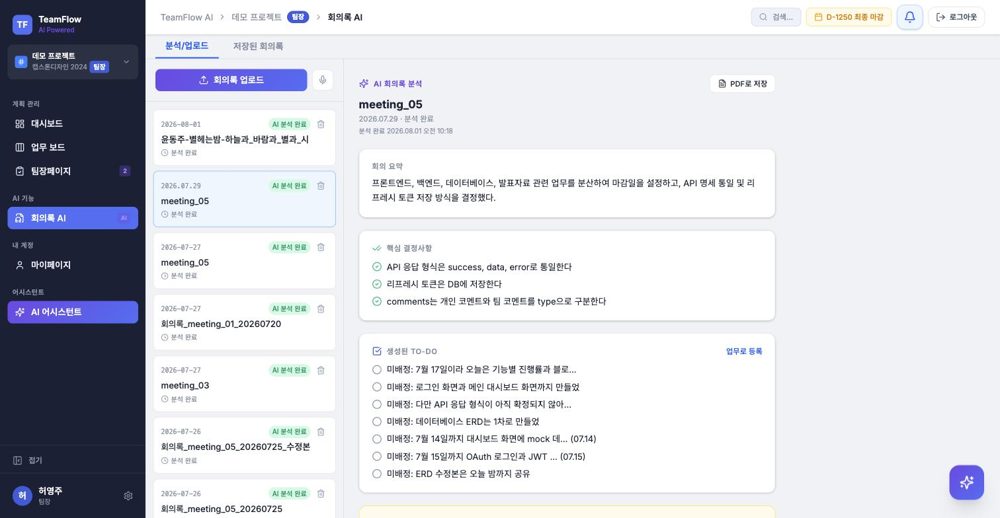
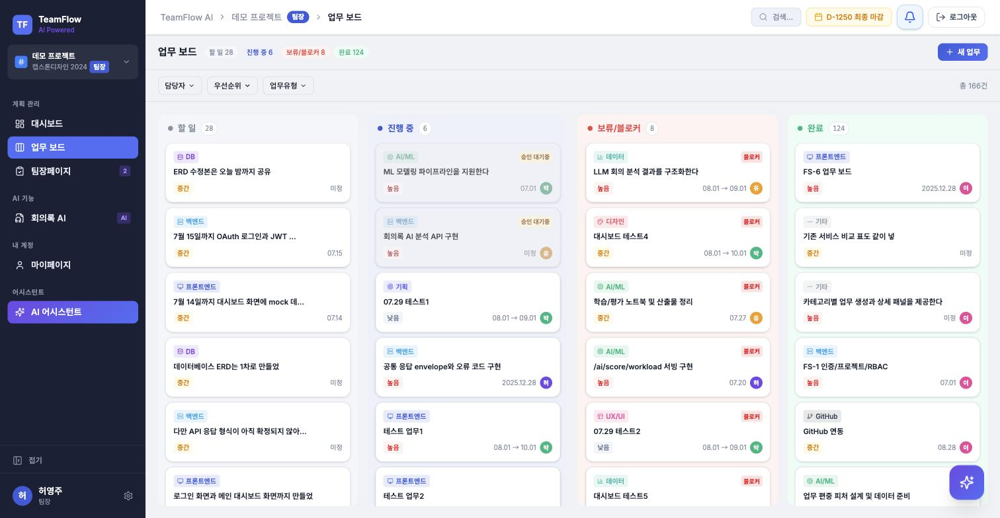
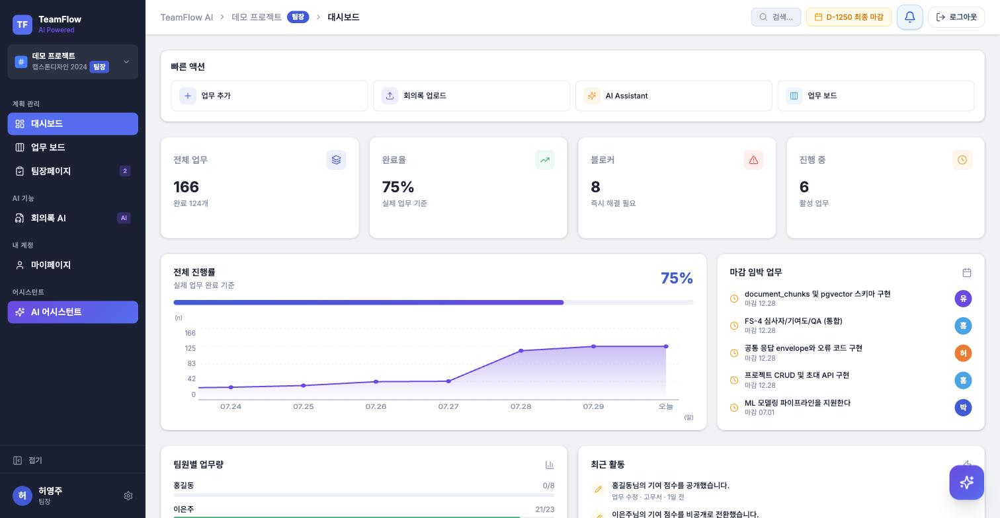
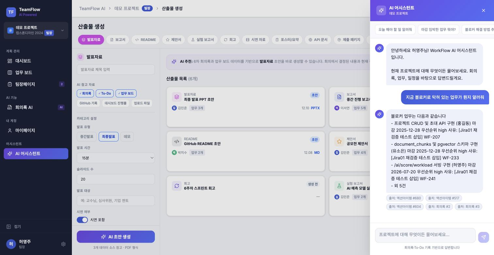
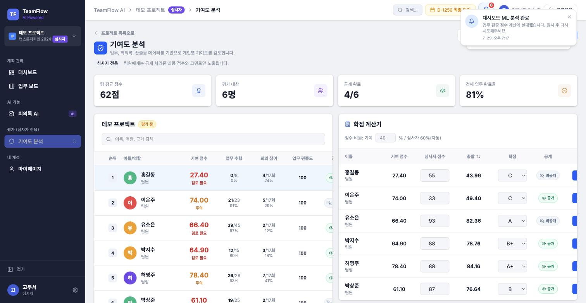
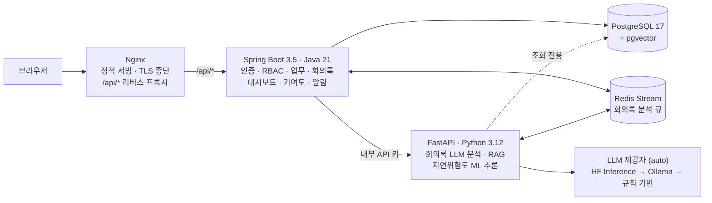

# WorkFlow AI

> **이 저장소는 팀 저장소 [rhantj/work-flow](https://github.com/rhantj/work-flow)의 포크입니다.**
> 6인 팀 프로젝트이고 저는 부팀장으로 참여한 **박지수**입니다. 코드 전체가 제 작업물이 아니며,
> 제가 맡은 범위는 [내 기여 범위](#내-기여-범위)에 적어 두었습니다.

> 팀 프로젝트의 회의, 업무, 진행 상황, 평가 근거를 AI가 하나의 흐름으로 연결하는 협업·평가 보조 웹 플랫폼

대학생 팀프로젝트, 캡스톤디자인, 해커톤, AI 경진대회, 공모전 팀을 위한 서비스입니다.
회의록을 올리면 요약·결정사항·To-Do가 자동으로 만들어져 업무 보드와 대시보드에 반영되고,
그 기록이 그대로 심사자용 기여도 근거로 이어집니다.

[](https://youtu.be/D5jy2qbKh7g)

**🌐 배포: https://t3-workflow-ai.site**
데모 계정: `1234@naver.com` / `park!6443` — 로그인하면 시딩된 팀 프로젝트를 바로 볼 수 있습니다.

> 산출물 자동 생성과 GitHub 연동은 최종 범위에서 빠졌습니다.
> 어디까지가 실제 동작인지는 [미구현 · 임시처리 현황](#미구현--임시처리-현황)에 정리해 두었습니다.

---

## 목차

1. [주요 기능](#주요-기능)
2. [미구현 · 임시처리 현황](#미구현--임시처리-현황)
3. [기술 스택 — 왜 이걸 골랐나](#기술-스택--왜-이걸-골랐나)
4. [시스템 아키텍처](#시스템-아키텍처)
5. [로컬 실행](#로컬-실행)
6. [테스트](#테스트)
7. [트러블슈팅 하이라이트](#트러블슈팅-하이라이트)
8. [왜 만들었나](#왜-만들었나)
9. [팀](#팀)
10. [내 기여 범위](#내-기여-범위)
11. [사용자 권한](#사용자-권한)
12. [CI/CD](#cicd)
13. [회의록 AI 분석 제공자](#회의록-ai-분석-제공자)
14. [DB 마이그레이션](#db-마이그레이션)
15. [문서](#문서)
16. [라이선스](#라이선스)

---

## 주요 기능

### 1. 회의록 AI 분석

문서(PDF/DOCX/PPTX)·음성·영상을 올리면 텍스트를 추출(음성·영상은 Whisper STT)해
**요약 / 핵심 결정사항 / 위험요소 / To-Do 후보**로 구조화합니다.
생성된 To-Do는 담당자·마감일을 붙여 그대로 업무 보드에 등록할 수 있습니다.



### 2. 업무 보드

`할 일 · 진행 중 · 보류/블로커 · 완료` 4단계 칸반. 업무는 상태보다 **카테고리(기획/백엔드/AI·ML/DB/디자인 …)** 를 먼저 고르게 해서,
같은 보드에서 담당자·우선순위·마감일·체크리스트를 일관되게 관리합니다.



### 3. 대시보드 + ML 예측

진행률, 마감 임박 업무, 팀원별 업무량, 최근 활동을 한 화면에 모읍니다.
여기에 두 개의 모델이 붙습니다.

- **지연 위험도 예측** — 마감일·진행률·체크리스트·담당자 업무량을 피처로 LightGBM 분류기가 미완료 업무의 지연 위험을 산정
- **업무 편중 점수** — 팀원별 업무 수·난이도·완료율로 과부하/저활동 팀원을 탐지 (라벨이 없어 룰 기반 점수로 부트스트랩 후 학습)



### 4. AI 어시스턴트 (RAG)

프로젝트의 회의록·업무를 임베딩해 pgvector에 적재하고, 질문에 **출처를 붙여** 답합니다.
LangGraph 기반 그래프가 단순 질의응답과 "업무 만들어줘" 같은 실행형 커맨드를 분기 처리하며,
실행형은 사용자 확인(interrupt)을 거친 뒤에만 반영됩니다.



### 5. 기여도 분석 (심사자 전용)

업무 수행·회의 참여·업무 편중을 집계해 팀원별 기여 점수와 근거를 만들고,
심사자가 자신의 점수를 입력하면 가중치에 따라 최종 학점이 계산됩니다. 공개 여부는 심사자가 정합니다.



### 그 외

- **로드맵** — 단계/마일스톤 기반 간트 뷰, 완료 승인 대기 관리 (팀장)
- **알림** — 업무 배정·상태 변경·마감 임박 알림, 딥링크로 해당 화면 이동

---

## 미구현 · 임시처리 현황

어디까지가 실제 동작이고 어디부터가 계획인지 구분해 둡니다. 최종 보고서 V-3-1과 같은 내용입니다.

| 항목 | 상태 | 실제 동작 |
| --- | --- | --- |
| **GitHub 연동** | 미구현 | `github_records` 테이블과 조회 경로만 존재. 동기화 로직이 없어 심사자 화면에 항상 0건으로 표시됨. 프론트 화면은 라우터에 연결된 적이 없어 제거함 |
| **산출물 생성** | 범위 제외 (P2) | 백엔드는 엔티티·리포지토리만 있고 생성 API 없음. 목업으로만 동작하던 `/deliverables` 화면은 제거함 |
| **업무 편중 점수 ML** | 임시 학습 | 라벨이 없어 룰 기반 점수로 부트스트랩한 합성 데이터로 학습된 상태. 운영 데이터가 쌓이면 재학습 필요 |
| **Kafka** | 미사용 | compose에 구성만 되어 있고 애플리케이션 코드에서 호출하지 않음 (확장 대비 선반영) |

---

## 기술 스택 — 왜 이걸 골랐나

| 기술 | 선택 이유 |
| --- | --- |
| **React 19 + TypeScript 5.9 + Vite 7** | 화면 10개·상태가 얽힌 SPA. 타입으로 API 계약을 프론트까지 강제하고, Vite 7은 Node 24 LTS 기준으로 빌드가 가장 빨랐음 |
| **Tailwind CSS 4** | v4의 CSS-first 방식(`@theme`)으로 색·간격 토큰을 CSS 한 파일에 모아 단일 출처로 관리 — `tailwind.config.js` 없음 |
| **Spring Boot 3.5 · Java 21** | 인증·권한(RBAC)·트랜잭션이 서비스의 뼈대라 이 부분이 가장 단단한 스택을 선택. 모든 외부 요청은 Spring만 받음 |
| **FastAPI · Python 3.12** | LLM·ML 생태계가 Python에 있음. 외부에 직접 열지 않고 Spring이 내부 API 키로만 호출하는 추론 전용 서버 |
| **PostgreSQL 17 + pgvector** | RAG 벡터 검색을 위해 Chroma/FAISS 같은 별도 벡터 DB를 두는 대신 pgvector로 통합 — 운영할 DB가 하나 줄고, 업무·회의록과 벡터를 한 트랜잭션 경계 안에서 다룸 |
| **Redis (Stream)** | 회의록 분석은 수십 초 걸리는 작업이라 HTTP 요청-응답으로 못 묶음. Stream 큐로 넘기고 워커가 소비 — Kafka는 이 규모에 과함 (compose에 구성만 있고 코드에서 미사용) |
| **LightGBM** | 지연 위험도는 소규모 테이블 데이터 분류 문제 — 딥러닝보다 부스팅 트리가 데이터 효율·추론 속도에서 유리 |
| **Ollama / HF Inference (auto)** | LLM 호출은 `HF Inference → 로컬 Ollama → 규칙 기반` 순서로 자동 폴백 — 외부 API 장애나 토큰 없는 환경에서도 기능이 완전히 죽지 않게 |
| **Flyway** | 스키마 변경 경로를 마이그레이션 파일 하나로 일원화. 이미 배포된 파일은 CI(`migration-guard`)가 수정을 차단 |
| **Docker Compose + nginx** | 서비스 5개(프론트·API·AI·DB·Redis)를 한 명령으로 재현. nginx가 TLS 종단과 `/api/*` 리버스 프록시 담당 |

세부 버전과 호환성 근거는 [기술 스택 버전 문서](docs/projects/WorkFlow_AI_기술_스택_버전.md)에 있습니다.

**Frontend**


**Backend**


**AI Backend · LLM / RAG**


**ML**


**Database**


**Infra / CI**


---

## 시스템 아키텍처



역할을 나눈 이유: 인증·권한·트랜잭션은 Spring이 강하고, ML/LLM 생태계는 Python이 강합니다.
FastAPI는 외부에 직접 열지 않고 Spring이 내부 API 키로만 호출합니다.

> **쓰기 권한 경계** — AI 계층은 **DB 쓰기 권한이 없음**. 추론만 담당하므로 그 컨테이너가 멈춰도 트랜잭션 정합성에는 영향이 없음.

### 개발 환경과 배포 환경은 경로가 다릅니다

| | 로컬 (docker-compose.yml) | 운영 (OCI, docker-compose.prod.yml) |
| --- | --- | --- |
| **DB 스키마 반영** | Flyway 기본 **꺼짐** — 빈 DB를 새로 만들 때만 1회 켠다 | Flyway **켜짐** — 배포 파이프라인이 마이그레이션 적용 |
| **LLM 호출** | `HF_TOKEN` 없으면 Ollama → 규칙 기반 | HF Inference 우선, 실패 시 폴백 |
| **프론트엔드** | nginx가 **빌드 결과물** 서빙 — dev 서버가 아니라 HMR 없음, 수정 후 `--build frontend` 재빌드 필요 | 동일 + certbot이 Let's Encrypt 인증서 자동 갱신 |
| **HTTPS** | 없음 (http://localhost) | nginx TLS 종단 |

이 차이를 모르면 두 가지 사고가 납니다: 로컬에서 Flyway를 켠 채 원격 공유 DB를 바라보면 스키마 이력이 오염되고, 프론트를 고치고 재빌드를 빼먹으면 "컨테이너는 떠 있는데 예전 화면"이 나옵니다. 둘 다 실제로 겪었습니다 — [트러블슈팅 하이라이트](#트러블슈팅-하이라이트) 참고.

계층별 컨테이너 구성 상세는 아래와 같습니다.

| 계층 | 컨테이너 | 기술 | 주요 역할 |
| --- | --- | --- | --- |
| **프레젠테이션** | Frontend Container | Nginx · React · TypeScript · Vite · Tailwind | 정적 파일 서빙 / HTTPS 종단(TLS termination) / `/api/*` 리버스 프록시 |
| **인증서 자동화** | Certbot Container | Let's Encrypt certbot | 인증서 발급·자동 갱신 / Nginx와 볼륨 공유 |
| **애플리케이션** | Backend API Container | Spring Boot 3.5 / Java 21 | 인증·회원·프로젝트 권한(RBAC) / 업무보드·회의록·대시보드 API / 기여도·마이페이지·알림·활동로그 / FastAPI 호출 및 분석 결과 저장 |
| **AI / ML** | AI/ML Backend Container | FastAPI / Python 3.12 | 회의록 AI 분석·To-Do 후보 추출 / RAG Assistant / 지연위험도 등 ML 모델 추론 / 체크리스트 AI |
| **데이터** | PostgreSQL Container | PostgreSQL 17 + pgvector | 업무·회의록·기여도 데이터 저장 / RAG 벡터 데이터 저장 |
| **인프라 / 큐** | Redis | Redis(Stream) | 회의록 분석 비동기 큐(Job enqueue / dequeue) / 세션·헬스체크 |
| **미사용** | Kafka Container | apache/kafka 3.8 (KRaft) | compose에 구성만 되어 있고 **애플리케이션 코드에서 호출하지 않음** — 확장 대비 선반영이라 서비스 경로에 포함되지 않음 |

---

## 로컬 실행

Docker Desktop만 있으면 됩니다. (FastAPI 이미지에 ML 라이브러리가 포함돼 첫 빌드는 10분 이상 걸립니다.)

```bash
git clone https://github.com/jjssspark/WorkFlow_AI.git
cd work-flow/App

# 1) 환경변수 준비 — 필수값 2개만 채우면 뜬다
cp .env.example .env
# .env에서 아래 두 값을 32바이트 이상 랜덤 문자열로 교체 (openssl rand -hex 32)
#   JWT_SECRET=...
#   RAG_INTERNAL_API_KEY=...   ← 비워두면 FastAPI가 RAG 요청을 전부 거부한다(fail-closed)

# 2) 최초 1회 — 빈 DB에 스키마를 구축하며 기동
SPRING_FLYWAY_ENABLED=true docker compose up -d --build

# 3) 이후에는
docker compose up -d
```

| 접속 | 주소 |
| --- | --- |
| 프론트엔드 | http://localhost:5173 |
| Spring API 헬스 | http://localhost:8080/api/v1/health |
| Swagger UI | http://localhost:8080/swagger-ui/index.html |
| AI FastAPI 헬스 | http://localhost:8000/api/v1/health |

> 이 절차는 2026-08-13에 빈 폴더 클론 → 빈 볼륨 상태에서 실제로 검증했습니다.
> Flyway 마이그레이션 37개가 전부 적용되고(최신 `20260801.1`), 테이블 30개와 pgvector 확장이 생성되며,
> Spring 헬스가 `{"status":"UP"}`, 프론트엔드가 200을 반환하는 것까지 확인했습니다.

**알아둘 것**

- 첫 빌드 중 `backend-fastapi`가 `pip ... ReadTimeoutError`로 실패할 수 있습니다. PyPI에서 PyTorch·transformers 등 수 GB를 받는 단계라 회선이 흔들리면 끊깁니다. 그대로 재실행하면 이번엔 **`Expected sha256 ... Got ...`** 로 실패할 수 있는데, 끊긴 다운로드가 pip 캐시에 반쪽짜리로 남았기 때문입니다. 이때는 캐시 마운트를 비우고 다시 받아야 합니다:

  ```bash
  docker builder prune --filter type=exec.cachemount -f
  SPRING_FLYWAY_ENABLED=true docker compose up -d --build
  ```

- `SPRING_FLYWAY_ENABLED=true`는 **compose 안의 로컬 DB를 쓸 때만** 최초 1회 켭니다. `.env`의 `SPRING_DATASOURCE_URL`을 원격 공유 DB로 바꾼 상태에서 켜면 그 DB의 마이그레이션 이력을 오염시킵니다 — [DB 마이그레이션](#db-마이그레이션) 참고.
- 프론트 코드를 수정했다면 `docker compose up -d --build frontend` — dev 서버가 아니라서 재빌드 없이는 예전 화면이 계속 보입니다.
- 로컬 5432 포트에 이미 PostgreSQL이 있다면 `.env`에 `DB_HOST_PORT=5433`을 추가합니다.
- **선택 기능용 환경변수** (없어도 기동에는 지장 없음): `HF_TOKEN`(회의록 분석을 HF Inference로) · Ollama 설치(로컬 LLM — [회의록 AI 분석 제공자](#회의록-ai-분석-제공자)) · `GOOGLE_CLIENT_ID/SECRET`(구글 로그인) · `STORAGE_*`(첨부파일·아바타 업로드)

---

## 테스트

세 계층 모두 테스트가 있고, 전부 CI에서 돌아갑니다.

| 계층 | 테스트 | 실행 |
| --- | --- | --- |
| Spring | **890건** (파일 138개) | `cd App/backend_spring && ./gradlew test` |
| FastAPI | **762건** (CI가 강제하는 하한) | `cd App/backend_fastapi && python -m pytest tests -q` |
| Frontend | **634건** (파일 83개) | `cd App/frontend && pnpm test` |

> Spring·Frontend 수치는 소스에서 `@Test`/`it()`을 센 값이고, FastAPI 수치는 CI가 실제 실행
> 건수로 검증하는 하한입니다.

### 테스트 개수를 CI가 검사합니다

pytest는 `--ignore`가 하나 더 붙거나 파일이 통째로 수집되지 않아도 **통과로 끝납니다.**
그러면 CI는 초록불인데 실제로는 아무것도 안 지키는 상태가 됩니다. 방어선이 있는 척하는 쪽이
없는 것보다 나쁩니다.

그래서 [`App/backend_fastapi/ci/verify-fastapi-test-count.py`](App/backend_fastapi/ci/verify-fastapi-test-count.py)가
JUnit 리포트의 실행 건수를 읽어 하한선과 비교하고,
모자라면 빌드를 깹니다. 하한에 여유를 두지 않고 실제 건수에 정확히 맞춰 뒀습니다 — 여유를 두면
Docker가 없어 pgvector 통합 테스트 5건이 스킵돼도 그대로 통과해, 막으려던 상황이 그대로
일어나기 때문입니다.

---

## 트러블슈팅 하이라이트

전체 기록은 [docs/trouble-shooting/](docs/trouble-shooting/)에 있습니다. 그중 사고 과정이 드러나는 것들:

| 기록 | 한 줄 요약 |
| --- | --- |
| [Flyway checksum crashloop](docs/trouble-shooting/2026-07-26-flyway-checksum-crashloop.md) | 배포된 마이그레이션 파일을 수정하면 전체 스택이 기동 불능 — 운영 API가 41분 중단됐고, 이 사고로 CI에 `migration-guard`가 생겼다 |
| [빈 볼륨 스키마 갭](docs/trouble-shooting/2026-07-27-dev-compose-fresh-volume-schema-gap.md) | 새로 합류한 사람만 밟는 지뢰 — 팀 전원이 공유 DB를 써서 아무도 몰랐다. 위 로컬 실행법의 `SPRING_FLYWAY_ENABLED=true`가 그 결론 |
| [Spring context crashloop과 죽은 롤백](docs/trouble-shooting/2026-07-23-spring-context-crashloop-and-dead-rollback.md) | 프론트만 살아 있어 겉보기엔 정상이던 18분 장애. 롤백 절차가 한 번도 동작한 적 없었다는 걸 이때 알았다 |
| [Redis protected-mode 접속 거부](docs/trouble-shooting/2026-07-24-redis-stack-protected-mode-denied.md) | 컨테이너 안에서는 되는데 밖에서는 안 되는 고전적 네트워크 문제 |
| [임베딩 모델 재다운로드 정체](docs/trouble-shooting/2026-07-24-fastapi-임베딩모델-재다운로드-정체.md) | 컨테이너 재시작마다 수 GB 모델을 다시 받던 문제 — HF 캐시 볼륨으로 해결 |

---

## 왜 만들었나

팀프로젝트에서 실제로 시간을 잡아먹는 건 개발이 아니라 **기록과 기록 사이의 단절**이었습니다.

| 문제 | 현장에서 일어나는 일 |
| --- | --- |
| 회의록 정리 부담 | 회의가 끝나면 요약·결정사항·담당자·마감일을 사람이 다시 옮겨 적어야 함 |
| 역할 분배 불명확 | 회의에서 정한 일이 업무 보드로 넘어가지 않아 "누가 뭐 하기로 했더라"가 반복됨 |
| 진행 상황 파악 어려움 | 마감 임박·지연 업무·업무 편중을 한눈에 볼 방법이 없음 |
| 기여도 판단 어려움 | 교수·심사자가 팀원별 실제 활동 근거를 확인할 방법이 없음 |

그래서 **회의록 → 업무 → 진행률 → 기여도**를 하나의 데이터 흐름으로 묶고,
각 단계마다 사람이 반복하던 판단을 LLM·RAG·ML이 대신하도록 만들었습니다.

---

## 팀

| 이름 | 담당 |
| --- | --- |
| **고무서 (PM)** | AI 어시스턴트·RAG — LangGraph 분기 그래프, pgvector 검색 / 심사자 기여도 분석 / 권한 QA |
| **박지수 (부팀장)** | 회의록 AI 분석 — Redis 큐 기반 비동기 처리, LLM 요약 / To-Do 자동 생성 |
| 박상준 | 인증·RBAC — Spring Security + JWT / 프로젝트 관리 / 팀원 초대 |
| 유소은 | 대시보드 / 지연 위험도 예측 — LightGBM |
| 이은주 | ML 모델링 — 업무 편중 점수(scikit-learn), 임베딩 파이프라인 |
| 허영주 | 업무 보드(칸반) |

---

## 내 기여 범위

위 표의 **박지수 (부팀장)** 가 접니다. 나머지 5명의 작업은 제 것이 아닙니다.

맡은 영역은 실시간 알림(SSE), 회의록 AI 분석 파이프라인, 심사자 기여도 평가, 마이페이지,
CI/CD 배포 게이트입니다. dev 브랜치에서 머지 커밋을 뺀 개인 커밋은 342개이고, 기간은
2026-07-06부터 2026-08-18까지입니다.

대표적인 작업 몇 가지입니다. 자세한 경위는 아래 문서에 있습니다.

| 작업 | 커밋 |
| --- | --- |
| 실시간 알림이 13곳에서 통째로 발송되지 않던 문제 — 호출부 교체 + SSE 비동기 디스패치에서 SecurityContext가 비던 문제 | [`982edb83`](https://github.com/jjssspark/WorkFlow_AI/commit/982edb83) |
| 알림의 소속 프로젝트를 파생 계산으로 갔다가 컬럼으로 뒤집은 결정, 그리고 백필이 남긴 사각지대 정리 | [`7945d7b0`](https://github.com/jjssspark/WorkFlow_AI/commit/7945d7b0) → [`fd582b1e`](https://github.com/jjssspark/WorkFlow_AI/commit/fd582b1e) → [`885408a7`](https://github.com/jjssspark/WorkFlow_AI/commit/885408a7) |
| 부수 작업(활동 로그) 실패가 본 작업의 트랜잭션을 무너뜨리던 문제 — TransactionTemplate으로 격리 | [`7aab8dd7`](https://github.com/jjssspark/WorkFlow_AI/commit/7aab8dd7) |
| 회의록 STT를 업로드 요청 안의 동기 처리에서 비동기 분석 큐로 이전 | [`73e6e2bd`](https://github.com/jjssspark/WorkFlow_AI/commit/73e6e2bd) |
| 녹음 복구 경로가 실제 브라우저에서는 한 번도 동작하지 않던 문제 — MediaRecorder timeslice | [`173a90a0`](https://github.com/jjssspark/WorkFlow_AI/commit/173a90a0) |

| 문서 | 내용 |
| --- | --- |
| [회고](document_박지수/회고.md) | 다시 만든다면 다르게 할 것, 알면서 남긴 기술 부채, 가장 오래 붙잡은 문제 |
| [ADR](document_박지수/ADR.md) | 되돌린 결정을 포함한 설계 결정 8건 |
| [트러블슈팅](document_박지수/트러블슈팅.md) | 증상·원인·실패한 시도·해결까지 12건 |

---

## 사용자 권한

| 역할 | 할 수 있는 일 |
| --- | --- |
| **팀장** | 프로젝트 생성·초대, 업무 생성/배정, 로드맵 관리, 완료 승인, 회의록 승인 |
| **팀원** | 본인 업무 관리, 회의록 업로드, 블로커 등록 |
| **심사자** | 진행률·기여도 리포트 조회, AI 평가 근거 확인, 최종 점수 입력 (그 외 화면은 열람 전용) |

---

## CI/CD

로컬 기능 브랜치 → `dev` 병합 → 검증 통과 시 `main` 승격 → OCI 자동 배포 순서의 3단계 브랜치 승격 파이프라인입니다.

| 워크플로 | 역할 |
| --- | --- |
| `backend-tests` | Spring Boot 빌드·단위 테스트 |
| `frontend-tests` | React 빌드·테스트 |
| `fastapi-tests` | AI 백엔드(FastAPI) 테스트 |
| `migration-guard` | 이미 배포된 Flyway 마이그레이션 파일 수정 차단 |
| `redis-acl-tests` | Redis ACL 설정 검증 |
| `deploy-oci` | `main` 병합 시 OCI 운영 서버 자동 배포 및 헬스체크 |

- `main` 직접 push 금지 — 배포는 항상 `dev` → `main` PR 병합으로만 트리거됩니다.
- 배포 실패나 배포 후 이상 발견 시 직전 정상 커밋으로 롤백 후 재배포합니다.

자세한 파이프라인 구성은 [CI/CD 구조 문서](docs/projects/WorkFlow_AI_CICD_구조.md), 배포 절차는 [App/DEPLOY_OCI.md](App/DEPLOY_OCI.md)를 참고하세요.

---

## 회의록 AI 분석 제공자

회의록 AI 분석 제공자 기본값은 `auto`입니다. `HF_TOKEN`이 있으면 Hugging Face Inference를 먼저 사용하고, 실패하거나 토큰이 없으면 로컬 Ollama, 그 다음 규칙 기반 분석으로 자동 대체합니다.

> **주의(개인정보/기밀)**: `auto` 모드에서 `HF_TOKEN`이 설정된 환경(로컬 `.env`, 배포 서버 등)에 회의록을 업로드하면, 회의록 원문이 Hugging Face의 외부 Inference API로 전송됩니다. 팀원 이름, 업무 내용 등이 포함된 회의록을 외부로 보내고 싶지 않다면 해당 환경에서 `HF_TOKEN`을 설정하지 않거나 `MEETING_ANALYSIS_PROVIDER=ollama`(또는 `rule`)로 명시적으로 고정하세요.

### 로컬 Ollama

- Ollama 설치: https://ollama.com
- 빠른 분석용 모델(기본값): `qwen2.5:1.5b` (로컬에 없으면 `ollama pull qwen2.5:1.5b`)
- Docker Compose 사용 시 컨테이너에서 호스트의 Ollama에 접근하므로 별도 설정이 필요 없습니다.
- FastAPI 직접 실행 시: `OLLAMA_HOST=http://localhost:11434`
- 어시스턴트 첫 응답이 느리면: 모델이 메모리에서 내려간 상태라 로드에 10초 이상 걸립니다. `RAG_OLLAMA_KEEP_ALIVE`(기본 30m)로 조절합니다.

### Hugging Face Inference

다른 컴퓨터에서 Ollama 설치 없이 시연해야 하면 Hugging Face Inference Provider를 사용할 수 있습니다.

- `.env`에 `HF_TOKEN=발급받은_토큰` 설정
- Hugging Face만 강제로 쓰려면 `.env`에 `MEETING_ANALYSIS_PROVIDER=huggingface` 설정
- 기본 모델: `HF_MEETING_ANALYSIS_MODEL=Qwen/Qwen3-4B-Instruct-2507`
- Docker Compose 사용 시 `backend-fastapi`를 재빌드/재시작해야 반영됩니다.
- Hugging Face 호출 실패 시에는 Ollama, 규칙 기반 분석 순서로 자동 대체됩니다.

---

## DB 마이그레이션

스키마 변경은 Flyway(`App/backend_spring/src/main/resources/db/migration/V*.sql`)로 관리합니다.

- **새 스키마 변경은 새 `V*.sql` 파일을 추가**합니다. 이미 배포되어 적용된 `V*.sql`은 CI가 수정을 차단하므로 절대 고치지 말 것 — 바꿀 게 있으면 그 변경을 되돌리거나 보완하는 새 버전 파일을 추가합니다.
- **로컬 개발 환경은 Flyway를 자동으로 켜지 않습니다** (`SPRING_FLYWAY_ENABLED` 기본값 `false`). 켜는 경우는 [로컬 실행](#로컬-실행)의 빈 DB 최초 구축 1회뿐이며, 그때 `SPRING_DATASOURCE_URL`이 compose 안의 로컬 DB(`db:5432`)를 가리키는지 반드시 확인합니다. 원격 공유 DB를 바라보는 상태에서 켜면 그 DB의 `flyway_schema_history`가 오염됩니다.
- **공유 DB에 대한 마이그레이션 적용은 배포 파이프라인만 수행**합니다. 로컬 앱이 스키마 불일치(schema validation 오류)로 기동하지 못해도, psql·DBeaver 등으로 공유 DB에 직접 SQL을 실행하지 않습니다 — 새 `V*.sql`을 추가해 배포 파이프라인을 통해 반영합니다.
- 신규 빈 DB에서 엄격하게 검증하려면 `SPRING_FLYWAY_BASELINE_ON_MIGRATE=false`로 override할 수 있습니다(기본값은 `true`).

---

## 문서

| 문서 | 내용 |
| --- | --- |
| [PRD](docs/projects/WorkFlow_AI_PRD.md) | 기능 범위, 요구사항, 권한, AI 적용 범위 |
| [최종 기능정리](docs/projects/WorkFlow_AI_최종_기능정리.md) | 화면·기능별 최종 정의와 차별점 |
| [API 명세서](docs/projects/WorkFlow_AI_API_명세서.md) | REST 경로, 응답 형식, 권한, AI 백엔드 계약 |
| [DB 스키마](docs/DB_스키마.md) | 테이블 29개, 관계·삭제 정책, 인덱스 판단 근거. DDL 원문은 [`docs/db/schema.sql`](docs/db/schema.sql) |
| [성능 · 품질 지표](docs/성능_지표.md) | 번들 크기, 전송량, 응답 시간, 타임아웃 값의 실측 근거. 재지 못한 것도 함께 적음 |
| [어시스턴트 RAG 구조](docs/projects/WorkFlow_AI_어시스턴트_RAG_구조.md) | 임베딩·검색·생성 파이프라인 |
| [인증/RBAC 구현](docs/projects/WorkFlow_AI_인증_RBAC_구현_파일.md) | 로그인·권한 처리 파일 맵 |
| [CI/CD 구조](docs/projects/WorkFlow_AI_CICD_구조.md) | GitHub Actions 워크플로 구성 |
| [기술 스택 버전](docs/projects/WorkFlow_AI_기술_스택_버전.md) | 버전 고정 값과 호환성 근거 |
| [개발 로드맵](docs/projects/WorkFlow_AI_개발_로드맵.md) | 단계별 개발 계획 |
| [컨벤션](convention/) | 프론트엔드·백엔드·AI 코드 컨벤션 |
| [결정 기록](docs/decisions/) | 아키텍처·데이터 모델 결정과 되돌리는 법 |
| [트러블슈팅](docs/trouble-shooting/) | 반복된 장애와 해결 기록 |

---

## 라이선스

[MIT License](LICENSE) — 출처를 표시하면 자유롭게 사용·수정·배포할 수 있습니다.
