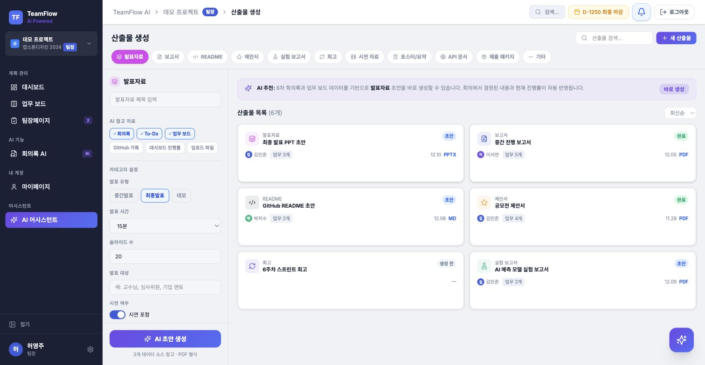

# WorkFlow AI

> 팀 프로젝트의 회의, 업무, 개발 기록, 산출물, 평가 근거를 AI가 하나의 흐름으로 연결하는 협업·평가 보조 웹 플랫폼

대학생 팀프로젝트, 캡스톤디자인, 해커톤, AI 경진대회, 공모전 팀을 위한 서비스입니다.
회의록을 올리면 요약·결정사항·To-Do가 자동으로 만들어져 업무 보드와 대시보드에 반영되고,
그 기록이 그대로 산출물 초안과 심사자용 기여도 근거로 이어집니다.


---

## 왜 만들었나

팀프로젝트에서 실제로 시간을 잡아먹는 건 개발이 아니라 **기록과 기록 사이의 단절**이었습니다.

| 문제 | 현장에서 일어나는 일 |
| --- | --- |
| 회의록 정리 부담 | 회의가 끝나면 요약·결정사항·담당자·마감일을 사람이 다시 옮겨 적어야 함 |
| 역할 분배 불명확 | 회의에서 정한 일이 업무 보드로 넘어가지 않아 "누가 뭐 하기로 했더라"가 반복됨 |
| 진행 상황 파악 어려움 | 마감 임박·지연 업무·업무 편중을 한눈에 볼 방법이 없음 |
| 산출물 준비 지연 | 발표자료·보고서·README를 제출 직전에 몰아서 작성 |
| 개발 기록 분리 | GitHub 활동이 업무·보고서·평가와 연결되지 않음 |
| 기여도 판단 어려움 | 교수·심사자가 팀원별 실제 활동 근거를 확인할 방법이 없음 |

그래서 **회의록 → 업무 → 진행률 → 산출물 → 기여도**를 하나의 데이터 흐름으로 묶고,
각 단계마다 사람이 반복하던 판단을 LLM·RAG·ML이 대신하도록 만들었습니다.

---

## 주요 기능

### 1. 회의록 AI 분석

문서(PDF/DOCX/PPTX)·음성·영상을 올리면 텍스트를 추출(음성·영상은 Whisper STT)해
**요약 / 핵심 결정사항 / 위험요소 / To-Do 후보**로 구조화합니다.
생성된 To-Do는 담당자·마감일을 붙여 그대로 업무 보드에 등록할 수 있습니다.


### 2. 업무 보드

`할 일 · 진행 중 · 보류/블로커 · 완료` 4단계 칸반. 업무는 상태보다 **카테고리(기획/백엔드/AI·ML/DB/디자인 …)** 를 먼저 고르게 해서,
같은 보드에서 담당자·우선순위·마감일·체크리스트를 일관되게 관리합니다.


### 3. 대시보드 + ML 예측

진행률, 마감 임박 업무, 팀원별 업무량, 최근 활동을 한 화면에 모읍니다.
여기에 두 개의 모델이 붙습니다.

- **지연 위험도 예측** — 마감일·진행률·체크리스트·담당자 업무량을 피처로 LightGBM 분류기가 미완료 업무의 지연 위험을 산정
- **업무 편중 점수** — 팀원별 업무 수·난이도·완료율로 과부하/저활동 팀원을 탐지 (라벨이 없어 룰 기반 점수로 부트스트랩 후 학습)

### 4. AI 어시스턴트 (RAG)

프로젝트의 회의록·업무·산출물을 임베딩해 pgvector에 적재하고, 질문에 **출처를 붙여** 답합니다.
LangGraph 기반 그래프가 단순 질의응답과 "업무 만들어줘" 같은 실행형 커맨드를 분기 처리하며,
실행형은 사용자 확인(interrupt)을 거친 뒤에만 반영됩니다.


### 5. 산출물 생성

회의록·To-Do·업무 보드 데이터를 참고 자료로 골라 발표자료·보고서·README·제안서·실험 보고서·회고 등의 초안을 생성합니다.
발표 유형, 발표 시간, 슬라이드 수, 발표 대상 같은 조건을 지정할 수 있습니다.



### 6. 기여도 분석 (심사자 전용)

업무 수행·회의 참여·업무 편중·GitHub 활동을 집계해 팀원별 기여 점수와 근거를 만들고,
심사자가 자신의 점수를 입력하면 가중치에 따라 최종 학점이 계산됩니다. 공개 여부는 심사자가 정합니다.


### 그 외

- **GitHub 연동** — 저장소 커밋 기록을 수집해 활동 로그와 기여도 근거로 사용
- **로드맵** — 단계/마일스톤 기반 간트 뷰, 완료 승인 대기 관리 (팀장)
- **알림** — 업무 배정·상태 변경·마감 임박 알림, 딥링크로 해당 화면 이동

---

## 사용자 권한

| 역할 | 할 수 있는 일 |
| --- | --- |
| **팀장** | 프로젝트 생성·초대, 업무 생성/배정, 로드맵 관리, 완료 승인, 회의록 승인, 산출물 검토 |
| **팀원** | 본인 업무 관리, 회의록 업로드, 블로커 등록, 산출물 작성 |
| **심사자** | 진행률·산출물·기여도 리포트 조회, AI 평가 근거 확인, 최종 점수 입력 (그 외 화면은 열람 전용) |

---

## 어떤 기술을 어디에 썼나

### 시스템 구성

```
React (Vite, nginx)
        │  /api/*
        ▼
Spring Boot  ── 인증·RBAC·업무/회의록/산출물 도메인·트랜잭션
        │  내부 API 키 인증
        ▼
FastAPI      ── LLM·RAG·ML 추론 전담
        │
        ├── PostgreSQL + pgvector  (업무 데이터 + 문서 임베딩)
        ├── Redis                  (캐시, rag_epoch)
        └── Ollama / Hugging Face  (LLM 추론)
```

역할을 나눈 이유: 인증·권한·트랜잭션은 Spring이 강하고, ML/LLM 생태계는 Python이 강합니다.
FastAPI는 외부에 직접 열지 않고 Spring이 내부 API 키로만 호출합니다.

### 기술 스택 (실제 사용 버전)

| 구성 | 기술 |
| --- | --- |
| **Frontend** | React 19, TypeScript 5.9, Vite 7, Tailwind CSS 4, Radix UI + MUI, react-router 7, Recharts, react-dnd |
| **Backend** | Java 21, Spring Boot 3.5 (Web / Security / Data JPA / Data Redis), JJWT, Flyway, springdoc-openapi, Apache PDFBox·POI, AWS SDK S3 |
| **AI Backend** | Python 3.12, FastAPI 0.139, Pydantic 2, asyncpg |
| **LLM / RAG** | LangGraph, LangChain Core, Ollama(로컬) / Hugging Face Inference, sentence-transformers(`bge-m3` 파인튜닝 임베딩), pgvector, LangSmith |
| **ML** | LightGBM(지연 위험도), scikit-learn, pandas/NumPy, MLflow(실험 추적) |
| **STT / 파일 처리** | faster-whisper, FFmpeg, pdfplumber, python-docx, python-pptx |
| **Database** | PostgreSQL 17 + pgvector, Redis 7 |
| **Infra / CI** | Docker Compose, nginx, GitHub Actions (backend/frontend 테스트, 마이그레이션 가드, OCI 배포), Let's Encrypt |
| **Test** | JUnit 5 + Testcontainers, pytest + pytest-asyncio, Vitest + Testing Library |

> 기능별 상세 스택과 버전 호환 근거는 [기술 스택 문서](docs/projects/WorkFlow_AI_기술_스택_버전.md)를 참고하세요.

---

## 실행 방법

```bash
cd App
cp .env.example .env   # DB 비밀번호, JWT_SECRET, RAG_INTERNAL_API_KEY 등 채우기
docker compose up -d
```

| 대상 | 주소 |
| --- | --- |
| 프론트엔드 | http://localhost:5173 |
| Spring Boot API | http://localhost:8080/api/v1/health |
| Swagger UI | http://localhost:8080/swagger-ui/index.html |
| AI FastAPI | http://localhost:8000/api/v1/health |

프론트엔드 컨테이너는 dev 서버가 아니라 빌드된 `dist`를 nginx로 서빙합니다.
프론트 코드를 고쳤다면 `docker compose up -d --build frontend`로 다시 빌드해야 화면에 반영됩니다.
자세한 내용은 [App/DOCKER.md](App/DOCKER.md), 배포는 [App/DEPLOY_OCI.md](App/DEPLOY_OCI.md)를 참고하세요.

### 로컬 시연용 테스트 계정

아이디/비밀번호 테스트 로그인은 운영 노출을 막기 위해 기본 비활성화되어 있습니다. 로컬 시연에서만 `.env`에 아래 값을 명시해 켭니다.

```env
WORKFLOW_DEMO_DEV_LOGIN_ENABLED=true
VITE_ENABLE_DEMO_AUTH=true
```

테스트 계정 비밀번호 `1111`은 중간보고/시연 전용이며, 운영 배포 환경에서는 위 값을 켜지 않습니다.

---

## 회의록 AI 분석 제공자

회의록 AI 분석 제공자 기본값은 `auto`입니다. `HF_TOKEN`이 있으면 Hugging Face Inference를 먼저 사용하고, 실패하거나 토큰이 없으면 로컬 Ollama, 그 다음 규칙 기반 분석으로 자동 대체합니다.

> **주의(개인정보/기밀)**: `auto` 모드에서 `HF_TOKEN`이 설정된 환경(로컬 `.env`, 배포 서버 등)에 회의록을 업로드하면, 회의록 원문이 Hugging Face의 외부 Inference API로 전송됩니다. 팀원 이름, 업무 내용 등이 포함된 회의록을 외부로 보내고 싶지 않다면 해당 환경에서 `HF_TOKEN`을 설정하지 않거나 `MEETING_ANALYSIS_PROVIDER=ollama`(또는 `rule`)로 명시적으로 고정하세요.

### 로컬 Ollama

- Ollama 설치: https://ollama.com
- 빠른 분석용 모델(기본값): `qwen2.5:1.5b` (로컬에 없으면 `ollama pull qwen2.5:1.5b`)
- 품질 우선 모델: `ollama pull llama3.2:3b` 또는 `ollama pull qwen3:8b` (`MEETING_ANALYSIS_MODEL=모델명`으로 전환)
- FastAPI 직접 실행 시: `OLLAMA_HOST=http://localhost:11434`
- Docker Compose 사용 시: `OLLAMA_HOST=http://host.docker.internal:11434`
- Ollama만 강제로 쓰려면: `MEETING_ANALYSIS_PROVIDER=ollama`
- Ollama를 끄고 기존 규칙 기반 분석만 쓰려면: `MEETING_ANALYSIS_PROVIDER=rule`
- 로컬 모델 응답이 느리면 `MEETING_ANALYSIS_TIMEOUT_SECONDS`, `MEETING_ANALYSIS_MAX_CHARS`, `MEETING_ANALYSIS_NUM_PREDICT` 값을 낮춰 fallback을 더 빨리 태울 수 있습니다.
- 환경변수 변경 후에는 `backend-fastapi`를 재시작해야 반영됩니다.
- 기존에 업로드된 회의록은 새 분석 로직이 소급 적용되지 않으므로 재분석/재업로드가 필요합니다.
- Ollama 서버가 꺼져 있거나 모델이 없거나 응답 파싱에 실패하면 자동으로 기존 규칙 기반 분석으로 대체됩니다.

### Hugging Face Inference

다른 컴퓨터에서 Ollama 설치 없이 시연해야 하면 Hugging Face Inference Provider를 사용할 수 있습니다.

- `.env`에 `HF_TOKEN=발급받은_토큰` 설정
- Hugging Face만 강제로 쓰려면 `.env`에 `MEETING_ANALYSIS_PROVIDER=huggingface` 설정
- 기본 모델: `HF_MEETING_ANALYSIS_MODEL=Qwen/Qwen3-4B-Instruct-2507`
- Docker Compose 사용 시 `backend-fastapi`를 재빌드/재시작해야 반영됩니다.
- Hugging Face 호출 실패 시에는 Ollama, 규칙 기반 분석 순서로 자동 대체됩니다.

---

## DB 마이그레이션

스키마 변경은 Flyway(`App/backend_spring/src/main/resources/db/migration/V*.sql`)로 관리합니다.

- **새 스키마 변경은 새 `V*.sql` 파일을 추가**합니다. 이미 배포되어 적용된 `V*.sql`은 CI가 수정을 차단하므로 절대 고치지 말 것 — 바꿀 게 있으면 그 변경을 되돌리거나 보완하는 새 버전 파일을 추가합니다.
- **로컬 개발 환경은 Flyway를 자동으로 켜지 않습니다** (`SPRING_FLYWAY_ENABLED` 기본값 `false`). 로컬 `.env`에 `SPRING_FLYWAY_ENABLED=true`나 `SPRING_FLYWAY_OUT_OF_ORDER`가 남아있다면 지울 것 — 로컬 compose에서 이 값들을 켜두면 로컬 실행이 공유 DB의 `flyway_schema_history`에 영향을 줄 수 있습니다.
- **공유 DB에 대한 마이그레이션 적용은 배포 파이프라인만 수행**합니다. 로컬 앱이 스키마 불일치(schema validation 오류)로 기동하지 못해도, psql·DBeaver 등으로 공유 DB에 직접 SQL을 실행하지 않습니다 — 새 `V*.sql`을 추가해 배포 파이프라인을 통해 반영합니다.
- 신규 빈 DB에서 엄격하게 검증하려면 `SPRING_FLYWAY_BASELINE_ON_MIGRATE=false`로 override할 수 있습니다(기본값은 `true`).

---

## 문서

| 문서 | 내용 |
| --- | --- |
| [PRD](docs/projects/WorkFlow_AI_PRD.md) | 기능 범위, 요구사항, 권한, AI 적용 범위 |
| [최종 기능정리](docs/projects/WorkFlow_AI_최종_기능정리.md) | 화면·기능별 최종 정의와 차별점 |
| [API 명세서](docs/projects/WorkFlow_AI_API_명세서.md) | REST 경로, 응답 형식, 권한, AI 백엔드 계약 |
| [어시스턴트 RAG 구조](docs/projects/WorkFlow_AI_어시스턴트_RAG_구조.md) | 임베딩·검색·생성 파이프라인 |
| [인증/RBAC 구현](docs/projects/WorkFlow_AI_인증_RBAC_구현_파일.md) | 로그인·권한 처리 파일 맵 |
| [CI/CD 구조](docs/projects/WorkFlow_AI_CICD_구조.md) | GitHub Actions 워크플로 구성 |
| [기술 스택 버전](docs/projects/WorkFlow_AI_기술_스택_버전.md) | 버전 고정 값과 호환성 근거 |
| [개발 로드맵](docs/projects/WorkFlow_AI_개발_로드맵.md) | 단계별 개발 계획 |
| [컨벤션](convention/) | 프론트엔드·백엔드·AI 코드 컨벤션 |
| [결정 기록](docs/decisions/) | 아키텍처·데이터 모델 결정과 되돌리는 법 |
| [트러블슈팅](docs/trouble-shooting/) | 반복된 장애와 해결 기록 |
