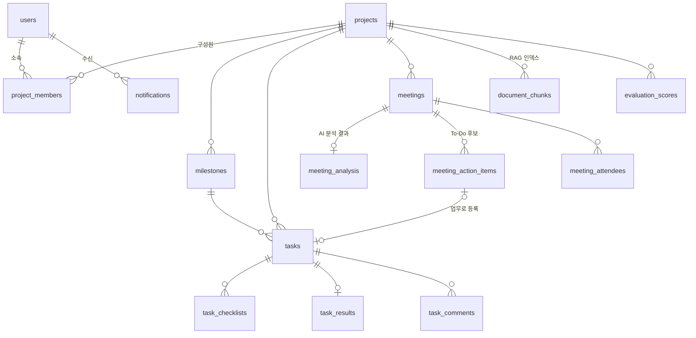

# DB 스키마

PostgreSQL 17 + pgvector. 애플리케이션 테이블 **29개**(그 외 Flyway 이력 테이블 1개).

DDL 원문은 [`docs/db/schema.sql`](db/schema.sql)에 있다. 실제로 돌린 DB에서 `pg_dump`로 뽑은
것이라 그대로 복붙해 재현할 수 있다.

---

## 이 문서를 만든 방법

스키마는 두 단계로 만들어진다. 컨테이너 최초 기동 시 `db/init/`의 스크립트 20개가 돌고,
그 뒤 Flyway가 `db/migration/`의 마이그레이션을 적용한다. Flyway는
`baseline-version: 20260721.1`로 잡혀 있어 그 이전 버전은 init이 이미 만든 것으로 보고
건너뛴다.

아래를 그대로 실행하면 같은 결과가 나온다.

```bash
cd App/backend_spring/src/main/resources/db

# 1) pgvector 포함 이미지로 DB를 띄운다. init 스크립트가 자동 실행된다
docker run -d --name wfschema-db \
  -e POSTGRES_DB=workflow -e POSTGRES_USER=postgres -e POSTGRES_PASSWORD=root \
  -p 55433:5432 -v "$PWD/init":/docker-entrypoint-initdb.d:ro \
  pgvector/pgvector:pg17

# 2) Flyway 마이그레이션 적용
docker run --rm -v "$PWD/migration":/flyway/sql:ro flyway/flyway:11 \
  -url="jdbc:postgresql://host.docker.internal:55433/workflow" \
  -user=postgres -password=root \
  -baselineOnMigrate=true -baselineVersion="20260721.1" migrate

# 3) 스키마 덤프
docker exec wfschema-db pg_dump -U postgres -d workflow \
  --schema-only --no-owner --no-privileges > schema.sql

# 4) 정리
docker rm -f wfschema-db
```

2단계 출력의 마지막 줄이 `Successfully applied 36 migrations to schema "public", now at
version v20260801.1`이면 정상이다.

> `pgvector/pgvector:pg17` 이미지를 써야 한다. 순정 `postgres:17`은 init 스크립트의
> `CREATE EXTENSION vector`에서 실패한다.

---

## 도메인별 테이블

| 도메인 | 테이블 |
| --- | --- |
| 사용자·프로젝트 | `users` `projects` `project_members` `invitations` |
| 업무 | `tasks` `task_checklists` `task_comments` `task_results` `task_result_files` `task_result_links` `milestones` |
| 회의록·AI | `meetings` `meeting_attendees` `meeting_analysis` `meeting_action_items` `document_chunks` |
| 평가·기여도 | `evaluation_scores` `evaluation_settings` `contribution_reports` `workload_scores` `reviewer_activities` `ml_predictions` |
| 활동·알림 | `activities` `notifications` `comments` `audit_logs` |
| 미구현·운영 | `deliverables` `github_records` `rag_assignee_sync_failures` |



`meetings`는 자기 자신을 참조한다(`original_meeting_id`) — 재분석본이 원본을 가리킨다.
`comments`도 자기 참조로 대댓글을 표현한다(`parent_id`).

---

## 관계와 삭제 정책

외래키는 49개다. 삭제 정책 분포가 설계 의도를 그대로 보여준다.

| 정책 | 개수 | 어디에 쓰였나 |
| --- | --- | --- |
| `CASCADE` | 33 | 프로젝트에 종속된 것 전부. 프로젝트가 지워지면 업무·회의록·평가가 같이 사라진다 |
| `SET NULL` | 10 | 사람이 빠져도 **기록은 남아야 하는** 자리. `tasks.assignee_id`, `tasks.milestone_id`, `projects.created_by` 등 |
| `NO ACTION` | 6 | 참조가 남아 있으면 삭제를 막는 자리. `notifications.user_id`, `tasks.created_by`, `meetings.uploaded_by` 등 |

기준은 하나다. **"이 행이 사라지면 남은 기록이 거짓말이 되는가."** 담당자가 탈퇴해도 그 업무가
있었다는 사실은 참이므로 `SET NULL`로 두고, 프로젝트 자체가 없어지면 그 안의 업무는 의미가
없으므로 `CASCADE`로 지운다.

다만 이 기준이 끝까지 일관되지는 않다. **`projects.created_by`는 `SET NULL`인데
`tasks.created_by`는 `NO ACTION`이다.** 같은 "만든 사람"인데 한쪽은 탈퇴를 허용하고 한쪽은
막는다. 의도한 구분이 아니라 서로 다른 시점에 추가되면서 갈린 것으로 보인다. 지금은 사용자
삭제 경로가 실제로 쓰이지 않아 드러나지 않지만, 탈퇴 기능을 붙이면 `tasks.created_by` 쪽에서
막힌다.

### FK가 없는 곳 — 폴리모픽 참조

`notifications`와 `comments`, `activities`는 여러 종류의 대상을 하나의 컬럼으로 가리킨다.

```sql
CREATE TABLE public.notifications (
    id bigint NOT NULL,
    user_id bigint NOT NULL,
    type character varying NOT NULL,
    title character varying NOT NULL,
    content text,
    target_type character varying,   -- 'task' | 'meeting' | 'milestone' | 'project' | 'evaluation'
    target_id bigint,                -- FK 없음
    project_id bigint,               -- FK 없음
    is_read boolean DEFAULT false NOT NULL,
    created_at timestamp without time zone DEFAULT CURRENT_TIMESTAMP NOT NULL
);
```

`target_id`는 `target_type`에 따라 다른 테이블을 가리키므로 FK를 걸 수 없다. **이 구조가 실제로
사고를 냈다.** 원본이 삭제돼도 알림 쪽에 전파되지 않아, `project_id` 백필 때 되짚을 원본이 없는
행이 남았고, 그 행들이 조회에서도 정리에서도 빠져 무한히 쌓였다. 경위는
[트러블슈팅](../document_박지수/트러블슈팅.md)과 [ADR](../document_박지수/ADR.md)에 있다.

`project_id`는 폴리모픽이 아닌데도 FK가 없다. 이건 백필 마이그레이션으로 나중에 추가된
컬럼이라 그렇다 — 되짚지 못한 행이 있는 상태에서 FK를 걸면 마이그레이션 자체가 실패한다.

`reviewer_activities`와 `rag_assignee_sync_failures`에는 FK가 하나도 없다. 앞은 심사자 활동
로그라 본 작업의 트랜잭션과 분리돼야 하고, 뒤는 동기화 실패를 적어두는 큐라 참조 무결성보다
기록이 남는 게 우선이다.

---

## 인덱스

PK를 뺀 인덱스는 28개다. 눈여겨볼 것만 짚는다.

### 조회 경로를 그대로 따라간 복합 인덱스

```sql
CREATE INDEX idx_notifications_user_project_created
  ON notifications (user_id, project_id, created_at DESC);
```

알림 목록은 항상 "내 알림 중 이 프로젝트 것을 최신순으로"다. 컬럼 순서가 그 질의 순서와 같다.
`created_at DESC`까지 명시해 정렬을 인덱스가 흡수한다.

### 부분 인덱스 — 조건이 붙는 행만

```sql
CREATE UNIQUE INDEX ux_comments_one_reply_per_parent
  ON comments (parent_id) WHERE parent_id IS NOT NULL;

CREATE INDEX idx_document_chunks_project_assignee
  ON document_chunks (project_id, assignee_id) WHERE assignee_id IS NOT NULL;
```

앞은 **댓글 하나에 답글 하나**라는 규칙을 DB가 강제하게 만든 것이다. 최상위 댓글은 `parent_id`가
NULL이라 유니크 제약에 걸리면 안 되므로 부분 인덱스로 범위를 좁혔다.

### 지운 인덱스 — ivfflat

`document_chunks.embedding`에 걸려 있던 ivfflat 벡터 인덱스는
`V20260801_1`에서 **삭제했다.** 지운 게 맞는 판단이었다.

```sql
-- 지워진 인덱스
CREATE INDEX idx_document_chunks_embedding
  ON document_chunks USING ivfflat (embedding vector_cosine_ops) WITH (lists='100');
```

ivfflat은 벡터를 `lists`개 후보 목록으로 나눠두고 질의 때 `ivfflat.probes`개만 훑는 근사
검색이고, `probes` 기본값은 1이다. 그런데 `document_chunks`는 전체 444행이라 목록당 약 4.4건이
된다. `probes=1`이면 4건만 보고 끝나고, 거기에 `WHERE project_id` 필터까지 걸리면 `LIMIT 5`를
요청해도 2~3건만 돌아온다. `pg_stat_user_indexes` 실측이 `idx_scan=33`, `idx_tup_read=119`로
스캔당 3.6건이었다. pgvector 권장값은 `lists ≈ 행수/1000`이라 444행이면 1이 적정인데 100이
들어가 있었다.

증상이 간헐적이라 오래 안 드러났다. 준비된 구문이 커스텀 플랜일 때만(커넥션당 앞 5회) 이
인덱스를 타고, 6회차부터는 제네릭 플랜이 순차 스캔을 골라 정상 동작했기 때문이다. 즉 커넥션마다
앞쪽 몇 개 질의만 나쁜 결과를 받았다.

**이 규모에서는 인덱스가 없는 게 낫다.** 444행 순차 스캔은 충분히 빠르고, 무엇보다 정확하다.
데이터가 수만 행으로 늘면 `lists`를 다시 잡아 넣으면 된다.

---

## 권한은 DB가 아니라 애플리케이션이 강제한다

**RLS(Row Level Security)를 켠 테이블은 0개다.**

```sql
SELECT count(*) FROM pg_class c
  JOIN pg_namespace n ON n.oid = c.relnamespace
 WHERE n.nspname = 'public' AND c.relrowsecurity;
-- 0
```

프로젝트 단위 접근 제어는 전부 Spring 계층에서 한다. DB에 붙는 주체가 애플리케이션 하나뿐이고
최종 사용자가 DB에 직접 붙지 않기 때문이다. 사용자별 DB 롤이 없으면 RLS가 판단할 근거도 없다.

대신 이 선택에는 대가가 있다. **권한 검사를 빠뜨린 쿼리가 있으면 DB는 막아주지 않는다.**
그래서 모든 외부 요청이 Spring 한 곳만 통과하도록 경계를 좁혔고, AI 계층(FastAPI)에는 아예
DB 쓰기 권한을 주지 않았다.

---

## CHECK 제약

CHECK는 두 개뿐이다. 둘 다 **상태값을 문자열로 두되 오타는 DB가 막게** 한 자리다.

```sql
-- 프로젝트 평가 단계
CHECK (eval_status IN ('PENDING', 'EVALUATING', 'PUBLISHED'))

-- 학점 표기 (NULL 허용 — 아직 매기지 않은 상태)
CHECK (grade IS NULL OR grade IN ('A+','A','A0','A-','B+', ... ,'F','P','NP'))
```

업무 상태(`할 일`/`진행 중`/`보류`/`완료`)나 역할(`팀장`/`팀원`)에는 CHECK를 걸지 않았다. 값이
늘어날 가능성이 있는 축은 마이그레이션 없이 바꿀 수 있게 두고, 확정된 축만 DB로 못박았다.

---

## 유니크 제약이 표현하는 규칙

| 제약 | 규칙 |
| --- | --- |
| `users (email)` | 이메일 중복 가입 불가 |
| `users (provider, provider_id)` | 같은 OAuth 계정으로 중복 가입 불가 |
| `project_members (project_id, user_id)` | 한 프로젝트에 같은 사람이 두 번 들어갈 수 없다 |
| `evaluation_scores (project_id, user_id)` | 평가는 사람당 한 행 |
| `meeting_attendees (meeting_id, user_id)` | 참석자 중복 불가 |
| `task_results (task_id)` | 업무 하나에 결과 하나 |
| `meeting_action_items (created_task_id)` | 같은 To-Do가 업무로 두 번 등록되지 않는다 |
| `projects (invite_code)` · `invitations (token)` | 초대 코드·링크 토큰 충돌 방지 |

`meeting_action_items (created_task_id)`가 중요하다. 회의록에서 뽑힌 To-Do를 두 번 눌러도 업무가
두 개 생기지 않는다는 보장을 DB가 한다.

---

## 미구현 기능의 테이블

`deliverables`와 `github_records`는 테이블이 있지만 기능은 완성되지 않았다. 자세한 상태는
[README의 미구현 · 임시처리 현황](../README.md#미구현--임시처리-현황)에 있다. 스키마만 보고
동작한다고 오해하지 않도록 여기에도 적어 둔다.
