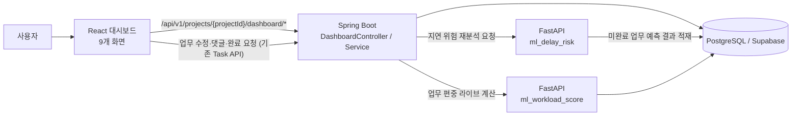
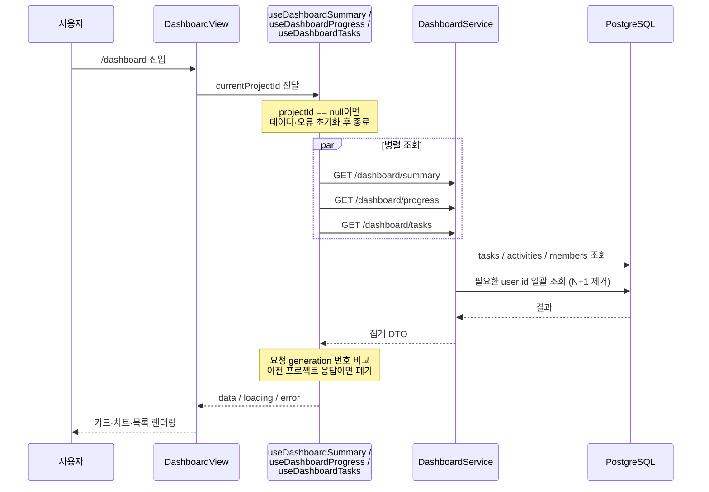
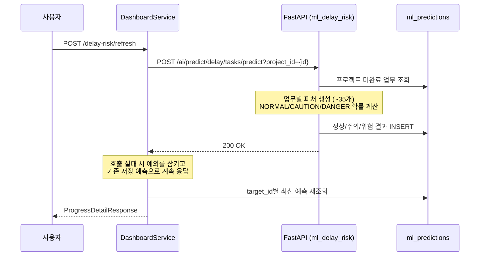
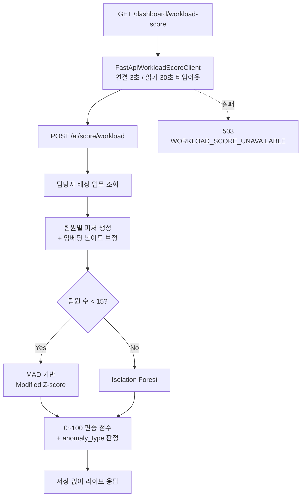

# 4. 대시보드

> 담당: 유소은
> 작성일: 2026-07-27
> 기준 브랜치: `feature/fs3_ml-delay-risk`
> 참고 문서: [dashboard-개발노트_260727.md](dashboard-개발노트_260727.md)

---

## 4.1 개요 및 기술스택

### 4.1.1 기능 개요

대시보드는 프로젝트의 업무 현황을 한 화면에 요약하고, 진행률·블로커·마감 임박 업무·팀원별 업무량·최근 활동을 상세 화면에서 관리하는 **프로젝트 운영 화면**이다. 단순 현황판이 아니라 실제 업무·마일스톤·댓글·활동·알림·완료 승인 흐름과 두 종류의 ML 분석(지연 위험도, 업무 편중 점수)을 연결한다.

| 구현 범위 | 내용 |
|---|---|
| 화면 | 대시보드 홈 1개 + 상세 화면 8개 (총 9개) |
| API | Spring Boot 대시보드 조회·마일스톤 관리 API 10개 |
| 데이터 | PostgreSQL/Supabase의 `tasks`, `milestones`, `activities`, `ml_predictions` 연동 |
| ML | FastAPI 지연 위험도 모델, FastAPI 업무 편중 점수 모델 |
| 권한 | 팀장/팀원 역할에 따른 업무 처리 및 완료 승인 흐름 |
| 공통 모듈 | 대시보드 전용 데이터 훅 5개, 공통 팝업 6종, 날짜·상태·위험도 유틸리티 |
| 테스트 | 프론트엔드(Vitest), Spring(JUnit/MockMvc), FastAPI(pytest) |

### 4.1.2 화면 구성

| 번호 | 경로 | 화면 | 핵심 기능 |
|---:|---|---|---|
| 1 | `/dashboard` | 대시보드 홈 | 핵심 지표, 진행률 차트, 마감 임박, 팀원별 업무량, 최근 활동, 빠른 액션 |
| 2 | `/dashboard/all-tasks` | 전체 업무 관리 | 검색·필터·정렬, 인라인 상태 변경, 상세·댓글, 회의록 AI 업무 확인 |
| 3 | `/dashboard/progress` | 진행률 분석 | 완료율, 이번 주 완료 업무, 팀원·카테고리·마일스톤 분석 |
| 4 | `/dashboard/blockers` | 블로커 관리 | 블로커 심각도·지속시간·지연 위험 분석 및 해결 처리 |
| 5 | `/dashboard/inprogress` | 진행 중 업무 모니터링 | 미업데이트 업무, ML 지연 예상, 완료 요청·블로커 전환 |
| 6 | `/dashboard/dash-progress` | 전체 진행률 | 일정 대비 진행률, 완료 빈도, 카테고리, 마일스톤 관리(생성·수정·삭제·일괄 처리) |
| 7 | `/dashboard/urgent` | 마감 임박 업무 | D-day 그룹, 담당자 필터, 리마인드, 상태·기한·담당자 변경 |
| 8 | `/dashboard/workload` | 팀원별 업무량 | 업무 분배 차트, 완료율, ML 업무 편중 점수, 업무 배정 |
| 9 | `/dashboard/activity` | 최근 활동 | 활동 타임라인, 유형·팀원·검색 필터, 활동 분포 |

### 4.1.3 기술 스택

| 구분 | 사용 기술 (버전) | 역할 |
|---|---|---|
| 프론트엔드 | React 19.2.7, TypeScript 5.9.3, Vite 7.3.6 | 대시보드 9개 화면과 팝업, 상태 관리 |
| UI | Tailwind CSS 4.3.2, Lucide React 0.487.0 | 반응형 레이아웃, 카드·배지·아이콘 |
| 차트 | Recharts 2.15.2, 자체 SVG 차트 | 진행률, 완료 빈도, 팀원별 업무량 시각화 |
| API 서버 | Spring Boot 3.5.16, Java 21 | 집계 API, 권한 검증, 마일스톤, FastAPI 중계 |
| 데이터 | PostgreSQL/Supabase, Spring Data JPA | `tasks`, `milestones`, `activities`, `ml_predictions` 조회 |
| AI/ML 서버 | FastAPI 0.139.0, pandas 2.2.3, scikit-learn 1.6.1, numpy 2.2.6 | 지연 위험도 예측 및 업무 편중 점수 계산 |
| ML 관측 | LangSmith 0.10.2 | 업무 편중 계산 흐름의 요약 트레이싱 |
| 테스트 | Vitest 3.0.5, JUnit/MockMvc, pytest | 프론트·Spring·FastAPI 회귀 검증 |

### 4.1.4 소스 위치

```
App/frontend/src/dashboard/
├─ screen/DashboardView.tsx           # 대시보드 홈
├─ screen/detail/                     # 상세 화면 8개
├─ components/                        # 공통 팝업·차트 6종
└─ libs/
   ├─ hooks/                          # 데이터 훅 5개
   ├─ types/dashboard.ts              # 응답 DTO 타입
   └─ utils/                          # API 클라이언트, 날짜·상태 유틸

App/backend_spring/src/main/java/com/workflowai/dashboard/
├─ controller/DashboardController.java
├─ service/DashboardService.java              # 집계 로직
├─ service/FastApiDashboardClient.java        # 지연 위험도 중계
├─ service/FastApiWorkloadScoreClient.java    # 업무 편중 중계
├─ DTO/ · entity/ · repository/

App/backend_fastapi/
├─ ml_delay_risk/                     # 지연 위험도 예측
└─ ml_workload_score/                 # 업무 편중 점수 계산
```

---

## 4.2 처리 흐름

### 4.2.1 전체 아키텍처



핵심 흐름은 다음 5단계다.

1. 프론트엔드가 현재 프로젝트 ID로 요약·업무·진행률·활동 API를 **병렬 조회**한다.
2. Spring이 업무·마일스톤·활동·최신 ML 예측을 집계해 화면용 DTO로 반환한다.
3. 지연 위험도는 FastAPI가 미완료 업무를 예측해 `ml_predictions`에 **저장**하고 Spring이 최신값을 읽는다.
4. 업무 편중 점수는 FastAPI가 호출 시점마다 계산해 Spring을 거쳐 **저장 없이 그대로** 반환한다.
5. 업무 상태·담당자·마감일·댓글 변경은 대시보드 전용 API가 아니라 **기존 업무 보드 API를 재사용**한다.

### 4.2.2 API 명세

기본 경로: `/api/v1/projects/{projectId}/dashboard`

| Method | 경로 | 기능 | 명시 권한 |
|---|---|---|---|
| GET | `/summary` | 메인 요약 집계 | 로그인 |
| GET | `/tasks` | 대시보드 업무 목록 | 로그인 |
| GET | `/activities` | 최근 활동 최대 50건 | 로그인 |
| GET | `/progress` | 진행률·마일스톤·지연 위험 | 로그인 |
| GET | `/delay-risk/mine` | 로그인 사용자 담당 위험 업무 | 프로젝트 멤버 |
| GET | `/workload-score` | 업무 편중 라이브 계산 | 프로젝트 멤버 |
| POST | `/milestones` | 마일스톤 생성 | 팀장 |
| PATCH | `/milestones/{milestoneId}` | 마일스톤 수정 | 팀장 |
| DELETE | `/milestones/{milestoneId}` | 마일스톤 삭제 | 팀장 |
| POST | `/delay-risk/refresh` | 지연 위험도 재분석 | 로그인 |

모든 API는 전역 `SecurityConfig`에 의해 JWT 로그인이 필요하다. 표의 "프로젝트 멤버 / 팀장" 항목은 컨트롤러에 추가로 선언된 `@PreAuthorize` 메서드 권한이다.

### 4.2.3 화면 진입 흐름 (대시보드 홈)



### 4.2.4 ML 지연 위험도 흐름



**주요 피처**: 업무 상태·우선순위·카테고리, 생성일·수정일·마감일, 연결 마일스톤 완료율, 체크리스트 진행 비율, 댓글 수·고유 작성자 수·마지막 댓글 경과시간, 활동 로그 수·최근 활동량, 현재 상태 체류시간, 경과시간 대비 진행 불균형(imbalance index).

Jira 전용 피처(issuelinks, worklog, reopen 횟수 등) 중 서비스 스키마에 대응 개념이 없는 항목은 학습 시 결측 처리와 동일한 **안전한 기본값**(0 / False / "Unknown" / "unassigned")으로 근사한다.

### 4.2.5 ML 업무 편중 점수 흐름



**이상치 유형 판정**

| 유형 | 조건 |
|---|---|
| 과부하 의심 | 활성 업무가 팀 평균보다 많고(`task_count_active_rel > 1.0`) 완료율이 팀 평균보다 낮음 |
| 배정량 불균형 | 전체 배정량이 팀 평균보다 적고(`task_count_total_rel < 1.0`) 완료율이 팀 평균보다 높음 |
| 이상 패턴(방향 불명확) | 이상치이지만 위 두 조건에 해당하지 않음 |
| 정상 | 이상치가 아님 |

### 4.2.6 데이터 흐름 요약

| 테이블 | 대시보드 사용 내용 |
|---|---|
| `projects` | 프로젝트 생성일, 마감일 (D-day, 예상 진행률 계산) |
| `project_members` | 팀원 목록과 역할 (REVIEWER 제외) |
| `users` | 담당자·행위자 이름 |
| `tasks` | 상태, 담당자, 카테고리, 우선순위, 마감일, 완료일, position |
| `milestones` | 마일스톤 이름, 시작일, 마감일 |
| `task_checklists` | 지연 위험도 진행 비율 피처 |
| `task_comments` | 댓글 표시 및 ML 활동 피처 |
| `activities` | 최근 활동 및 ML 활동 피처 |
| `ml_predictions` | 업무별 지연 위험도 이력 |

관련 마이그레이션: `V20260704_1__activities_message.sql`(활동 메시지·target 인덱스), `V20260722_1__roadmap_planning_dates.sql`(`milestones.start_date`), `V20260727_2__task_done_date.sql`(완료 업무 날짜).

---

## 4.3 핵심 로직 및 구현 코드

### 4.3.1 대시보드 요약 집계와 N+1 제거

`getSummary()`는 프로젝트의 전체 업무를 한 번 읽어 통계·마감 임박·팀원별 업무량·최근 활동을 모두 만들어낸다. 초기 구현은 업무·활동·팀원마다 `UserRepository.findById`를 반복 호출해 Supabase 왕복이 레코드 수만큼 늘어났다. 필요한 user id를 먼저 모아 **한 번의 쿼리**로 이름을 조회하도록 바꿨다.

**`DashboardService.java:94-139`**

```java
// DashboardService.java:94-139 — 대시보드 요약 집계와 N+1 제거
@Transactional(readOnly = true)
public DashboardSummaryResponse getSummary(String projectIdParam) {
    Long projectId = demoDataService.resolveProjectId(projectIdParam);
    List<Task> tasks = taskRepository.findByProjectIdOrderByCreatedAtDesc(projectId);

    long total = tasks.size();
    long done = tasks.stream().filter(t -> STATUS_DONE.equals(t.getStatus())).count();
    long blocked = tasks.stream().filter(t -> STATUS_BLOCKED.equals(t.getStatus())).count();
    long inProgress = tasks.stream().filter(t -> STATUS_INPROGRESS.equals(t.getStatus())).count();
    long progressPercent = total == 0 ? 0 : Math.round(done * 100.0 / total);

    List<Activity> recentActivityRows = activityRepository.findTop10ByProjectIdOrderByCreatedAtDesc(projectId);
    // 팀원 업무 편중도(workload) 화면이므로 심사자는 제외한다(심사자는 업무를 배정받지 않는 평가자).
    List<ProjectMember> members = projectMemberRepository.findAllByProjectId(projectId).stream()
        .filter(member -> member.getRole() != ProjectRole.REVIEWER)
        .toList();

    // 업무마다/활동마다 담당자 이름을 각각 조회하면(N+1) Supabase 왕복이 업무·활동 개수만큼
    // 늘어나 대시보드 로딩이 크게 느려진다(2026-07-27 실측) - 필요한 user id를 모아 한 번에 조회한다.
    Set<Long> userIds = new java.util.HashSet<>();
    tasks.forEach(t -> userIds.add(t.getAssigneeId()));
    recentActivityRows.forEach(a -> userIds.add(a.getActorId()));
    members.forEach(m -> userIds.add(m.getUserId()));
    Map<Long, String> userNames = loadUserNames(userIds);

    List<UpcomingTaskDto> upcoming = tasks.stream()
        .filter(t -> !STATUS_DONE.equals(t.getStatus()))
        .sorted(Comparator.comparing(Task::getDueDate, Comparator.nullsLast(Comparator.naturalOrder())))
        .limit(5)
        .map(t -> new UpcomingTaskDto(...))
        .toList();

    List<WorkloadEntryDto> workload = buildWorkload(members, tasks, userNames);
    ...
}
```

**`DashboardService.java:479-487`**

```java
/** 여러 user id의 이름을 한 번의 쿼리로 조회한다(반복 조회로 인한 N+1 방지). */
private Map<Long, String> loadUserNames(Collection<Long> userIds) {
    List<Long> distinctIds = userIds.stream().filter(Objects::nonNull).distinct().toList();
    if (distinctIds.isEmpty()) {
        return Map.of();
    }
    return userRepository.findAllById(distinctIds).stream()
        .collect(Collectors.toMap(User::getId, u -> Objects.requireNonNullElse(u.getName(), "")));
}
```

동일한 패턴을 `getTasks`, `getActivities`, `getProgressDetail`, `getMyDelayRisks`에 공통 적용하고, 모든 읽기 메서드에 `@Transactional(readOnly = true)`를 붙였다.

또한 담당 업무가 없는 팀원도 0건으로 표시되도록, 프로젝트 멤버를 기준으로 먼저 채우고 멤버 목록에 없는 담당자만 뒤에 덧붙인다.

**`DashboardService.java:315-333`**

```java
private List<WorkloadEntryDto> buildWorkload(List<ProjectMember> members, List<Task> tasks, Map<Long, String> userNames) {
    Map<Long, List<Task>> byAssignee = new LinkedHashMap<>();
    for (Task task : tasks) {
        if (task.getAssigneeId() == null) continue;
        byAssignee.computeIfAbsent(task.getAssigneeId(), k -> new ArrayList<>()).add(task);
    }

    List<WorkloadEntryDto> result = new ArrayList<>();
    for (ProjectMember member : members) {
        Long userId = member.getUserId();
        result.add(toWorkloadEntry(userId, byAssignee.remove(userId), userNames));  // 0건 멤버도 포함
    }
    for (Map.Entry<Long, List<Task>> entry : byAssignee.entrySet()) {
        result.add(toWorkloadEntry(entry.getKey(), entry.getValue(), userNames));
    }
    return result;
}
```

### 4.3.2 지연 위험도 최신 예측 추출

`ml_predictions`는 재분석할 때마다 **행이 누적**되는 이력 테이블이다. 화면에는 업무별 가장 최근 예측 하나만 보여야 하므로, `target_id` 오름차순 + `created_at` 내림차순으로 정렬해 읽은 뒤 각 target의 첫 행만 남긴다.

**`DashboardService.java:408-420`**

```java
/** target_id별로 created_at이 가장 최신인 예측 한 건만 남긴다. */

// DashboardService.java:408-420 — 지연 위험도 최신 예측 추출
private List<MlPrediction> latestPredictionsByTarget(Long projectId) {
    List<MlPrediction> ordered = mlPredictionRepository
        .findByProjectIdAndTargetTypeAndModelTypeOrderByTargetIdAscCreatedAtDesc(
            projectId, TARGET_TYPE_TASK, MODEL_TYPE_DELAY_RISK
        );

    Map<Long, MlPrediction> latestByTarget = new LinkedHashMap<>();
    for (MlPrediction prediction : ordered) {
        latestByTarget.putIfAbsent(prediction.getTargetId(), prediction);  // 첫 행 = 최신
    }
    return new ArrayList<>(latestByTarget.values());
}
```

이후 두 단계로 걸러낸다. **정상 결과는 위험 목록에서 제외**하고, 예측 이후 삭제된 업무의 **고아 예측도 제외**한다.

**`DashboardService.java:180-184`, `430-446`**

```java
// DashboardService.java:180-184, 430-446 — 정상, 삭제된 업무 제외
List<DelayRiskDto> delayRisks = latestPredictions.stream()
    .filter(p -> !RISK_RESULT_NORMAL.equals(p.getResult()))          // 정상 제외
    .map(p -> toDelayRiskDto(p, tasksById.get(p.getTargetId()), userNames))
    .filter(Objects::nonNull)                                        // 삭제된 업무의 예측 제외
    .toList();

private DelayRiskDto toDelayRiskDto(MlPrediction prediction, Task task, Map<Long, String> userNames) {
    if (task == null) {
        // 예측 이후 업무가 삭제된 경우 등 - 더 이상 존재하지 않는 업무는 화면에 표시하지 않는다.
        return null;
    }
    ...
}
```

프론트엔드는 이 계약을 그대로 받아, **완료 업무는 위험도 판정 대상에서 제외**하고 **예측 이력은 있지만 위험 목록에 없는 미완료 업무는 "정상"으로 표시**한다.

**`AllTasksPage.tsx:137-142`**

```typescript
// AllTasksPage.tsx:137-142 — 지연 위험도 예측값 표시 (정상/주의/위험)
const delayRiskLabel = (taskId: string, status: TaskStatus): string | null => {
  if (status === "done") return null; // 완료된 업무는 지연 위험도 분석 대상이 아님
  const result = delayRiskByTaskId.get(taskId);
  if (result) return result;
  return progress?.hasPredictions ? "정상" : null;
};
```

### 4.3.3 FastAPI 연동 — 실패 정책의 분리

두 ML 모델은 **저장 방식이 다르기 때문에 실패 정책도 다르다.**

- **지연 위험도**: `ml_predictions`에 결과가 남으므로 되돌아갈 마지막 값이 있다 → 실패를 삼키고 기존 예측으로 계속 서비스한다.
- **업무 편중**: 라이브 계산이라 캐시가 없다 → 실패를 숨기지 않고 503으로 명시한다.

**`DashboardService.java:295-313`**

```java
/** FastAPI에 재예측을 요청한 뒤(베스트-에포트) 최신 진행률 상세를 반환한다. */
// 지연 위험도
public ProgressDetailResponse refreshDelayRiskAndGetProgress(String projectIdParam) {
    Long projectId = demoDataService.resolveProjectId(projectIdParam);
    try {
        fastApiDashboardClient.refreshDelayRisk(projectId);
    } catch (Exception e) {
        // FastAPI가 내려가 있어도 대시보드 자체는 계속 떠야 하므로, 여기서 예외를 삼키고
        // ml_predictions에 이미 저장돼 있던 마지막 예측 결과로 계속 진행한다.
        log.warn("지연 위험도 재예측 요청 실패 (project_id={}): {}", projectId, e.getMessage());
    }
    return getProgressDetail(projectIdParam);
}
```

**`DashboardController.java:91-102`**

```java
@GetMapping("/workload-score")
@PreAuthorize("@projectAccess.isMember(#projectId)")
public ResponseEntity<ApiResponse<WorkloadScoreResponseDto>> getWorkloadScore(@PathVariable String projectId) {
    try {
        return ResponseEntity.ok(ApiResponse.ok(dashboardService.getWorkloadScore(projectId)));
    } catch (Exception ex) {
        return ResponseEntity.status(HttpStatus.SERVICE_UNAVAILABLE)
            .body(ApiResponse.fail("WORKLOAD_SCORE_UNAVAILABLE", "업무 편중 점수를 조회하지 못했습니다."));
    }
}
```

편중 점수 클라이언트는 무한 대기를 막기 위해 **연결 3초 / 읽기 30초** 타임아웃을 명시한다.

**`FastApiWorkloadScoreClient.java:13-32`**

```java
public class FastApiWorkloadScoreClient {
    private static final Duration CONNECT_TIMEOUT = Duration.ofSeconds(3);
    private static final Duration READ_TIMEOUT = Duration.ofSeconds(30);

    public FastApiWorkloadScoreClient(@Value("${workflow.ai.base-url}") String baseUrl) {
        // JDK HttpClient는 plaintext(http://) 대상에도 기본적으로 HTTP/2(h2c) 업그레이드를 시도하는데,
        // uvicorn(FastAPI)이 이를 지원하지 않아 요청이 깨진다. HTTP/1.1을 명시해 우회한다.
        HttpClient httpClient = HttpClient.newBuilder()
            .version(HttpClient.Version.HTTP_1_1)
            .connectTimeout(CONNECT_TIMEOUT)
            .build();
        JdkClientHttpRequestFactory requestFactory = new JdkClientHttpRequestFactory(httpClient);
        requestFactory.setReadTimeout(READ_TIMEOUT);
        this.restClient = RestClient.builder().baseUrl(baseUrl).requestFactory(requestFactory).build();
    }
}
```

### 4.3.4 프론트엔드 데이터 훅 — 세대 번호와 Promise 반환

대시보드 훅 5개(`useDashboardSummary`, `useDashboardTasks`, `useDashboardProgress`, `useDashboardActivities`, `useWorkloadScore`)는 동일한 3가지 규칙을 공유한다.

1. **첫 로드 이후 재조회에서는 `loading`을 올리지 않는다** → 화면이 통째로 "불러오는 중"으로 비워지지 않고 바뀐 항목만 리렌더된다.
2. **요청 generation 번호로 stale response를 폐기한다** → 프로젝트를 전환한 뒤 도착한 이전 프로젝트 응답이 최신 상태를 덮어쓰지 않는다.
3. **`refetch`는 반드시 Promise를 반환한다** → 호출 화면이 `await refetch()`로 완료 시점을 기다릴 수 있다.

**`useDashboardTasks.ts:5-53`**

```typescript

// useDashboardTasks.ts:5-53 - 프론트엔드 데이터 훅 — 세대 번호와 Promise 반환
export function useDashboardTasks(projectId: string | number | null | undefined) {
  const [data, setData] = useState<DashboardTaskDto[]>([]);
  const [loading, setLoading] = useState(true);
  const [error, setError] = useState<string | null>(null);
  // 최초 로드 이후의 refetch(데이터 변경 감지, 액션 후 새로고침 등)에서는 loading을 true로 만들지 않는다 —
  // 그러면 화면이 통째로 "불러오는 중"으로 비워지지 않고, 새 데이터가 도착했을 때 바뀐 항목만 리렌더된다.
  const hasLoadedRef = useRef(false);
  useEffect(() => { hasLoadedRef.current = false; }, [projectId]);

  // 요청 세대(generation) 번호 - 응답이 도착했을 때 이 값이 요청 시점과 다르면(그사이
  // projectId가 바뀌어 refetch가 다시 호출됨) 이전 프로젝트의 응답으로 최신 상태를
  // 덮어쓰지 않도록 무시한다. 이전 구현은 cleanup 함수(() => void)를 반환해서,
  // 호출부에서 `await refetch()`를 해도 실제 fetch 완료를 기다리지 못하고 즉시
  // 통과해버리는 문제도 있었다 — 그래서 취소는 cleanup이 아니라 세대 번호 비교로
  // 처리하고,
  const generationRef = useRef(0);

  // refetch 자체는 반드시 Promise를 반환한다.
  const refetch = useCallback(async (): Promise<void> => {
    const generation = ++generationRef.current;
    if (projectId == null) {
      setData([]); setLoading(false); setError(null);
      return;
    }
    if (!hasLoadedRef.current) setLoading(true);
    setError(null);
    try {
      const result = await fetchDashboardTasks(projectId);
      if (generation !== generationRef.current) return;   // stale 응답 폐기
      setData(result);
    } catch (err) {
      if (generation !== generationRef.current) return;
      setError((err as Error).message);
    } finally {
      if (generation === generationRef.current) {
        hasLoadedRef.current = true;
        setLoading(false);
      }
    }
  }, [projectId]);

  useEffect(() => { refetch(); }, [refetch]);
  return { data, loading, error, refetch };
}
```

### 4.3.5 조용한 자동 새로고침 (전체 업무 관리)

여러 팀원이 동시에 업무를 수정하는 화면이라 다른 사용자의 변경을 반영해야 하지만, 15초마다 화면을 다시 그리면 스크롤·선택 상태가 흔들린다. 그래서 **주기적으로 최신 데이터를 조용히 가져와 시그니처를 비교하고, 실제로 달라졌을 때만 `refetch()`**를 호출한다.

**`AllTasksPage.tsx:105-123`**

```typescript
// 목록 화면을 깜빡이며 새로고침하지 않도록, 주기적으로 조용히 최신 데이터를 가져와
// 실제로 달라졌을 때만 refetch()로 화면을 갱신한다.

// AllTasksPage.tsx:105-123 - 조용한 자동 새로고침 (전체 업무 관리)
const tasksSignatureRef = useRef<string>("");
useEffect(() => {
  tasksSignatureRef.current = tasks.map(t => `${t.id}:${t.status}:${t.updatedAt}`).join("|");
}, [tasks]);

useEffect(() => {
  if (currentProjectId == null) return;
  const interval = setInterval(() => {
    fetchDashboardTasks(currentProjectId)
      .then(fresh => {
        const freshSignature = fresh.map(t => `${t.id}:${t.status}:${t.updatedAt}`).join("|");
        if (freshSignature !== tasksSignatureRef.current) refetch();
      })
      .catch(() => {});
  }, AUTO_REFRESH_INTERVAL_MS);   // 15000ms
  return () => clearInterval(interval);
}, [currentProjectId, refetch]);
```

### 4.3.6 인라인 상태 변경 시 position 재계산

블로커/진행 중/마감 임박 화면의 "해결 완료", "완료 처리", "블로커 전환" 버튼은 칸반 보드를 거치지 않고 상태를 바꾼다. 이때 원래 컬럼의 `position` 값을 그대로 넘기면 대상 컬럼의 기존 카드와 값이 겹칠 수 있어, 보드 드래그앤드롭과 **동일한 규칙**("마지막 카드 position + 1")으로 새로 계산한다.

**`dashboardTaskUtils.ts:158-166`**

```typescript
/** targetStatus 컬럼(상태)의 맨 끝에 이어붙일 position 값을 계산한다.
 * 보드의 reorderTasks()/computeInsertPosition()과 동일한 "마지막 카드 position + 1" 규칙을
 * 쓴다 — 대시보드 화면의 빠른 상태 변경 버튼이 원래 있던 컬럼의 position을 그대로 들고 가면
 * 대상 컬럼의 기존 카드와 값이 겹칠 수 있어, 항상 대상 컬럼 끝에 배치되도록 새로 계산한다. */
export function nextPositionForStatus(tasks: DashboardTaskDto[], status: string): number {
  const columnTasks = tasks.filter(task => normalizeTaskStatus(task.status) === status);
  if (columnTasks.length === 0) return 0;
  return Math.max(...columnTasks.map(task => task.position)) + 1;
}
```

### 4.3.7 KST 기준 날짜 처리

백엔드 JVM은 `Asia/Seoul`로 고정되어 있지만, `LocalDateTime` 문자열에는 오프셋이 없다. 브라우저에서 `new Date(...)`로 그대로 파싱하면 **보는 사람의 로컬 타임존**으로 해석돼 완료일·경과일이 하루씩 틀어진다. 오프셋이 없는 문자열에는 `+09:00`을 명시로 붙인다.

**`dashboardTaskUtils.ts:76-124`**

```typescript
/** 백엔드가 내려주는 LocalDateTime 문자열(예: "2026-07-24T10:15:30")은 오프셋이 없어,
 * `new Date(...)`로 그대로 파싱하면 보는 사람 브라우저의 로컬 타임존으로 해석돼버린다.
 * 백엔드 JVM은 Asia/Seoul(KST, UTC+9)로 고정되어 있으므로, 오프셋이 없는 문자열에는
 * "+09:00"을 명시로 붙여 브라우저 타임존과 무관하게 항상 정확한 시각으로 파싱한다. */
export function parseKstDateTime(dateStr: string): Date {
  if (/^\d{4}-\d{2}-\d{2}$/.test(dateStr)) {
    return new Date(`${dateStr}T00:00:00+09:00`);      // 날짜-only → KST 자정
  }
  const hasOffset = /[Zz]|[+-]\d{2}:?\d{2}$/.test(dateStr);
  return new Date(hasOffset ? dateStr : `${dateStr}+09:00`);
}

/** ISO 날짜/일시 문자열부터 지금까지 경과한 시간을 "일" 단위로 내림 계산한다.
 * 캘린더 날짜 경계가 아니라 실제 경과 시간 기준(체류시간 근사 — 백엔드 ML 피처
 * hours_in_current_status와 동일한 방식)이라 "3일 이상"류 임계값 판정에 적합하다. */
export function daysSince(dateStr: string | null | undefined): number | null {
  if (!dateStr) return null;
  const past = parseKstDateTime(dateStr);
  if (Number.isNaN(past.getTime())) return null;
  return Math.max(0, Math.floor((Date.now() - past.getTime()) / 86400000));
}

/** "오늘"/"어제"/"n일 전"(30일 이상이면 MM.DD) — 캘린더 날짜 경계 기준 상대 날짜 표기.
 * daysSince와 달리 사람이 읽는 라벨이라 자정 기준으로 날짜를 비교한다. */
export function formatRelativeDate(dateStr: string | null | undefined): string { ... }
```

`daysSince`(경과 시간 기준)와 `formatRelativeDate`(캘린더 경계 기준)를 **의도적으로 분리**한 것이 핵심이다. 전자는 "3일 이상 미업데이트" 같은 임계값 판정에, 후자는 사람이 읽는 라벨에 쓴다.

### 4.3.8 마일스톤 일괄 처리 — 부분 실패 허용

마일스톤 일괄 수정/삭제는 요청을 개별적으로 보내므로 일부만 실패할 수 있다. `Promise.allSettled`로 전부 기다린 뒤, **성공분은 이미 서버에 반영됐으므로 먼저 화면을 최신화**하고 실패 건만 재시도할 수 있도록 편집 모드를 유지한다.

**`DashProgressPage.tsx:329-360`**

```typescript
const submitBulkDelete = async () => {
  ...
  const ids = Array.from(bulkSelectedIds);
  const results = await Promise.allSettled(ids.map(id => deleteMilestone(currentProjectId, id)));
  const failedIds = ids.filter((_, index) => results[index].status === "rejected");
  // 일부만 실패해도 성공한 나머지는 이미 삭제됐으므로, 우선 화면을 최신 상태로 맞춘다.
  // refetch 자체가 실패하더라도 로딩 표시가 고착되지 않도록 finally로 반드시 해제한다.
  setMilestoneRefreshing(true);
  try {
    await refetch();
  } finally {
    setMilestoneRefreshing(false);
  }
  if (failedIds.length > 0) {
    setBulkSelectedIds(new Set(failedIds));   // 실패 건만 선택 상태로 남겨 재시도 가능
    setBulkError(`${ids.length}개 중 ${failedIds.length}개 삭제에 실패했습니다. 다시 시도해주세요.`);
  } else {
    exitBulkEditMode();
  }
};
```

서버 측에서는 마일스톤 삭제 시 **연결 업무를 삭제하지 않고 일정 미정으로 이동**시킨다.

**`DashboardService.java:276-293`**

```java
/** 마일스톤 연결 업무를 일정 미정으로 옮긴 뒤 삭제하고, 팀 전체에 알린다. */
@Transactional
public void deleteMilestone(String projectIdParam, Long milestoneId) {
    ...
    taskRepository.clearMilestoneId(projectId, milestoneId);   // 업무는 보존, 연결만 해제
    milestoneRepository.delete(milestone);

    String content = "'" + title + "' 마일스톤이 삭제되었습니다.";
    projectMemberRepository.findAllByProjectId(projectId).stream()
        .map(ProjectMember::getUserId)
        .forEach(memberId -> notificationService.notify(
            memberId, "MILESTONE_DELETED", "마일스톤이 삭제되었습니다.", content, "milestone", null
        ));
}
```

마일스톤 **수정**은 값이 실제로 바뀐 경우에만 알림을 보내고, 변경 전/후 값을 문구에 담는다.

**`DashboardService.java:251-268`**

```java
List<String> changes = new ArrayList<>();
if (!Objects.equals(titleBefore, saved.getTitle())) {
    changes.add("이름이 '" + saved.getTitle() + "'(으)로");
}
if (!Objects.equals(startDateBefore, saved.getStartDate())) {
    changes.add("시작일이 " + (saved.getStartDate() == null ? "미정" : saved.getStartDate() + "일") + "(으)로");
}
if (!Objects.equals(dueDateBefore, saved.getDueDate())) {
    changes.add("마감일이 " + (saved.getDueDate() == null ? "미정" : saved.getDueDate() + "일") + "(으)로");
}
if (!changes.isEmpty()) {   // 실제 변경이 있을 때만 알림
    String content = "마일스톤 '" + titleBefore + "'의 " + String.join(", ", changes) + " 변경되었습니다.";
    ...
}
```

### 4.3.9 지연 위험도 피처 근사 (FastAPI)

`delay_model`은 Jira 기반 가상 데이터셋으로 학습됐고, 운영 스키마(`tasks`/`milestones`/`task_checklists`)의 값을 그 피처 계약(약 35개 키)에 맞춰 근사한다.

**`ml_delay_risk/services/delay_service.py:132-173`**

```python
elapsed_hours = _hours_between(created_at, now)
hours_in_current_status = _hours_between(updated_at, now) if pd.notna(updated_at) else elapsed_hours
blocked_hours = hours_in_current_status if is_blocked_status(status_at_cutoff) else 0.0

due_date = task_row.get("due_date")
milestone_due_date = task_row.get("milestone_due_date")
deadline = due_date if pd.notna(due_date) else milestone_due_date if pd.notna(milestone_due_date) else None

if deadline is not None and pd.notna(created_at):
    proxy_deadline_hours = _hours_between(created_at, deadline)
    if proxy_deadline_hours <= 0:
        proxy_deadline_hours = proxy_deadline_lookup(category, priority)
else:
    proxy_deadline_hours = proxy_deadline_lookup(category, priority)

progress_ratio = checklist_done / checklist_total if checklist_total > 0 else None
elapsed_ratio = elapsed_hours / proxy_deadline_hours if proxy_deadline_hours > 0 else 0.0
imbalance_index = (elapsed_ratio - progress_ratio) if progress_ratio is not None else None

# <실제 Supabase 데이터로 계산 — task_comments/activities>
# 이 두 피처는 예전에는 대응 테이블이 없어 0으로만 채웠지만, task_comments(댓글)와
# activities(업무 변경 로그)가 실제로 존재하므로 cutoff(now) 이전 데이터만 걸러서 계산한다.
comments_before_cutoff = _rows_before_cutoff(comments, now)
num_comments_before_cutoff = len(comments_before_cutoff)
```

핵심은 `imbalance_index`(경과 비율 − 진행 비율)다. "시간은 많이 지났는데 체크리스트 진행은 안 된" 업무를 잡아내는 신호다.

예측 실행은 **미완료 업무만** 대상으로 하고, 업무마다 DB를 조회하지 않도록 댓글·활동을 프로젝트 단위로 일괄 조회한다.

**`ml_delay_risk/services/delay_service.py:264-298`**

```python
def run_delay_risk_for_project(project_id: int) -> list[dict[str, Any]]:
    """프로젝트의 미완료 업무 전체에 대해 예측을 실행하고 ml_predictions에 적재한 뒤 결과를 반환."""
    engine = get_engine()
    tasks_df = load_tasks_for_project(project_id, engine=engine)
    if tasks_df.empty:
        return []

    pending_df = tasks_df[tasks_df["status"] != "done"]   # 완료 업무 제외
    if pending_df.empty:
        return []

    now = datetime.utcnow()
    milestone_completion = _milestone_completion_map(tasks_df)

    # 업무마다 DB를 따로 조회하지 않도록, 프로젝트 전체 댓글/활동 로그를 한 번에 읽어서
    # task_id별로 미리 나눠둔다.
    comments_by_task = _group_by_task_id(load_task_comments_for_project(project_id, engine=engine))
    activities_by_task = _group_by_task_id(load_task_activities_for_project(project_id, engine=engine))

    predictions = [
        predict_for_task_row(row, now=now, milestone_completion=milestone_completion,
                             comments=comments_by_task.get(int(row["task_id"])),
                             activities=activities_by_task.get(int(row["task_id"])))
        for _, row in pending_df.iterrows()
    ]

    insert_predictions(project_id, predictions, engine=engine)
    return predictions
```

### 4.3.10 업무 편중 이상치 탐지 (FastAPI)

팀 규모에 따라 탐지 알고리즘을 자동 선택한다. 캡스톤 팀 규모(5~9명)에서는 Isolation Forest가 트리 분할 불안정으로 극단값을 놓치는 사례가 실제로 확인돼, **소규모 팀은 MAD 기반 Modified Z-score**로 처리한다.

**`ml_workload_score/app/services/workload_model.py:357-378`**

```python
@traceable(
    run_type="tool",
    name="detect_overload_anomalies_auto",
    process_inputs=_summarize_detect_overload_inputs,     # 원문 대신 요약만 LangSmith로
    process_outputs=_summarize_detect_overload_outputs,
)
def detect_overload_anomalies_auto(feature_df: pd.DataFrame, small_team_threshold: int = 15) -> pd.DataFrame:
    """
    팀 규모에 따라 자동으로 방법을 선택.
    - 팀원 수 < 15: MAD 기반 (표본 적을 때 안정적)
    - 팀원 수 >= 15: Isolation Forest (표본 충분할 때 비선형 패턴 포착 가능)
    실제 캡스톤 팀(5~9명) 기준으로는 항상 MAD 경로를 타게 됨.
    """
    n = len(feature_df)
    if n < small_team_threshold:
        method = "MAD (소규모 팀)"
        result = detect_overload_anomalies_robust(feature_df)
    else:
        method = "Isolation Forest (대규모)"
        result = detect_overload_anomalies(feature_df)
    result.attrs["method_used"] = method
    return result
```

**`ml_workload_score/app/services/workload_model.py:282-334`**

```python
def detect_overload_anomalies_robust(feature_df: pd.DataFrame, z_threshold: float = 3.5) -> pd.DataFrame:
    """MAD(Median Absolute Deviation) 기반 Modified Z-score 이상치 탐지.
    z_threshold: Iglewicz & Hoaglin(1993) 권장 기준값 3.5"""
    X = feature_df[FEATURE_COLUMNS].fillna(0).values
    median = np.median(X, axis=0)
    mad = np.median(np.abs(X - median), axis=0)

    # MAD가 0이면(값들이 중앙값에 몰려있으면) 아주 작은 차이도 z-score가 폭발함.
    # → 표준편차로 폴백. 표준편차마저 0(완전히 동일한 값)이면 그 피처는 변별력이 없으므로
    #   판단에서 제외(가중치 0) 처리.
    std = X.std(axis=0)
    denom = np.where(mad > 0, mad / 0.6745, np.where(std > 0, std, np.inf))

    modified_z = (X - median) / denom
    # 여러 피처의 이상치 정도를 하나의 거리값으로 합산 (Euclidean of z-scores)
    combined_distance = np.sqrt((modified_z ** 2).sum(axis=1))

    result = feature_df.copy()
    result["is_anomaly"] = combined_distance > z_threshold
    max_d = combined_distance.max()
    result["overload_score_0_100"] = 100 * combined_distance / max_d if max_d > 0 else 0.0

    team_mean_completion = feature_df["completion_rate"].mean()

    def tag_direction(row):
        if not row["is_anomaly"]:
            return "정상"
        if row["task_count_active_rel"] > 1.0 and row["completion_rate"] < team_mean_completion:
            return "과부하 의심"
        # "배정량 불균형"은 "진행중 업무가 적음"(task_count_active_rel)이 아니라 "애초에
        # 배정받은 업무 자체가 팀 평균보다 적음"(task_count_total_rel)으로 판단한다. 전자로
        # 판단하면 배정된 일을 전부 끝낸 사람(진행중 업무=0)도 무조건 걸리는 문제가 있었다.
        elif row["task_count_total_rel"] < 1.0 and row["completion_rate"] > team_mean_completion:
            return "배정량 불균형"
        return "이상 패턴(방향 불명확)"

    result["anomaly_type"] = result.apply(tag_direction, axis=1)
    result.attrs["team_mean_completion"] = float(team_mean_completion)
    return result
```

LangSmith 트레이싱은 `@traceable`의 `process_inputs`/`process_outputs`로 **요약값만 기록**한다. 원문 업무 데이터와 임베딩 원문은 남기지 않고, 프로젝트 ID·인원 수·이상치 수·최고 점수만 기록한다. API 키가 없으면 트레이싱이 비활성화된다.

### 4.3.11 프론트엔드 판정 로직 — ML 결과만 신뢰

`isAnomaly`는 과부하와 배정량 불균형을 **모두 true로 묶어서** 주기 때문에, 그대로 쓰면 잘못된 라벨이 붙는다. 또한 ML 호출 실패 시 휴리스틱으로 조용히 대체하면 "N명 과부하"라는 카운트는 뜨는데 팀원 이름은 "데이터 없음"으로 나오는 모순이 생긴다.

**`WorkloadPage.tsx:105-135`**

```typescript
// "과부하 위험" 판정은 ml_workload_score(FastAPI)의 실제 이상치 탐지 결과만 신뢰한다.
// 점수를 못 불러왔을 때 휴리스틱으로 조용히 대체하면, "N명 과부하"라고 카운트/배지는 뜨는데
// AI 추천 액션이나 최고 위험 팀원 이름은 "데이터 없음"이라고 나오는 모순이 생긴다(실제 발생 사례).
const workloadScoreByAssignee = new Map<string, WorkloadScoreMemberDto>(
  (workloadScore?.members ?? []).map(member => [member.assigneeId, member])
);
// isAnomaly는 과부하/저활동 이상치를 모두 true로 묶어서 주기 때문에, 그대로 쓰면
// "저활동 의심" 팀원까지 "과부하 위험"으로 잘못 표시된다 — anomalyType으로 과부하만 걸러낸다.
const isMemberOverloaded = (member: (typeof workload)[number]) =>
  workloadScoreByAssignee.get(member.assigneeId)?.anomalyType === "과부하 의심";
const overloaded = workload.filter(isMemberOverloaded);

// "과부하 위험" 카드의 서브텍스트용 - overloadScore(AI 편중 점수)는 과부하/저활동 모두 높게 나오므로,
// 반드시 anomalyType이 "과부하 의심"인 사람 중에서만 골라야 저활동 팀원 이름이 잘못 뜨지 않는다.
const topOverloadedMember = overloadedByMl.reduce<WorkloadScoreMemberDto | null>(
  (top, member) => (!top || member.overloadScore > top.overloadScore ? member : top), null
);
```

조회에 실패하면 "0명"이 아니라 `...명`으로 표시해 **실패를 실패로** 드러낸다.

**`WorkloadPage.tsx:184-187`**

```tsx
<StatCard
  label="과부하 위험"
  value={summaryLoading || pageRefreshing ? "..." : workloadScoreError ? "...명" : `${overloaded.length}명`}
/>
```

### 4.3.12 권한 및 업무 처리 흐름

| 역할 | 가능한 작업 |
|---|---|
| 팀장 | 업무 생성, 상태 직접 변경·완료 처리, 마감일·담당자 변경, 업무 배정, 마일스톤 생성·수정·삭제, 블로커 해결 처리 |
| 팀원 | 대시보드 조회, 내 업무 목록 조회, 본인 담당 업무의 완료 승인 요청, 본인 담당 업무의 블로커 전환, 댓글 작성 |

- 모든 서버 API는 JWT 인증이 필요하다.
- 프로젝트 멤버십과 팀장 권한은 Spring `@PreAuthorize`로 검증한다 (`@projectAccess.isMember`, `@projectAccess.hasRole(#projectId, 'LEADER')`).
- 프론트엔드 버튼 노출과 서버 권한을 함께 적용한다.
- 업무 생성·수정·상태 변경은 대시보드 전용 API가 아니라 **기존 Task API를 재사용**한다.

---

## 4.4 구현 화면 및 트러블슈팅

### 4.4.1 구현 화면

#### (1) 대시보드 홈 — `/dashboard`


프로젝트 전체 현황의 진입 화면. 전체 업무·완료율·블로커·진행 중 업무 카드, 프로젝트 기간 기준 누적 완료 진행률 차트, 마감일이 빠른 미완료 업무 최대 5건, 팀원별 업무량 막대 차트, 최근 활동 5건을 배치했다. 각 카드를 클릭하면 대응하는 상세 화면으로 이동한다. 팀장에게는 "업무 추가", 일반 팀원에게는 "내 업무 조회" 빠른 액션을 제공하며, 내 업무 조회 팝업은 현재 로그인 사용자에게 배정된 업무만 표시한다.

#### (2) 전체 업무 관리 — `/dashboard/all-tasks`


ID·업무명·카테고리·담당자·상태·우선순위·지연 위험도·마감일·출처별 검색, 상태 필터, 5종 정렬을 지원한다. 회의록 AI가 생성한 대기 업무는 별도 배너와 전용 필터로 구분하고, 15초 간격 조용한 자동 새로고침으로 다른 사용자의 변경을 반영한다.

#### (3) 진행률 분석 — `/dashboard/progress`


전체 완료율·완료 업무 수·목표 완료율·프로젝트 D-day, 이번 주 완료 업무 목록, 팀원별 완료율, 카테고리별 완료 현황, 마일스톤 일정 타임라인(간트 차트)을 제공한다. 마일스톤 바에 호버하면 제목·ID·시작일·마감일 툴팁이 뜬다.

#### (4) 블로커 관리 — `/dashboard/blockers`


현재 블로커 수, 높은 심각도 수, 위험 업무 평균 지연일을 요약하고, 지속시간·심각도·지연 위험도·마감일 등 7종 정렬을 지원한다. 블로커 해결 완료 처리, 마감일 조정, 댓글 작성이 화면 내에서 가능하다.

#### (5) 진행 중 업무 모니터링 — `/dashboard/inprogress`


진행 중 업무 수, **3일 이상 업데이트가 없는 업무 수**, ML 주의·위험 단계 업무 수, 프로젝트 D-day를 표시한다. 팀장은 직접 완료 처리하고, 팀원은 본인 담당 업무의 완료 승인을 팀장에게 요청한다.

#### (6) 전체 진행률 — `/dashboard/dash-progress`


실제 완료율과 **프로젝트 시작일·마감일 기반 계획상 예상 진행률**을 대비해 보여준다. 누적 완료 업무량 차트, 날짜별·팀원별 완료 업무량 스택 차트, 카테고리별 진행률과 지연 위험 비율, 마일스톤별 완료율을 제공하며, 팀장은 마일스톤 생성·수정·삭제와 일괄 수정·일괄 삭제를 수행할 수 있다.

#### (7) 마감 임박 업무 — `/dashboard/urgent`


이미 지연 / 오늘 마감 / 3일 이내 / 7일 이내로 그룹화하고, 15개 단위로 점진 표시한다. 담당자에게 리마인드 알림을 전송할 수 있고, 팀장은 담당자 변경과 마감일 조정이 가능하다.

#### (8) 팀원별 업무량 — `/dashboard/workload`


심사자(REVIEWER)를 제외한 프로젝트 구성원 기준으로 팀원 수와 1인 평균 업무량을 계산한다. 완료·진행 중·대기·블로커 스택 막대 차트, 팀원별 완료율 비교, **ML 업무 편중 점수(0~100)와 이상치 유형 배지**를 표시하고, 팀원 카드를 클릭하면 해당 팀원의 업무 목록 팝업이 열린다.

#### (9) 최근 활동 — `/dashboard/activity`


최근 활동 최대 50건을 타임라인으로 보여주고, 오늘 활동·최근 7일 활동·업무 활동·체크리스트 활동을 통계로 요약한다. 활동 유형(업무 생성/상태 변경/담당자 변경/수정/삭제/체크리스트) 필터, 팀원 필터, 메시지 검색을 지원한다.

---

### 4.4.2 트러블슈팅

#### TS-1. 수동 새로고침 버튼이 화면에 반영되지 않음

| 항목 | 내용 |
|---|---|
| 증상 | 새로고침 버튼을 눌러도 스피너만 잠깐 돌고 데이터가 그대로였다. |
| 원인 | 데이터 훅의 `refetch`가 `useEffect` 내부 함수를 그대로 반환해 **Promise가 아닌 cleanup 함수(`() => void`)** 를 돌려주고 있었다. 호출부에서 `await refetch()`를 해도 실제 fetch 완료를 기다리지 못하고 즉시 통과했다. |
| 해결 | `refetch`가 항상 Promise를 반환하도록 재작성하고, 요청 취소는 cleanup이 아니라 **generation 번호 비교**로 처리했다. → [4.3.4](#434-프론트엔드-데이터-훅--세대-번호와-promise-반환) |
| 검증 | `useDashboardTasks.test.ts` 회귀 테스트 추가 |
| 커밋 | `c76051b` |

#### TS-2. 프로젝트 전환 시 이전 프로젝트 데이터가 덮어씀

| 항목 | 내용 |
|---|---|
| 증상 | 프로젝트를 빠르게 전환하면 이전 프로젝트의 업무 목록이 잠깐 표시되거나 그대로 남았다. |
| 원인 | 이전 요청의 응답이 나중에 도착하면(stale response) 최신 프로젝트 상태를 덮어썼다. |
| 해결 | 훅마다 `generationRef`를 두고 요청 시 증가시킨 뒤, 응답 도착 시점의 값이 다르면 `setData`/`setError`를 건너뛴다. 5개 훅에 공통 적용했다. |
| 커밋 | `c76051b` |

#### TS-3. 인라인 상태 변경 시 칸반 position 충돌

| 항목 | 내용 |
|---|---|
| 증상 | 대시보드에서 "해결 완료"/"완료 처리"/"블로커 전환"을 누른 업무가 보드에서 엉뚱한 순서에 끼어들었다. |
| 원인 | 원래 있던 컬럼의 `position` 값을 그대로 넘겨, 대상 컬럼(예: `done`)의 기존 카드와 값이 겹쳤다. |
| 해결 | `nextPositionForStatus()`를 추가해 항상 대상 컬럼 맨 끝(`max(position) + 1`)에 이어붙이도록 수정. 보드 드래그앤드롭의 `computeInsertPosition()`과 **동일한 규칙**을 사용한다. → [4.3.6](#436-인라인-상태-변경-시-position-재계산) |
| 검증 | `dashboardTaskUtils.test.ts` |
| 커밋 | `179a592` |

#### TS-4. 대시보드 로딩 지연 (N+1 조회)

| 항목 | 내용 |
|---|---|
| 증상 | 업무·활동이 늘어날수록 대시보드 첫 로딩이 눈에 띄게 느려졌다(2026-07-27 실측). |
| 원인 | 업무마다·활동마다·팀원마다 `UserRepository.findById`를 호출해 Supabase 왕복이 레코드 개수만큼 발생했다. |
| 해결 | 필요한 `assigneeId`/`actorId`/`member userId`를 먼저 수집 → null·중복 제거 → `findAllById`로 **한 번에 조회**. `summary`, `tasks`, `activities`, `progress`, `delay-risk/mine`에 공통 적용하고 읽기 메서드에 `@Transactional(readOnly = true)`를 붙였다. → [4.3.1](#431-대시보드-요약-집계와-n1-제거) |
| 커밋 | `acdd843` |

#### TS-5. 업무를 전부 완료한 팀원이 "저활동 의심"으로 오탐

| 항목 | 내용 |
|---|---|
| 증상 | 배정된 업무 12건을 **전부 완료**해 진행 중 업무가 0인 팀원이 "저활동 의심"으로 표시됐다. |
| 원인 | 저활동 여부를 **진행 중 업무 비율**(`task_count_active_rel`)로 판단해, 배정받은 일을 다 끝낸 사람도 진행 중 업무가 0이 되어 무조건 걸리는 구조적 문제가 있었다. |
| 해결 | 판정 기준을 `task_count_active_rel` → **`task_count_total_rel`(전체 배정 업무 비율)** 로 변경했다. "애초에 배정량 자체가 팀 평균보다 적은가"로 봐야 완료 여부와 무관하게 정확히 판정된다. 라벨도 태만을 단정하는 "저활동 의심" → 중립적 관찰 사실만 전달하는 **"배정량 불균형"** 으로 변경했다. FastAPI → Spring → Frontend 전 계층에 `task_count_total_rel` 필드를 추가했다. |
| 검증 | `test_workload_model_anomaly_direction.py` — 배정량이 팀 평균과 같으면(rel=1.0) 진행 중 업무가 0이어도 걸리지 않음을 검증 |
| 커밋 | `aee8aad` |

#### TS-6. 저활동 팀원이 "과부하 위험"으로 표시

| 항목 | 내용 |
|---|---|
| 증상 | 업무량이 적은 팀원에게 "과부하 위험" 배지가 붙고, "과부하 위험" 카드의 서브텍스트에도 그 팀원 이름이 떴다. |
| 원인 | `isAnomaly`는 과부하/저활동 이상치를 **모두 true로 묶어서** 주는데 이 값만으로 과부하를 판정했다. 서브텍스트 역시 `overloadScore` 최고점자를 골랐는데, 이 점수는 저활동 이상치에서도 높게 나온다. |
| 해결 | 과부하 판정과 최고 위험 팀원 선정 모두 `anomalyType === "과부하 의심"` 으로 먼저 필터링하도록 수정했다. → [4.3.11](#4311-프론트엔드-판정-로직--ml-결과만-신뢰) |
| 커밋 | `c76051b` |

#### TS-7. ML 점수 조회 실패를 "과부하 0명"으로 오인

| 항목 | 내용 |
|---|---|
| 증상 | FastAPI 호출이 실패했는데 화면에는 "과부하 0명"으로 표시돼, 편중이 없는 것처럼 보였다. 반면 AI 추천 액션이나 최고 위험 팀원 이름은 "데이터 없음"이라 서로 모순됐다. |
| 원인 | 점수를 못 불러왔을 때 프론트가 휴리스틱으로 조용히 대체하고 있었다. |
| 해결 | 과부하 판정은 **ML 결과만 신뢰**하도록 바꾸고, 조회 실패 시 카운트를 `...명`으로 표시해 실패 상태를 명시했다. 서버도 실패를 숨기지 않고 `503 WORKLOAD_SCORE_UNAVAILABLE`로 반환한다. |
| 커밋 | `acdd843` |

#### TS-8. 이번 주 완료 업무 집계 누락 (타임존)

| 항목 | 내용 |
|---|---|
| 증상 | 진행률 분석 화면의 "이번 주 완료 업무"에서 특정 날짜의 완료 업무가 누락됐다. |
| 원인 | `YYYY-MM-DD` 형식의 완료일(`done_date`)을 `new Date(...)`로 파싱하면 브라우저 로컬 타임존(또는 UTC 자정)으로 해석돼 실제 KST 날짜와 하루 어긋났다. |
| 해결 | `parseKstDateTime()`에서 날짜-only 값을 **KST 자정(`T00:00:00+09:00`)** 으로 명시 파싱하도록 보강했다. → [4.3.7](#437-kst-기준-날짜-처리) |
| 검증 | `dashboardTaskUtils.test.ts` 회귀 테스트 추가 |
| 커밋 | `acdd843` |

#### TS-9. Spring → FastAPI 요청이 깨짐 (HTTP/2 h2c)

| 항목 | 내용 |
|---|---|
| 증상 | Spring에서 FastAPI를 호출하면 요청이 실패했다. |
| 원인 | JDK `HttpClient`는 plaintext(`http://`) 대상에도 기본적으로 **HTTP/2(h2c) 업그레이드**를 시도하는데, uvicorn(FastAPI)이 이를 지원하지 않았다. |
| 해결 | 두 FastAPI 클라이언트 모두 `HttpClient.Version.HTTP_1_1`을 명시해 우회했다. → [4.3.3](#433-fastapi-연동--실패-정책의-분리) |

#### TS-10. 마일스톤 일괄 처리 부분 실패 시 로딩 고착

| 항목 | 내용 |
|---|---|
| 증상 | 마일스톤 일괄 수정/삭제 중 일부가 실패하면, 이후 `refetch`도 실패했을 때 로딩 표시가 계속 남았다. |
| 원인 | `refetch()` 실패 경로에서 `setMilestoneRefreshing(false)`가 호출되지 않았다. |
| 해결 | `try/finally`로 감싸 어떤 경우에도 로딩이 해제되게 했다. 부분 실패 시 성공분은 먼저 화면에 반영하고, 실패 건만 선택 상태로 남겨 재시도할 수 있게 했다. → [4.3.8](#438-마일스톤-일괄-처리--부분-실패-허용) |
| 검증 | `DashProgressPage.test.tsx` — `Promise.allSettled` 부분 성공·실패 시 새로고침·에러 안내·편집 모드 유지 동작 검증 |
| 커밋 | `21e8827` |

#### TS-11. 심사자(REVIEWER)가 팀원 수에 포함

| 항목 | 내용 |
|---|---|
| 증상 | 팀원 6명 프로젝트에서 팀 규모가 7명으로 표시되고, 업무량 화면에도 심사자가 0건 팀원으로 나왔다. |
| 원인 | 심사자 계정이 팀원과 같은 `ProjectMember` 목록에 들어 있었고, 프론트(`ContributorsView`)에서만 "심사자" 문자열로 필터하고 있었다. |
| 해결 | 백엔드 소스에서 시맨틱을 통일했다. `ProjectMemberRepository.countByProjectIdAndRoleNot` 추가, `ProjectService.toResponse()`의 `memberCount`와 `members()` 목록, `DashboardService.buildWorkload`에서 모두 REVIEWER를 제외한다(심사자는 업무를 배정받지 않는 평가자). |
| 커밋 | `d0454c9` |

#### TS-12. 마일스톤 알림 관련 문제 (3건)

| 문제 | 원인 | 해결 |
|---|---|---|
| 마일스톤 삭제 시 연결 업무까지 사라짐 | 삭제 전 연결 해제 처리가 없었다 | 삭제 전에 `taskRepository.clearMilestoneId()`로 업무를 일정 미정으로 이동 |
| 수정 알림에 변경 전 이름 없이 변경 후 이름만 중복 노출 | 문구 조립 시 변경 전 값을 참조하지 않았다 | 변경 전/후 값을 모두 담고, 실제 변경이 있을 때만 발송 |
| 마일스톤 변경 알림이 행위자(팀장)에게는 가지 않음 | 발송 대상에서 행위자를 제외했다 | 마일스톤은 팀 전체 공지 성격이므로 생성자 포함 전원에게 발송 |

#### TS-13. 완료 빈도 차트 off-by-one

| 항목 | 내용 |
|---|---|
| 증상 | 차트에 정확히 7개 데이터가 있을 때 오른쪽에 빈 공간이 생겼다. |
| 원인 | 7일 슬라이딩 윈도우 계산에서 경계 처리가 어긋났다. |
| 해결 | 윈도우 범위 계산을 수정하고 스크롤바 숨김(`.scrollbar-none`)을 적용했다. |
| 커밋 | `c76051b` |

---

### 4.4.3 테스트 및 검증 결과

개발노트 기록 기준(2026-07-27 작업 트리에서 실행).

| 대상 | 명령 | 결과 |
|---|---|---|
| 프론트엔드 | `npm.cmd test -- --run src/dashboard src/ai/components/AiInsightBox.test.tsx` | 테스트 파일 4개 / 테스트 23개 통과, 실패 0 |
| Spring Boot | `.\gradlew.bat test --tests "com.workflowai.dashboard.*"` | 18개 통과 (Controller 6, MilestoneSecurity 3, Service 9) |
| FastAPI 지연 위험도 | `pytest tests/ml_delay_risk -q` | 41개 통과 (deprecation warning 14건) |
| FastAPI 업무 편중 | `pytest tests/ml_workload_score -q --ignore=.../test_workload_router.py` | 47개 통과 |

전체 검증(`acdd843` 시점): 프론트엔드 58개 테스트 파일 / 398개 테스트, Vite 프로덕션 빌드, Spring 전체 빌드 통과.

---

### 4.4.4 남은 이슈

| # | 항목 | 내용 |
|---|---|---|
| 1 | 업무 편중 라벨 계약 불일치 | FastAPI는 "배정량 불균형"을 반환하지만, Spring DTO와 프론트엔드는 `task_count_total_rel`을 아직 전달·사용하지 않고 `WorkloadPage`의 배지·범례·필터가 여전히 "저활동 의심" 기준이다. |
| 2 | 조회 API 권한 세분화 | `summary`, `tasks`, `activities`, `progress`, `delay-risk/refresh`는 현재 JWT 로그인만 요구한다. 다른 프로젝트 ID 직접 요청을 막으려면 `@projectAccess.isMember` 검사 추가가 필요하다. |
| 3 | 프론트 버튼과 서버 권한 정합 | 일부 화면이 모든 사용자에게 상태 변경 버튼을 노출하지만 Task API는 팀장 권한을 요구할 수 있다. 역할별 버튼 노출을 서버 정책과 재정렬할 필요가 있다. |
| 4 | React key 중복 경고 | `DashProgressPage` 테스트에서 숫자 tick/차트 요소의 중복 key 경고가 반복된다. 기능 테스트는 통과하나 key 생성 규칙 보강이 필요하다. |
| 5 | FastAPI 라우터 테스트 환경 | 로컬 가상환경에서 `redis.Redis` import가 실패해 `test_workload_router.py`가 수집 단계에서 제외된다. 환경 복구 후 전체 재실행이 필요하다. |
| 6 | AI 기능 노출 정책 | 자동 인사이트와 일부 버튼은 비활성화했으나 대시보드 빠른 액션의 AI 어시스턴트 바로가기와 블로커 화면의 AI 해결 방법 추천은 활성 상태다. 전체 비활성화인지 일부 유지인지 최종 정책 확정이 필요하다. |

---

## 요약

대시보드는 React 9개 화면 + Spring Boot 10개 API + FastAPI ML 모델 2종으로 구성된 프로젝트 운영 화면이다. 구현의 핵심은 다음 네 가지다.

1. **집계 성능** — user id 일괄 조회로 N+1을 제거하고 읽기 트랜잭션을 분리했다.
2. **ML 연동의 실패 정책 분리** — 저장형(지연 위험도)은 마지막 예측으로 계속 서비스하고, 라이브형(업무 편중)은 실패를 503으로 명시한다.
3. **데이터 신선도와 화면 안정성의 양립** — generation 번호로 stale response를 폐기하고, 시그니처 비교로 실제 변경이 있을 때만 리렌더한다.
4. **ML 판정 결과의 정확한 소비** — `isAnomaly` 대신 `anomalyType`으로 방향을 구분하고, 판정 기준을 진행 중 업무량이 아닌 전체 배정량으로 교정했다.

기능 구현과 주요 회귀 테스트는 완료됐으며, 권한 세분화·업무 편중 응답 계약 정렬·React key 경고·FastAPI 라우터 테스트 환경 정리가 남아 있다.
