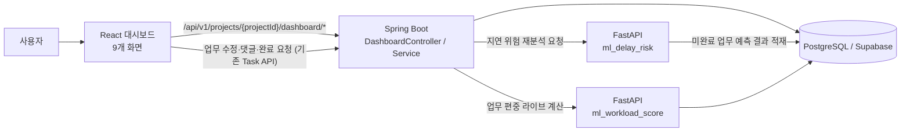
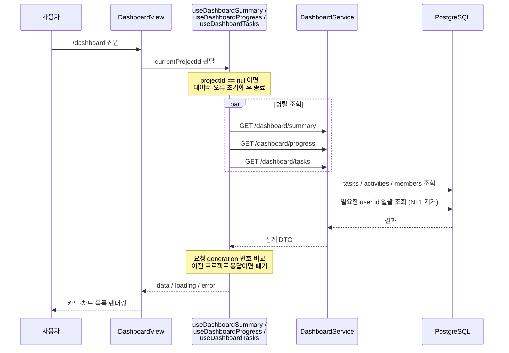
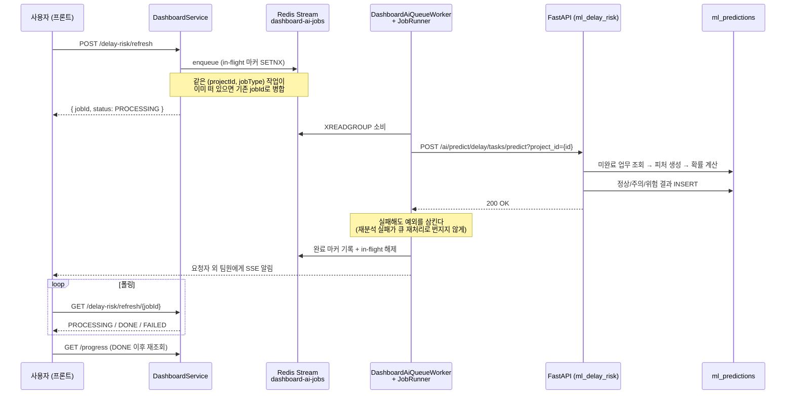
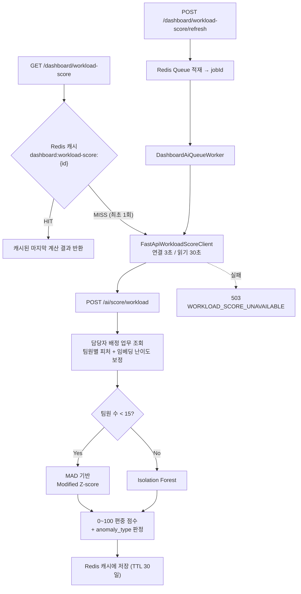

# 4. 대시보드 — 전체 개발 총정리

> 담당: 유소은
> 작성일: 2026-07-28
> 기준 브랜치: `feature/fs3_ml-delay-risk`

**이 문서는 아래 네 문서를 합친 통합본이다.** 이후 대시보드 관련 내용은 이 문서를 기준으로 한다.

| 원본 | 역할 | 이 문서에 반영된 방식 |
|---|---|---|
| `대시보드_개발보고서_260727.md` | 보고서 골격, 아키텍처 다이어그램, 구현 코드, 트러블슈팅 | **전체 구조와 본문을 그대로 계승** |
| `대시보드_개발노트_260727.md` | 화면별 세부 기능, 공통 모듈, 집계 규칙, 개발 이력 | 4.1.5 · 4.2.7 · 4.3.13 · 4.4.1 · 4.5 로 **병합** |
| `delayrisk_model_report.md` | 지연 위험도 모델의 타겟·피처·학습·성능 | **4.6으로 병합** (4.2.4 · 4.3.9의 낡은 서술도 함께 교정) |
| `2026-07-20_delay_model_가짜_Supabase_데이터셋_전환.md` | 학습 데이터를 Jira → 가짜 Supabase로 전환한 설계 결정 | **4.6.2로 병합** |
| `check_cells.txt` (저장소 루트) | 2026-07-20 시점 학습 노트북 셀 덤프 | 현재도 유효한 노트북 구조 결정은 **4.6.8**, 그 이후 바뀐 부분은 **4.6.9 대비표**로 정리 |

관련 문서: 트러블슈팅 45건 전수 목록은 [`대시보드_트러블슈팅_보고서_260728.md`](대시보드_트러블슈팅_보고서_260728.md)를 참고한다. 지연 위험도 모델의 전체 실행 로그·재현 명령·피처 후보 22개 전수 표는 원본 [`delayrisk_model_report.md`](delayrisk_model_report.md)에 남아 있고, 이 문서 4.6은 그중 결론과 근거만 추린 것이다.

> **기준 시점** — 이 문서는 **현재 코드 기준**으로 작성됐다(`feature/fs3_ml-delay-risk` / `3f81f809`). 원본 두 문서의 작성일(2026-07-27) 이후 커밋된 변경 — 재분석의 Redis Queue 전환, 대시보드 LLM 의존성 제거, 편중 점수 스케일링 교정 등 — 을 **본문에 직접 반영**했다. 변경 이력 자체는 4.5에 정리했다.

---

## 4.1 개요 및 기술스택

### 4.1.1 기능 개요

대시보드는 프로젝트의 업무 현황을 한 화면에 요약하고, 진행률·블로커·마감 임박 업무·팀원별 업무량·최근 활동을 상세 화면에서 관리하는 **프로젝트 운영 화면**이다. 단순 현황판이 아니라 실제 업무·마일스톤·댓글·활동·알림·완료 승인 흐름과 두 종류의 ML 분석(지연 위험도, 업무 편중 점수)을 연결한다.

| 구현 범위 | 내용 |
|---|---|
| 화면 | 대시보드 홈 1개 + 상세 화면 8개 (총 9개) |
| API | Spring Boot 대시보드 조회·마일스톤 관리 API 10개 |
| 데이터 | PostgreSQL/Supabase의 `tasks`, `milestones`, `activities`, `ml_predictions` 연동 |
| ML | FastAPI 지연 위험도 모델, FastAPI 업무 편중 점수 모델 |
| 권한 | 팀장/팀원 역할에 따른 업무 처리 및 완료 승인 흐름 |
| 공통 모듈 | 대시보드 전용 데이터 훅 5개, 공통 팝업 6종, 날짜·상태·위험도 유틸리티 |
| 테스트 | 프론트엔드(Vitest), Spring(JUnit/MockMvc), FastAPI(pytest) |

### 4.1.2 화면 구성

| 번호 | 경로 | 화면 | 핵심 기능 |
|---:|---|---|---|
| 1 | `/dashboard` | 대시보드 홈 | 핵심 지표, 진행률 차트, 마감 임박, 팀원별 업무량, 최근 활동, 빠른 액션 |
| 2 | `/dashboard/all-tasks` | 전체 업무 관리 | 검색·필터·정렬, 인라인 상태 변경, 상세·댓글, 회의록 AI 업무 확인 |
| 3 | `/dashboard/progress` | 진행률 분석 | 완료율, 이번 주 완료 업무, 팀원·카테고리·마일스톤 분석 |
| 4 | `/dashboard/blockers` | 블로커 관리 | 블로커 심각도·지속시간·지연 위험 분석 및 해결 처리 |
| 5 | `/dashboard/inprogress` | 진행 중 업무 모니터링 | 미업데이트 업무, ML 지연 예상, 완료 요청·블로커 전환 |
| 6 | `/dashboard/dash-progress` | 전체 진행률 | 일정 대비 진행률, 완료 빈도, 카테고리, 마일스톤 관리(생성·수정·삭제·일괄 처리) |
| 7 | `/dashboard/urgent` | 마감 임박 업무 | D-day 그룹, 담당자 필터, 리마인드, 상태·기한·담당자 변경 |
| 8 | `/dashboard/workload` | 팀원별 업무량 | 업무 분배 차트, 완료율, ML 업무 편중 점수, 업무 배정 |
| 9 | `/dashboard/activity` | 최근 활동 | 활동 타임라인, 유형·팀원·검색 필터, 활동 분포 |

### 4.1.3 기술 스택

| 구분 | 사용 기술 (버전) | 역할 |
|---|---|---|
| 프론트엔드 | React 19.2.7, TypeScript 5.9.3, Vite 7.3.6 | 대시보드 9개 화면과 팝업, 상태 관리 |
| UI | Tailwind CSS 4.3.2, Lucide React 0.487.0 | 반응형 레이아웃, 카드·배지·아이콘 |
| 차트 | Recharts 2.15.2, 자체 SVG 차트 | 진행률, 완료 빈도, 팀원별 업무량 시각화 |
| API 서버 | Spring Boot 3.5.16, Java 21 | 집계 API, 권한 검증, 마일스톤, FastAPI 중계 |
| 데이터 | PostgreSQL/Supabase, Spring Data JPA | `tasks`, `milestones`, `activities`, `ml_predictions` 조회 |
| AI/ML 서버 | FastAPI 0.139.0, pandas 2.2.3, scikit-learn 1.6.1, numpy 2.2.6 | 지연 위험도 예측 및 업무 편중 점수 계산 |
| ML 관측 | LangSmith 0.10.2 | 업무 편중 계산 흐름의 요약 트레이싱 |
| 테스트 | Vitest 3.0.5, JUnit/MockMvc, pytest | 프론트·Spring·FastAPI 회귀 검증 |

### 4.1.4 소스 위치

```
App/frontend/src/dashboard/
├─ screen/DashboardView.tsx           # 대시보드 홈
├─ screen/detail/                     # 상세 화면 8개
├─ components/                        # 공통 팝업·차트 6종
└─ libs/
   ├─ hooks/                          # 데이터 훅 5개
   ├─ types/dashboard.ts              # 응답 DTO 타입
   └─ utils/                          # API 클라이언트, 날짜·상태 유틸

App/backend_spring/src/main/java/com/workflowai/dashboard/
├─ controller/DashboardController.java
├─ service/DashboardService.java              # 집계 로직
├─ service/FastApiDashboardClient.java        # 지연 위험도 중계
├─ service/FastApiWorkloadScoreClient.java    # 업무 편중 중계
├─ DTO/ · entity/ · repository/

App/backend_fastapi/
├─ ml_delay_risk/                     # 지연 위험도 예측
└─ ml_workload_score/                 # 업무 편중 점수 계산
```

테스트와 스키마 위치는 다음과 같다.

```
App/backend_fastapi/tests/ml_delay_risk/ · tests/ml_workload_score/
App/backend_spring/src/main/resources/db/migration/     # Flyway 마이그레이션
docs/db/workflow_ai_schema.sql                          # 운영 스키마 스냅샷
```

### 4.1.5 공통 모듈 구성

대시보드 9개 화면이 공유하는 모듈이다. 화면마다 조회·날짜·판정 로직을 새로 쓰지 않도록 분리했다.

**데이터 훅 (`libs/hooks/`)**

| 훅 | 역할 |
|---|---|
| `useDashboardSummary` | 홈 요약, 마감 임박, 팀원별 업무량, 최근 활동 조회 |
| `useDashboardTasks` | 대시보드 전체 업무 조회 |
| `useDashboardProgress` | 진행률·마일스톤·카테고리·지연 위험 조회 및 재분석 트리거 |
| `useDashboardActivities` | 최근 활동 최대 50건 조회 |
| `useWorkloadScore` | FastAPI 기반 업무 편중 점수 조회 |

5개 훅은 아래 계약을 공통으로 지킨다. 구현은 [4.3.4](#434-프론트엔드-데이터-훅--세대-번호와-promise-반환) 참조.

- `projectId`가 없으면 데이터와 오류 상태를 초기화한다.
- 첫 로드 이후 재조회 시 기존 화면을 유지해 깜빡임을 막는다.
- 요청 **generation 번호**로 프로젝트 전환 후 도착한 이전 응답을 무시한다.
- `refetch`는 **실제 Promise를 반환**해 호출 화면이 완료 시점을 기다릴 수 있다.
- 로딩·오류·빈 데이터 상태를 화면별로 구분해 내려준다.

**공통 유틸리티 (`libs/utils/`)**

- 상태·우선순위 값 정규화
- `MM.DD`, D-Day, 경과일, 상대 날짜 표시
- 날짜-only 값을 **KST 자정**으로 해석해 타임존 오차 방지
- 프로젝트 기간 대비 예상 진행률 계산
- 정상·주의·위험 판정(한글/영문 결과 호환)
- 상태 변경 시 대상 칸반 컬럼의 마지막 position 계산
- 업무 생성 출처를 "직접 생성 / 회의록 AI"로 변환
- 사용자 ID 기반 안정적인 프로필 색상 생성
- 활동 유형 정규화 및 아이콘·라벨·상대 시간 변환

**공통 UI (`components/`)**

| 컴포넌트 | 역할 |
|---|---|
| `ProgressFrequencyChart` | 프로젝트 기간 내 누적 완료 업무량 시각화 |
| `TaskDetailPopup` | 업무 정보·출처·설명·댓글 조회 및 작성 |
| `TaskStatusPopup` | 상태 선택 및 칸반 position 보정 |
| `TaskDueDatePopup` | 마감일 변경 |
| `TaskAssigneePopup` | 프로젝트 멤버 조회 및 담당자 변경 |
| `MilestoneAddPopup` | 마일스톤 생성·수정, 시작일/마감일 검증 |

---

## 4.2 처리 흐름

### 4.2.1 전체 아키텍처



핵심 흐름은 다음 5단계다.

1. 프론트엔드가 현재 프로젝트 ID로 요약·업무·진행률·활동 API를 **병렬 조회**한다.
2. Spring이 업무·마일스톤·활동·최신 ML 예측을 집계해 화면용 DTO로 반환한다.
3. 지연 위험도는 FastAPI가 미완료 업무를 예측해 `ml_predictions`에 **저장**하고 Spring이 최신값을 읽는다.
4. 업무 편중 점수는 FastAPI가 호출 시점마다 계산해 Spring을 거쳐 **저장 없이 그대로** 반환한다.
5. 업무 상태·담당자·마감일·댓글 변경은 대시보드 전용 API가 아니라 **기존 업무 보드 API를 재사용**한다.

### 4.2.2 API 명세

기본 경로: `/api/v1/projects/{projectId}/dashboard`

| Method | 경로 | 기능 | 명시 권한 |
|---|---|---|---|
| GET | `/summary` | 메인 요약 집계 | 로그인 |
| GET | `/tasks` | 대시보드 업무 목록 | 로그인 |
| GET | `/activities` | 최근 활동 최대 50건 | 로그인 |
| GET | `/progress` | 진행률·마일스톤·지연 위험 | 로그인 |
| GET | `/delay-risk/mine` | 로그인 사용자 담당 위험 업무 | 프로젝트 멤버 |
| GET | `/workload-score` | 업무 편중 점수 조회 (**캐시 우선**) | 프로젝트 멤버 |
| POST | `/workload-score/refresh` | 편중 점수 재계산 작업 적재 → `jobId` | 프로젝트 멤버 |
| GET | `/workload-score/refresh/{jobId}` | 편중 재계산 상태 조회 | 프로젝트 멤버 |
| POST | `/delay-risk/refresh` | 지연 위험도 재분석 작업 적재 → `jobId` | 프로젝트 멤버 |
| GET | `/delay-risk/refresh/{jobId}` | 지연 위험도 재분석 상태 조회 | 프로젝트 멤버 |
| POST | `/milestones` | 마일스톤 생성 | 팀장 |
| PATCH | `/milestones/{milestoneId}` | 마일스톤 수정 | 팀장 |
| DELETE | `/milestones/{milestoneId}` | 마일스톤 삭제 | 팀장 |

모든 API는 전역 `SecurityConfig`에 의해 JWT 로그인이 필요하다. 표의 "프로젝트 멤버 / 팀장" 항목은 컨트롤러에 추가로 선언된 `@PreAuthorize` 메서드 권한이다.

> `/summary`, `/tasks`, `/activities`, `/progress` **4개는 아직 JWT 로그인만 요구**한다. 다른 프로젝트 ID를 직접 넣은 요청을 막으려면 `@projectAccess.isMember` 추가가 필요하다(4.4.4의 2번).

**재분석 작업의 상태 값**

| 상태 | 의미 |
|---|---|
| `PROCESSING` | in-flight 마커가 살아 있음 — 큐 대기 중이거나 워커가 처리 중 |
| `DONE` | 워커가 남긴 **완료 마커**가 확인됨 |
| `FAILED` | in-flight도 완료 마커도 없음 — TTL 만료, 재시도 대기, 또는 존재한 적 없는 `jobId` |

`DONE` 판정에 **완료 마커를 반드시 확인**한다. "in-flight 마커가 없다"는 사실만으로는 성공인지 실패·정체인지 구분할 수 없어, 이전 구현은 이 경우를 전부 `DONE`으로 잘못 보고했다(TS-14).

### 4.2.3 화면 진입 흐름 (대시보드 홈)



### 4.2.4 ML 지연 위험도 흐름

재분석은 **Redis Queue 기반 비동기**로 동작한다. 요청은 즉시 `jobId`를 받고, 실제 예측은 워커가 백그라운드에서 수행한다.



FastAPI가 내려가 있어도 대시보드는 `ml_predictions`에 저장된 **마지막 예측으로 계속 서비스**된다.

**입력 계약과 실제 학습 피처는 다르다.** `build_feature_row()`는 아래 데이터를 읽어 **52개 컬럼**을 만들지만, 그중 모델이 실제로 학습에 쓰는 것은 **5개**뿐이다(`status_at_cutoff`, `blocked_hours_before_cutoff`, `num_events_before_cutoff`, `hours_in_current_status`, `activity_count_recent_window`). 나머지는 데이터 누수 방지·스키마 미지원·부기 목적으로 제외되거나 상관계수 기준에서 탈락했다. 선정 과정과 근거는 **4.6.3**을 참고한다.

Jira 전용 피처(issuelinks, worklog, reopen 횟수 등) 중 서비스 스키마에 대응 개념이 없는 항목은 학습 시 결측 처리와 동일한 **안전한 기본값**(0 / False / "Unknown" / "unassigned")으로 근사한다.

**사용 데이터 상세** (아래는 피처 계약을 채우기 위해 읽는 원천 데이터이며, 이것이 곧 학습 피처는 아니다.)

| 구분 | 사용 컬럼·테이블 |
|---|---|
| 업무 속성 | 상태, 우선순위, 카테고리 |
| 일정 | 생성일, 수정일, 실제 마감일 |
| 마일스톤 | 연결 마일스톤과 해당 마일스톤 완료율 |
| 체크리스트 | `task_checklists` 전체/완료 수와 진행 비율 |
| 댓글 | `task_comments` 수, 고유 작성자 수, 마지막 댓글 이후 경과시간 |
| 활동 | `activities` 로그 수와 최근 활동량 |
| 정체 신호 | 담당자, 현재 상태 체류시간, 경과시간 대비 진행 불균형 |

**모델 운영 안정성** — 예측 품질과 별개로, 운영 중 모델이 조용히 잘못된 값을 내지 않도록 아래를 적용했다.

- 모델 아티팩트가 없으면 **503을 반환**한다(잘못된 예측 대신 명시적 실패).
- Hugging Face 모델 다운로드 시 **SHA256 체크섬을 검증**하고 실제 받은 커밋 해시를 로그에 남긴다.
- 운영 추론 코드를 `delay_model.py`로 분리해 **노트북 실행 의존을 제거**했다(노트북 수정이 서버를 깨뜨리지 않는다).
- **미완료 업무만** 예측 대상으로 삼는다(완료 업무는 지연 위험 판정에서 제외).
- 댓글·활동을 **프로젝트 단위로 일괄 조회**해 업무별 N+1을 방지한다.
- 예측 점수와 함께 **클래스별 확률**을 저장한다.

### 4.2.5 ML 업무 편중 점수 흐름

조회는 **Redis 캐시 우선**이고, 재계산은 지연 위험도와 같은 큐를 탄다. 대시보드를 열 때마다 무거운 계산이 반복되지 않는다.



**점수 스케일링** — `overload_score_0_100`은 **이상치 임계값(z_threshold = 3.5) 기준 절대 스케일링**이다.

```
overload_score_0_100 = min(100, 100 × combined_distance / 3.5)
```

팀 내 최댓값 기준 상대 스케일링을 쓰면 **전원이 정상 범위여도 그중 가장 튀는 한 명이 무조건 100점**을 받는다. 절대 기준으로 바꾸면서 이상치 판정(`anomaly_type`)과 점수가 같은 기준(3.5)을 공유하게 됐다.

**이상치 유형 판정**

| 유형 | 조건 |
|---|---|
| 과부하 의심 | 활성 업무가 팀 평균보다 많고(`task_count_active_rel > 1.0`) 완료율이 팀 평균보다 낮음 |
| 배정량 불균형 | 전체 배정량이 팀 평균보다 적고(`task_count_total_rel < 1.0`) 완료율이 팀 평균보다 높음 |
| 이상 패턴(방향 불명확) | 이상치이지만 위 두 조건에 해당하지 않음 |
| 정상 | 이상치가 아님 |

**주요 피처**

- 전체 배정 업무 수 / 미완료 업무 수 / 완료율
- 우선순위·카테고리 기반 평균 난이도, 임베딩 기반 난이도 보정
- 마감 초과 업무 수와 비율, 3일 이내 마감 업무 수
- 팀 평균 대비 활성 업무·전체 배정량·평균 난이도 비율(`*_rel`)

**LangSmith 트레이싱** — 편중 계산은 임베딩까지 태우는 다단계 파이프라인이라 관측이 필요하지만, 업무 원문이 외부로 나가면 안 된다. 그래서 **요약값만** 기록한다.

- 전체 실행을 `chain`으로, 피처 생성과 이상치 탐지를 `tool`로 추적
- 원문 업무 데이터와 임베딩 입력 텍스트는 **기록하지 않음**(reducer로 글자 수만 전송)
- 프로젝트 ID, 인원 수, 이상치 수, 최고 점수 등 요약 통계만 기록
- `LANGSMITH_API_KEY`가 없으면 트레이싱을 비활성화하고 `LANGSMITH_TRACING` 값도 함께 제거

### 4.2.6 데이터 흐름 요약

| 테이블 | 대시보드 사용 내용 |
|---|---|
| `projects` | 프로젝트 생성일, 마감일 (D-day, 예상 진행률 계산) |
| `project_members` | 팀원 목록과 역할 (REVIEWER 제외) |
| `users` | 담당자·행위자 이름 |
| `tasks` | 상태, 담당자, 카테고리, 우선순위, 마감일, 완료일, position |
| `milestones` | 마일스톤 이름, 시작일, 마감일 |
| `task_checklists` | 지연 위험도 진행 비율 피처 |
| `task_comments` | 댓글 표시 및 ML 활동 피처 |
| `activities` | 최근 활동 및 ML 활동 피처 |
| `ml_predictions` | 업무별 지연 위험도 이력 |

관련 마이그레이션: `V20260704_1__activities_message.sql`(활동 메시지·target 인덱스), `V20260722_1__roadmap_planning_dates.sql`(`milestones.start_date`), `V20260727_2__task_done_date.sql`(완료 업무 날짜).

### 4.2.7 Spring 집계 규칙

화면에 보이는 숫자가 각각 어떤 기준으로 계산되는지 정리한다. 구현 코드는 [4.3.1](#431-대시보드-요약-집계와-n1-제거)·[4.3.2](#432-지연-위험도-최신-예측-추출) 참조.

**메인 요약 (`GET /summary`)**

| 지표 | 계산 기준 |
|---|---|
| 전체 업무 수 | 프로젝트 `tasks` 전체 건수 |
| 완료 업무 수 | `status = done` |
| 블로커 수 | `status = blocked` |
| 진행 중 수 | `status = inprogress` |
| 완료율 | 완료 수 ÷ 전체 수 × 100, 반올림 |
| 마감 임박 | 미완료 업무를 마감일 오름차순 정렬해 **최대 5건** |
| 팀원별 업무량 | 담당자별 전체·완료·대기·진행 중·블로커 수 |
| 최근 활동 | 최신순 **최대 10건** |

- 팀원별 업무량에서 **REVIEWER(심사자)는 제외**한다(평가자는 업무 배정 대상이 아니다).
- 담당 업무가 없는 프로젝트 멤버도 **0건으로 포함**해 누락되지 않게 한다.

**진행률 상세 (`GET /progress`)**

- 전체 완료율과 마일스톤별 연결 업무 수·완료 수·완료율
- 카테고리별 전체/완료 업무 수, 프로젝트 마감일·생성일
- `task` + `delay_risk` 조합의 **`target_id`별 최신 예측 1건**만 사용
- **정상** 결과는 상세 위험 목록에서 제외하고, 예측 이후 삭제된 업무의 **고아 예측**도 제외

마일스톤 상태는 저장값이 아니라 연결 업무로부터 **자동 계산**한다.

| 조건 | 상태 |
|---|---|
| 연결 업무가 모두 완료 | `done` |
| 일부 완료 또는 진행 중 업무 존재 | `inprogress` |
| 그 외 | `todo` |

**마일스톤 (`POST` / `PATCH` / `DELETE /milestones`)**

- 생성·수정·삭제 시 프로젝트 멤버 **전체에 알림**을 보낸다(행위자인 팀장 포함).
- 수정은 **값이 실제로 변경된 경우에만** 알림을 발송한다.
- 삭제 전 연결 업무의 `milestone_id`를 `null`로 바꿔 **업무는 삭제하지 않고** 일정 미정으로 옮긴다.
- 일괄 수정·삭제는 프론트에서 `Promise.allSettled`로 **부분 실패를 허용**한다([4.3.8](#438-마일스톤-일괄-처리--부분-실패-허용)).

---

## 4.3 핵심 로직 및 구현 코드

### 4.3.1 대시보드 요약 집계와 N+1 제거

`getSummary()`는 프로젝트의 전체 업무를 한 번 읽어 통계·마감 임박·팀원별 업무량·최근 활동을 모두 만들어낸다. 초기 구현은 업무·활동·팀원마다 `UserRepository.findById`를 반복 호출해 Supabase 왕복이 레코드 수만큼 늘어났다. 필요한 user id를 먼저 모아 **한 번의 쿼리**로 이름을 조회하도록 바꿨다.

**`DashboardService.java:94-139`**

```java
@Transactional(readOnly = true)
public DashboardSummaryResponse getSummary(String projectIdParam) {
    Long projectId = demoDataService.resolveProjectId(projectIdParam);
    List<Task> tasks = taskRepository.findByProjectIdOrderByCreatedAtDesc(projectId);

    long total = tasks.size();
    long done = tasks.stream().filter(t -> STATUS_DONE.equals(t.getStatus())).count();
    long blocked = tasks.stream().filter(t -> STATUS_BLOCKED.equals(t.getStatus())).count();
    long inProgress = tasks.stream().filter(t -> STATUS_INPROGRESS.equals(t.getStatus())).count();
    long progressPercent = total == 0 ? 0 : Math.round(done * 100.0 / total);

    List<Activity> recentActivityRows = activityRepository.findTop10ByProjectIdOrderByCreatedAtDesc(projectId);
    // 팀원 업무 편중도(workload) 화면이므로 심사자는 제외한다(심사자는 업무를 배정받지 않는 평가자).
    List<ProjectMember> members = projectMemberRepository.findAllByProjectId(projectId).stream()
        .filter(member -> member.getRole() != ProjectRole.REVIEWER)
        .toList();

    // 업무마다/활동마다 담당자 이름을 각각 조회하면(N+1) Supabase 왕복이 업무·활동 개수만큼
    // 늘어나 대시보드 로딩이 크게 느려진다(2026-07-27 실측) - 필요한 user id를 모아 한 번에 조회한다.
    Set<Long> userIds = new java.util.HashSet<>();
    tasks.forEach(t -> userIds.add(t.getAssigneeId()));
    recentActivityRows.forEach(a -> userIds.add(a.getActorId()));
    members.forEach(m -> userIds.add(m.getUserId()));
    Map<Long, String> userNames = loadUserNames(userIds);

    List<UpcomingTaskDto> upcoming = tasks.stream()
        .filter(t -> !STATUS_DONE.equals(t.getStatus()))
        .sorted(Comparator.comparing(Task::getDueDate, Comparator.nullsLast(Comparator.naturalOrder())))
        .limit(5)
        .map(t -> new UpcomingTaskDto(...))
        .toList();

    List<WorkloadEntryDto> workload = buildWorkload(members, tasks, userNames);
    ...
}
```

**`DashboardService.java:479-487`**

```java
/** 여러 user id의 이름을 한 번의 쿼리로 조회한다(반복 조회로 인한 N+1 방지). */
private Map<Long, String> loadUserNames(Collection<Long> userIds) {
    List<Long> distinctIds = userIds.stream().filter(Objects::nonNull).distinct().toList();
    if (distinctIds.isEmpty()) {
        return Map.of();
    }
    return userRepository.findAllById(distinctIds).stream()
        .collect(Collectors.toMap(User::getId, u -> Objects.requireNonNullElse(u.getName(), "")));
}
```

동일한 패턴을 `getTasks`, `getActivities`, `getProgressDetail`, `getMyDelayRisks`에 공통 적용하고, 모든 읽기 메서드에 `@Transactional(readOnly = true)`를 붙였다.

또한 담당 업무가 없는 팀원도 0건으로 표시되도록, 프로젝트 멤버를 기준으로 먼저 채우고 멤버 목록에 없는 담당자만 뒤에 덧붙인다.

**`DashboardService.java:315-333`**

```java
private List<WorkloadEntryDto> buildWorkload(List<ProjectMember> members, List<Task> tasks, Map<Long, String> userNames) {
    Map<Long, List<Task>> byAssignee = new LinkedHashMap<>();
    for (Task task : tasks) {
        if (task.getAssigneeId() == null) continue;
        byAssignee.computeIfAbsent(task.getAssigneeId(), k -> new ArrayList<>()).add(task);
    }

    List<WorkloadEntryDto> result = new ArrayList<>();
    for (ProjectMember member : members) {
        Long userId = member.getUserId();
        result.add(toWorkloadEntry(userId, byAssignee.remove(userId), userNames));  // 0건 멤버도 포함
    }
    for (Map.Entry<Long, List<Task>> entry : byAssignee.entrySet()) {
        result.add(toWorkloadEntry(entry.getKey(), entry.getValue(), userNames));
    }
    return result;
}
```

### 4.3.2 지연 위험도 최신 예측 추출

`ml_predictions`는 재분석할 때마다 **행이 누적**되는 이력 테이블이다. 화면에는 업무별 가장 최근 예측 하나만 보여야 하므로, `target_id` 오름차순 + `created_at` 내림차순으로 정렬해 읽은 뒤 각 target의 첫 행만 남긴다.

**`DashboardService.java:408-420`**

```java
/** target_id별로 created_at이 가장 최신인 예측 한 건만 남긴다. */
private List<MlPrediction> latestPredictionsByTarget(Long projectId) {
    List<MlPrediction> ordered = mlPredictionRepository
        .findByProjectIdAndTargetTypeAndModelTypeOrderByTargetIdAscCreatedAtDesc(
            projectId, TARGET_TYPE_TASK, MODEL_TYPE_DELAY_RISK
        );

    Map<Long, MlPrediction> latestByTarget = new LinkedHashMap<>();
    for (MlPrediction prediction : ordered) {
        latestByTarget.putIfAbsent(prediction.getTargetId(), prediction);  // 첫 행 = 최신
    }
    return new ArrayList<>(latestByTarget.values());
}
```

이후 두 단계로 걸러낸다. **정상 결과는 위험 목록에서 제외**하고, 예측 이후 삭제된 업무의 **고아 예측도 제외**한다.

**`DashboardService.java:180-184`, `430-446`**

```java
List<DelayRiskDto> delayRisks = latestPredictions.stream()
    .filter(p -> !RISK_RESULT_NORMAL.equals(p.getResult()))          // 정상 제외
    .map(p -> toDelayRiskDto(p, tasksById.get(p.getTargetId()), userNames))
    .filter(Objects::nonNull)                                        // 고아 예측 제외
    .toList();

private DelayRiskDto toDelayRiskDto(MlPrediction prediction, Task task, Map<Long, String> userNames) {
    if (task == null) {
        // 예측 이후 업무가 삭제된 경우 등 - 더 이상 존재하지 않는 업무는 화면에 표시하지 않는다.
        return null;
    }
    ...
}
```

프론트엔드는 이 계약을 그대로 받아, **완료 업무는 위험도 판정 대상에서 제외**하고 **예측 이력은 있지만 위험 목록에 없는 미완료 업무는 "정상"으로 표시**한다.

**`AllTasksPage.tsx:137-142`**

```typescript
const delayRiskLabel = (taskId: string, status: TaskStatus): string | null => {
  if (status === "done") return null; // 완료된 업무는 지연 위험도 분석 대상이 아님
  const result = delayRiskByTaskId.get(taskId);
  if (result) return result;
  return progress?.hasPredictions ? "정상" : null;
};
```

### 4.3.3 FastAPI 연동 — 실패 정책의 분리

FastAPI 호출은 **모두 큐 워커 안으로 옮겼다.** 사용자 요청 스레드는 작업을 적재만 하고 즉시 반환하므로, 무거운 ML 호출이 HTTP 요청을 붙잡지 않는다.

**`DashboardService.java:303-318` — 적재만 하고 즉시 반환**

```java
public DashboardAiJobResponse enqueueDelayRiskRefresh(String projectIdParam, Long requestedBy) {
    Long projectId = demoDataService.resolveProjectId(projectIdParam);
    String jobId = dashboardAiJobPublisher.enqueue(projectId, DashboardAiJobType.DELAY_RISK, requestedBy);
    return new DashboardAiJobResponse(jobId, projectIdParam, DashboardAiJobType.DELAY_RISK.name(), "PROCESSING");
}
```

실제 호출은 `DashboardAiJobRunner`가 맡는다. **실패를 여기서 삼키는 것이 핵심**이다 — 재분석 실패가 큐 재처리(retry)로 번지면 FastAPI가 내려가 있는 동안 같은 작업이 무한 반복된다.

**`DashboardAiJobRunner.java:52-85`**

```java
private void runDelayRisk(DashboardAiJob job) {
    boolean success = true;
    try {
        fastApiDashboardClient.refreshDelayRisk(job.projectId());
    } catch (Exception exception) {
        success = false;
        log.warn("지연 위험도 재분석 실패. projectId={}", job.projectId(), exception);
    }
    notifyMembers(job, DELAY_RISK_NOTIFICATION_TYPE,
        success ? "ML 지연 위험도 재분석이 완료되었습니다."
                : "ML 지연 위험도 재분석에 실패했습니다. 잠시 후 다시 시도해주세요.");
}

private void runWorkloadScore(DashboardAiJob job) {
    boolean success = true;
    try {
        WorkloadScoreResponseDto result = fastApiWorkloadScoreClient.fetch(job.projectId());
        workloadScoreCache.put(job.projectId(), result);   // 성공한 결과만 캐시에 남긴다
    } catch (Exception exception) {
        success = false;
        log.warn("업무 편중 점수 계산 실패. projectId={}", job.projectId(), exception);
    }
    notifyMembers(job, WORKLOAD_SCORE_NOTIFICATION_TYPE, ...);
}
```

알림은 **작업을 요청한 본인을 제외**하고 보낸다. 요청자는 화면에서 폴링으로 결과를 직접 받으므로 알림이 중복된다.

두 모델 모두 이제 **마지막 성공 결과로 계속 서비스**한다. 저장 위치만 다르다.

| 모델 | 마지막 결과 보관 위치 | 조회 실패 시 |
|---|---|---|
| 지연 위험도 | `ml_predictions` 테이블 | 마지막 저장 예측으로 응답 |
| 업무 편중 | Redis 캐시 (TTL 30일) | 캐시가 아예 없을 때만 503 |

**`DashboardService.java:342-349` — 캐시 우선 조회**

```java
public WorkloadScoreResponseDto getWorkloadScore(String projectIdParam) {
    Long projectId = demoDataService.resolveProjectId(projectIdParam);
    return workloadScoreCache.get(projectId).orElseGet(() -> {
        WorkloadScoreResponseDto live = fastApiWorkloadScoreClient.fetch(projectId);
        workloadScoreCache.put(projectId, live);
        return live;
    });
}
```

**`DashboardController.java:91-102`**

```java
@GetMapping("/workload-score")
@PreAuthorize("@projectAccess.isMember(#projectId)")
public ResponseEntity<ApiResponse<WorkloadScoreResponseDto>> getWorkloadScore(@PathVariable String projectId) {
    try {
        return ResponseEntity.ok(ApiResponse.ok(dashboardService.getWorkloadScore(projectId)));
    } catch (Exception ex) {
        return ResponseEntity.status(HttpStatus.SERVICE_UNAVAILABLE)
            .body(ApiResponse.fail("WORKLOAD_SCORE_UNAVAILABLE", "업무 편중 점수를 조회하지 못했습니다."));
    }
}
```

편중 점수 클라이언트는 무한 대기를 막기 위해 **연결 3초 / 읽기 30초** 타임아웃을 명시한다.

**`FastApiWorkloadScoreClient.java:13-32`**

```java
public class FastApiWorkloadScoreClient {
    private static final Duration CONNECT_TIMEOUT = Duration.ofSeconds(3);
    private static final Duration READ_TIMEOUT = Duration.ofSeconds(30);

    public FastApiWorkloadScoreClient(@Value("${workflow.ai.base-url}") String baseUrl) {
        // JDK HttpClient는 plaintext(http://) 대상에도 기본적으로 HTTP/2(h2c) 업그레이드를 시도하는데,
        // uvicorn(FastAPI)이 이를 지원하지 않아 요청이 깨진다. HTTP/1.1을 명시해 우회한다.
        HttpClient httpClient = HttpClient.newBuilder()
            .version(HttpClient.Version.HTTP_1_1)
            .connectTimeout(CONNECT_TIMEOUT)
            .build();
        JdkClientHttpRequestFactory requestFactory = new JdkClientHttpRequestFactory(httpClient);
        requestFactory.setReadTimeout(READ_TIMEOUT);
        this.restClient = RestClient.builder().baseUrl(baseUrl).requestFactory(requestFactory).build();
    }
}
```

### 4.3.4 프론트엔드 데이터 훅 — 세대 번호와 Promise 반환

대시보드 훅 5개(`useDashboardSummary`, `useDashboardTasks`, `useDashboardProgress`, `useDashboardActivities`, `useWorkloadScore`)는 동일한 3가지 규칙을 공유한다.

1. **첫 로드 이후 재조회에서는 `loading`을 올리지 않는다** → 화면이 통째로 "불러오는 중"으로 비워지지 않고 바뀐 항목만 리렌더된다.
2. **요청 generation 번호로 stale response를 폐기한다** → 프로젝트를 전환한 뒤 도착한 이전 프로젝트 응답이 최신 상태를 덮어쓰지 않는다.
3. **`refetch`는 반드시 Promise를 반환한다** → 호출 화면이 `await refetch()`로 완료 시점을 기다릴 수 있다.

**`useDashboardTasks.ts:5-53`**

```typescript
export function useDashboardTasks(projectId: string | number | null | undefined) {
  const [data, setData] = useState<DashboardTaskDto[]>([]);
  const [loading, setLoading] = useState(true);
  const [error, setError] = useState<string | null>(null);
  // 최초 로드 이후의 refetch(데이터 변경 감지, 액션 후 새로고침 등)에서는 loading을 true로 만들지 않는다 —
  // 그러면 화면이 통째로 "불러오는 중"으로 비워지지 않고, 새 데이터가 도착했을 때 바뀐 항목만 리렌더된다.
  const hasLoadedRef = useRef(false);
  useEffect(() => { hasLoadedRef.current = false; }, [projectId]);

  // 요청 세대(generation) 번호 - 응답이 도착했을 때 이 값이 요청 시점과 다르면(그사이
  // projectId가 바뀌어 refetch가 다시 호출됨) 이전 프로젝트의 응답으로 최신 상태를
  // 덮어쓰지 않도록 무시한다. 이전 구현은 cleanup 함수(() => void)를 반환해서,
  // 호출부에서 `await refetch()`를 해도 실제 fetch 완료를 기다리지 못하고 즉시
  // 통과해버리는 문제도 있었다 — 그래서 취소는 cleanup이 아니라 세대 번호 비교로
  // 처리하고, refetch 자체는 반드시 Promise를 반환한다.
  const generationRef = useRef(0);

  const refetch = useCallback(async (): Promise<void> => {
    const generation = ++generationRef.current;
    if (projectId == null) {
      setData([]); setLoading(false); setError(null);
      return;
    }
    if (!hasLoadedRef.current) setLoading(true);
    setError(null);
    try {
      const result = await fetchDashboardTasks(projectId);
      if (generation !== generationRef.current) return;   // stale 응답 폐기
      setData(result);
    } catch (err) {
      if (generation !== generationRef.current) return;
      setError((err as Error).message);
    } finally {
      if (generation === generationRef.current) {
        hasLoadedRef.current = true;
        setLoading(false);
      }
    }
  }, [projectId]);

  useEffect(() => { refetch(); }, [refetch]);
  return { data, loading, error, refetch };
}
```

### 4.3.5 조용한 자동 새로고침 (전체 업무 관리)

여러 팀원이 동시에 업무를 수정하는 화면이라 다른 사용자의 변경을 반영해야 하지만, 15초마다 화면을 다시 그리면 스크롤·선택 상태가 흔들린다. 그래서 **주기적으로 최신 데이터를 조용히 가져와 시그니처를 비교하고, 실제로 달라졌을 때만 `refetch()`**를 호출한다.

**`AllTasksPage.tsx:105-123`**

```typescript
// 목록 화면을 깜빡이며 새로고침하지 않도록, 주기적으로 조용히 최신 데이터를 가져와
// 실제로 달라졌을 때만 refetch()로 화면을 갱신한다.
const tasksSignatureRef = useRef<string>("");
useEffect(() => {
  tasksSignatureRef.current = tasks.map(t => `${t.id}:${t.status}:${t.updatedAt}`).join("|");
}, [tasks]);

useEffect(() => {
  if (currentProjectId == null) return;
  const interval = setInterval(() => {
    fetchDashboardTasks(currentProjectId)
      .then(fresh => {
        const freshSignature = fresh.map(t => `${t.id}:${t.status}:${t.updatedAt}`).join("|");
        if (freshSignature !== tasksSignatureRef.current) refetch();
      })
      .catch(() => {});
  }, AUTO_REFRESH_INTERVAL_MS);   // 15000ms
  return () => clearInterval(interval);
}, [currentProjectId, refetch]);
```

### 4.3.6 인라인 상태 변경 시 position 재계산

블로커/진행 중/마감 임박 화면의 "해결 완료", "완료 처리", "블로커 전환" 버튼은 칸반 보드를 거치지 않고 상태를 바꾼다. 이때 원래 컬럼의 `position` 값을 그대로 넘기면 대상 컬럼의 기존 카드와 값이 겹칠 수 있어, 보드 드래그앤드롭과 **동일한 규칙**("마지막 카드 position + 1")으로 새로 계산한다.

**`dashboardTaskUtils.ts:158-166`**

```typescript
/** targetStatus 컬럼(상태)의 맨 끝에 이어붙일 position 값을 계산한다.
 * 보드의 reorderTasks()/computeInsertPosition()과 동일한 "마지막 카드 position + 1" 규칙을
 * 쓴다 — 대시보드 화면의 빠른 상태 변경 버튼이 원래 있던 컬럼의 position을 그대로 들고 가면
 * 대상 컬럼의 기존 카드와 값이 겹칠 수 있어, 항상 대상 컬럼 끝에 배치되도록 새로 계산한다. */
export function nextPositionForStatus(tasks: DashboardTaskDto[], status: string): number {
  const columnTasks = tasks.filter(task => normalizeTaskStatus(task.status) === status);
  if (columnTasks.length === 0) return 0;
  return Math.max(...columnTasks.map(task => task.position)) + 1;
}
```

### 4.3.7 KST 기준 날짜 처리

백엔드 JVM은 `Asia/Seoul`로 고정되어 있지만, `LocalDateTime` 문자열에는 오프셋이 없다. 브라우저에서 `new Date(...)`로 그대로 파싱하면 **보는 사람의 로컬 타임존**으로 해석돼 완료일·경과일이 하루씩 틀어진다. 오프셋이 없는 문자열에는 `+09:00`을 명시로 붙인다.

**`dashboardTaskUtils.ts:76-124`**

```typescript
/** 백엔드가 내려주는 LocalDateTime 문자열(예: "2026-07-24T10:15:30")은 오프셋이 없어,
 * `new Date(...)`로 그대로 파싱하면 보는 사람 브라우저의 로컬 타임존으로 해석돼버린다.
 * 백엔드 JVM은 Asia/Seoul(KST, UTC+9)로 고정되어 있으므로, 오프셋이 없는 문자열에는
 * "+09:00"을 명시로 붙여 브라우저 타임존과 무관하게 항상 정확한 시각으로 파싱한다. */
export function parseKstDateTime(dateStr: string): Date {
  if (/^\d{4}-\d{2}-\d{2}$/.test(dateStr)) {
    return new Date(`${dateStr}T00:00:00+09:00`);      // 날짜-only → KST 자정
  }
  const hasOffset = /[Zz]|[+-]\d{2}:?\d{2}$/.test(dateStr);
  return new Date(hasOffset ? dateStr : `${dateStr}+09:00`);
}

/** ISO 날짜/일시 문자열부터 지금까지 경과한 시간을 "일" 단위로 내림 계산한다.
 * 캘린더 날짜 경계가 아니라 실제 경과 시간 기준(체류시간 근사 — 백엔드 ML 피처
 * hours_in_current_status와 동일한 방식)이라 "3일 이상"류 임계값 판정에 적합하다. */
export function daysSince(dateStr: string | null | undefined): number | null {
  if (!dateStr) return null;
  const past = parseKstDateTime(dateStr);
  if (Number.isNaN(past.getTime())) return null;
  return Math.max(0, Math.floor((Date.now() - past.getTime()) / 86400000));
}

/** "오늘"/"어제"/"n일 전"(30일 이상이면 MM.DD) — 캘린더 날짜 경계 기준 상대 날짜 표기.
 * daysSince와 달리 사람이 읽는 라벨이라 자정 기준으로 날짜를 비교한다. */
export function formatRelativeDate(dateStr: string | null | undefined): string { ... }
```

`daysSince`(경과 시간 기준)와 `formatRelativeDate`(캘린더 경계 기준)를 **의도적으로 분리**한 것이 핵심이다. 전자는 "3일 이상 미업데이트" 같은 임계값 판정에, 후자는 사람이 읽는 라벨에 쓴다.

### 4.3.8 마일스톤 일괄 처리 — 부분 실패 허용

마일스톤 일괄 수정/삭제는 요청을 개별적으로 보내므로 일부만 실패할 수 있다. `Promise.allSettled`로 전부 기다린 뒤, **성공분은 이미 서버에 반영됐으므로 먼저 화면을 최신화**하고 실패 건만 재시도할 수 있도록 편집 모드를 유지한다.

**`DashProgressPage.tsx:329-360`**

```typescript
const submitBulkDelete = async () => {
  ...
  const ids = Array.from(bulkSelectedIds);
  const results = await Promise.allSettled(ids.map(id => deleteMilestone(currentProjectId, id)));
  const failedIds = ids.filter((_, index) => results[index].status === "rejected");
  // 일부만 실패해도 성공한 나머지는 이미 삭제됐으므로, 우선 화면을 최신 상태로 맞춘다.
  // refetch 자체가 실패하더라도 로딩 표시가 고착되지 않도록 finally로 반드시 해제한다.
  setMilestoneRefreshing(true);
  try {
    await refetch();
  } finally {
    setMilestoneRefreshing(false);
  }
  if (failedIds.length > 0) {
    setBulkSelectedIds(new Set(failedIds));   // 실패 건만 선택 상태로 남겨 재시도 가능
    setBulkError(`${ids.length}개 중 ${failedIds.length}개 삭제에 실패했습니다. 다시 시도해주세요.`);
  } else {
    exitBulkEditMode();
  }
};
```

서버 측에서는 마일스톤 삭제 시 **연결 업무를 삭제하지 않고 일정 미정으로 이동**시킨다.

**`DashboardService.java:276-293`**

```java
/** 마일스톤 연결 업무를 일정 미정으로 옮긴 뒤 삭제하고, 팀 전체에 알린다. */
@Transactional
public void deleteMilestone(String projectIdParam, Long milestoneId) {
    ...
    taskRepository.clearMilestoneId(projectId, milestoneId);   // 업무는 보존, 연결만 해제
    milestoneRepository.delete(milestone);

    String content = "'" + title + "' 마일스톤이 삭제되었습니다.";
    projectMemberRepository.findAllByProjectId(projectId).stream()
        .map(ProjectMember::getUserId)
        .forEach(memberId -> notificationService.notify(
            memberId, "MILESTONE_DELETED", "마일스톤이 삭제되었습니다.", content, "milestone", null
        ));
}
```

마일스톤 **수정**은 값이 실제로 바뀐 경우에만 알림을 보내고, 변경 전/후 값을 문구에 담는다.

**`DashboardService.java:251-268`**

```java
List<String> changes = new ArrayList<>();
if (!Objects.equals(titleBefore, saved.getTitle())) {
    changes.add("이름이 '" + saved.getTitle() + "'(으)로");
}
if (!Objects.equals(startDateBefore, saved.getStartDate())) {
    changes.add("시작일이 " + (saved.getStartDate() == null ? "미정" : saved.getStartDate() + "일") + "(으)로");
}
if (!Objects.equals(dueDateBefore, saved.getDueDate())) {
    changes.add("마감일이 " + (saved.getDueDate() == null ? "미정" : saved.getDueDate() + "일") + "(으)로");
}
if (!changes.isEmpty()) {   // 실제 변경이 있을 때만 알림
    String content = "마일스톤 '" + titleBefore + "'의 " + String.join(", ", changes) + " 변경되었습니다.";
    ...
}
```

### 4.3.9 지연 위험도 피처 근사 (FastAPI)

`delay_model`은 운영 스키마와 **같은 형태로 합성한 가짜 Supabase 데이터셋**으로 학습됐다(4.6.2). 아래 `build_feature_row()`는 **학습과 실시간 추론이 공유하는 단일 함수**로, 운영 스키마(`tasks`/`milestones`/`task_checklists`/`task_comments`/`activities`)의 값을 52개 키의 피처 계약으로 변환한다. 학습 전용 피처 생성 코드가 아예 없으므로 train/serve skew가 구조적으로 발생할 수 없다.

**`ml_delay_risk/services/delay_service.py:132-173`**

```python
elapsed_hours = _hours_between(created_at, now)
hours_in_current_status = _hours_between(updated_at, now) if pd.notna(updated_at) else elapsed_hours
blocked_hours = hours_in_current_status if is_blocked_status(status_at_cutoff) else 0.0

due_date = task_row.get("due_date")
milestone_due_date = task_row.get("milestone_due_date")
deadline = due_date if pd.notna(due_date) else milestone_due_date if pd.notna(milestone_due_date) else None

if deadline is not None and pd.notna(created_at):
    proxy_deadline_hours = _hours_between(created_at, deadline)
    if proxy_deadline_hours <= 0:
        proxy_deadline_hours = proxy_deadline_lookup(category, priority)
else:
    proxy_deadline_hours = proxy_deadline_lookup(category, priority)

progress_ratio = checklist_done / checklist_total if checklist_total > 0 else None
elapsed_ratio = elapsed_hours / proxy_deadline_hours if proxy_deadline_hours > 0 else 0.0
imbalance_index = (elapsed_ratio - progress_ratio) if progress_ratio is not None else None

# <실제 Supabase 데이터로 계산 — task_comments/activities>
# 이 두 피처는 예전에는 대응 테이블이 없어 0으로만 채웠지만, task_comments(댓글)와
# activities(업무 변경 로그)가 실제로 존재하므로 cutoff(now) 이전 데이터만 걸러서 계산한다.
comments_before_cutoff = _rows_before_cutoff(comments, now)
num_comments_before_cutoff = len(comments_before_cutoff)
```

`imbalance_index`(경과 비율 − 진행 비율)는 "시간은 많이 지났는데 체크리스트 진행은 안 된" 업무를 가리키는 신호로, **라벨을 정하는 기준값**이다. 그래서 계산은 하되 `elapsed_ratio`·`blocked_ratio`와 함께 **학습 피처에서는 제외**한다(4.6.3의 누수 방지). 남기면 모델이 패턴이 아니라 라벨링 규칙식을 그대로 베낀다.

또 하나 주의할 구조적 성질이 있다. 위 3행에서 보듯 `blocked_hours`는 블로커 상태일 때 `hours_in_current_status`와 **정확히 같은 값**이다(실측 100% 일치). 최종 학습 피처 5개 중 2개가 이 관계에 있으므로, 실질 독립 신호는 5개보다 적다.

예측 실행은 **미완료 업무만** 대상으로 하고, 업무마다 DB를 조회하지 않도록 댓글·활동을 프로젝트 단위로 일괄 조회한다.

**`ml_delay_risk/services/delay_service.py:264-298`**

```python
def run_delay_risk_for_project(project_id: int) -> list[dict[str, Any]]:
    """프로젝트의 미완료 업무 전체에 대해 예측을 실행하고 ml_predictions에 적재한 뒤 결과를 반환."""
    engine = get_engine()
    tasks_df = load_tasks_for_project(project_id, engine=engine)
    if tasks_df.empty:
        return []

    pending_df = tasks_df[tasks_df["status"] != "done"]   # 완료 업무 제외
    if pending_df.empty:
        return []

    now = datetime.utcnow()
    milestone_completion = _milestone_completion_map(tasks_df)

    # 업무마다 DB를 따로 조회하지 않도록, 프로젝트 전체 댓글/활동 로그를 한 번에 읽어서
    # task_id별로 미리 나눠둔다.
    comments_by_task = _group_by_task_id(load_task_comments_for_project(project_id, engine=engine))
    activities_by_task = _group_by_task_id(load_task_activities_for_project(project_id, engine=engine))

    predictions = [
        predict_for_task_row(row, now=now, milestone_completion=milestone_completion,
                             comments=comments_by_task.get(int(row["task_id"])),
                             activities=activities_by_task.get(int(row["task_id"])))
        for _, row in pending_df.iterrows()
    ]

    insert_predictions(project_id, predictions, engine=engine)
    return predictions
```

### 4.3.10 업무 편중 이상치 탐지 (FastAPI)

팀 규모에 따라 탐지 알고리즘을 자동 선택한다. 캡스톤 팀 규모(5~9명)에서는 Isolation Forest가 트리 분할 불안정으로 극단값을 놓치는 사례가 실제로 확인돼, **소규모 팀은 MAD 기반 Modified Z-score**로 처리한다.

**`ml_workload_score/app/services/workload_model.py:357-378`**

```python
@traceable(
    run_type="tool",
    name="detect_overload_anomalies_auto",
    process_inputs=_summarize_detect_overload_inputs,     # 원문 대신 요약만 LangSmith로
    process_outputs=_summarize_detect_overload_outputs,
)
def detect_overload_anomalies_auto(feature_df: pd.DataFrame, small_team_threshold: int = 15) -> pd.DataFrame:
    """
    팀 규모에 따라 자동으로 방법을 선택.
    - 팀원 수 < 15: MAD 기반 (표본 적을 때 안정적)
    - 팀원 수 >= 15: Isolation Forest (표본 충분할 때 비선형 패턴 포착 가능)
    실제 캡스톤 팀(5~9명) 기준으로는 항상 MAD 경로를 타게 됨.
    """
    n = len(feature_df)
    if n < small_team_threshold:
        method = "MAD (소규모 팀)"
        result = detect_overload_anomalies_robust(feature_df)
    else:
        method = "Isolation Forest (대규모)"
        result = detect_overload_anomalies(feature_df)
    result.attrs["method_used"] = method
    return result
```

**`ml_workload_score/app/services/workload_model.py:282-334`**

```python
def detect_overload_anomalies_robust(feature_df: pd.DataFrame, z_threshold: float = 3.5) -> pd.DataFrame:
    """MAD(Median Absolute Deviation) 기반 Modified Z-score 이상치 탐지.
    z_threshold: Iglewicz & Hoaglin(1993) 권장 기준값 3.5"""
    X = feature_df[FEATURE_COLUMNS].fillna(0).values
    median = np.median(X, axis=0)
    mad = np.median(np.abs(X - median), axis=0)

    # MAD가 0이면(값들이 중앙값에 몰려있으면) 아주 작은 차이도 z-score가 폭발함.
    # → 표준편차로 폴백. 표준편차마저 0(완전히 동일한 값)이면 그 피처는 변별력이 없으므로
    #   판단에서 제외(가중치 0) 처리.
    std = X.std(axis=0)
    denom = np.where(mad > 0, mad / 0.6745, np.where(std > 0, std, np.inf))

    modified_z = (X - median) / denom
    # 여러 피처의 이상치 정도를 하나의 거리값으로 합산 (Euclidean of z-scores)
    combined_distance = np.sqrt((modified_z ** 2).sum(axis=1))

    result = feature_df.copy()
    result["is_anomaly"] = combined_distance > z_threshold
    max_d = combined_distance.max()
    result["overload_score_0_100"] = 100 * combined_distance / max_d if max_d > 0 else 0.0

    team_mean_completion = feature_df["completion_rate"].mean()

    def tag_direction(row):
        if not row["is_anomaly"]:
            return "정상"
        if row["task_count_active_rel"] > 1.0 and row["completion_rate"] < team_mean_completion:
            return "과부하 의심"
        # "배정량 불균형"은 "진행중 업무가 적음"(task_count_active_rel)이 아니라 "애초에
        # 배정받은 업무 자체가 팀 평균보다 적음"(task_count_total_rel)으로 판단한다. 전자로
        # 판단하면 배정된 일을 전부 끝낸 사람(진행중 업무=0)도 무조건 걸리는 문제가 있었다.
        elif row["task_count_total_rel"] < 1.0 and row["completion_rate"] > team_mean_completion:
            return "배정량 불균형"
        return "이상 패턴(방향 불명확)"

    result["anomaly_type"] = result.apply(tag_direction, axis=1)
    result.attrs["team_mean_completion"] = float(team_mean_completion)
    return result
```

LangSmith 트레이싱은 `@traceable`의 `process_inputs`/`process_outputs`로 **요약값만 기록**한다. 원문 업무 데이터와 임베딩 원문은 남기지 않고, 프로젝트 ID·인원 수·이상치 수·최고 점수만 기록한다. API 키가 없으면 트레이싱이 비활성화된다.

### 4.3.11 프론트엔드 판정 로직 — ML 결과만 신뢰

`isAnomaly`는 과부하와 배정량 불균형을 **모두 true로 묶어서** 주기 때문에, 그대로 쓰면 잘못된 라벨이 붙는다. 또한 ML 호출 실패 시 휴리스틱으로 조용히 대체하면 "N명 과부하"라는 카운트는 뜨는데 팀원 이름은 "데이터 없음"으로 나오는 모순이 생긴다.

**`WorkloadPage.tsx:105-135`**

```typescript
// "과부하 위험" 판정은 ml_workload_score(FastAPI)의 실제 이상치 탐지 결과만 신뢰한다.
// 점수를 못 불러왔을 때 휴리스틱으로 조용히 대체하면, "N명 과부하"라고 카운트/배지는 뜨는데
// AI 추천 액션이나 최고 위험 팀원 이름은 "데이터 없음"이라고 나오는 모순이 생긴다(실제 발생 사례).
const workloadScoreByAssignee = new Map<string, WorkloadScoreMemberDto>(
  (workloadScore?.members ?? []).map(member => [member.assigneeId, member])
);
// isAnomaly는 과부하/저활동 이상치를 모두 true로 묶어서 주기 때문에, 그대로 쓰면
// "저활동 의심" 팀원까지 "과부하 위험"으로 잘못 표시된다 — anomalyType으로 과부하만 걸러낸다.
const isMemberOverloaded = (member: (typeof workload)[number]) =>
  workloadScoreByAssignee.get(member.assigneeId)?.anomalyType === "과부하 의심";
const overloaded = workload.filter(isMemberOverloaded);

// "과부하 위험" 카드의 서브텍스트용 - overloadScore(AI 편중 점수)는 과부하/저활동 모두 높게 나오므로,
// 반드시 anomalyType이 "과부하 의심"인 사람 중에서만 골라야 저활동 팀원 이름이 잘못 뜨지 않는다.
const topOverloadedMember = overloadedByMl.reduce<WorkloadScoreMemberDto | null>(
  (top, member) => (!top || member.overloadScore > top.overloadScore ? member : top), null
);
```

조회에 실패하면 "0명"이 아니라 `...명`으로 표시해 **실패를 실패로** 드러낸다.

**`WorkloadPage.tsx:184-187`**

```tsx
<StatCard
  label="과부하 위험"
  value={summaryLoading || pageRefreshing ? "..." : workloadScoreError ? "...명" : `${overloaded.length}명`}
/>
```

### 4.3.12 권한 및 업무 처리 흐름

| 역할 | 가능한 작업 |
|---|---|
| 팀장 | 업무 생성, 상태 직접 변경·완료 처리, 마감일·담당자 변경, 업무 배정, 마일스톤 생성·수정·삭제, 블로커 해결 처리 |
| 팀원 | 대시보드 조회, 내 업무 목록 조회, 본인 담당 업무의 완료 승인 요청, 본인 담당 업무의 블로커 전환, 댓글 작성 |

- 모든 서버 API는 JWT 인증이 필요하다.
- 프로젝트 멤버십과 팀장 권한은 Spring `@PreAuthorize`로 검증한다 (`@projectAccess.isMember`, `@projectAccess.hasRole(#projectId, 'LEADER')`).
- 프론트엔드 버튼 노출과 서버 권한을 함께 적용한다.
- 업무 생성·수정·상태 변경은 대시보드 전용 API가 아니라 **기존 Task API를 재사용**한다.

### 4.3.13 오류·로딩·동기화 처리 정책

대시보드는 9개 화면이 5개 훅과 2개 ML 서버에 동시에 의존해, 실패·지연·상태 전환 케이스가 많다. 화면마다 다르게 처리하지 않도록 아래 정책으로 통일했다.

**상태 표시**

- 프로젝트 미선택 상태를 별도 안내로 구분한다.
- 요약·진행률 API 오류는 화면을 비우지 않고 **오류 배너**로 알린다.
- **첫 로드와 수동 새로고침 상태를 분리**해, 재조회 중에도 기존 데이터를 유지한다(기존 데이터 유지형 백그라운드 갱신).
- 빈 업무·빈 활동·빈 마일스톤·빈 팀원별 업무량 상태를 각각 처리한다.

**동기화**

- 프로젝트 전환 시 **stale response를 폐기**한다(generation 번호 비교).
- 마일스톤 일괄 처리는 **부분 실패 시 성공분을 먼저 반영**하고 실패 건만 재시도할 수 있게 남긴다.
- 전체 업무 관리 화면은 15초 간격 **조용한 자동 새로고침**으로 다른 사용자의 변경을 반영한다([4.3.5](#435-조용한-자동-새로고침-전체-업무-관리)).

**ML 실패 정책 — 마지막 성공 결과로 버틴다**

| 모델 | 마지막 결과 보관 | 실패 시 동작 |
|---|---|---|
| 지연 위험도 | `ml_predictions` 테이블 | 예외를 삼키고 **마지막 저장 예측으로 계속 서비스** |
| 업무 편중 점수 | Redis 캐시 (TTL 30일) | **마지막 성공 계산 결과로 서비스**, 캐시가 아예 없을 때만 503 |

편중 점수는 원래 저장 없는 라이브 계산이라 폴백할 값이 없었고, 실패가 곧 화면 오류였다. Redis 캐시 도입으로 두 모델의 실패 정책이 같아졌다.

다만 **실패를 실패로 드러내는 원칙은 유지**한다. 값을 못 받았을 때 휴리스틱으로 조용히 대체하면 "N명 과부하"라는 숫자는 뜨는데 팀원 이름은 "데이터 없음"으로 나오는 모순이 생긴다([4.3.11](#4311-프론트엔드-판정-로직--ml-결과만-신뢰)).

**날짜 처리**

- KST와 UTC 변환 규칙을 구분해 날짜·상대 시간 오류를 방지한다.
- 날짜-only(`YYYY-MM-DD`)는 **KST 자정**으로, 타임스탬프는 **오프셋 포함**으로 각각 파싱한다([4.3.7](#437-kst-기준-날짜-처리)).

---

## 4.4 구현 화면 및 트러블슈팅

### 4.4.1 구현 화면

각 화면의 스크린샷과 개요, 그리고 **구현된 세부 기능 전체 목록**을 함께 싣는다.

#### (1) 대시보드 홈 — `/dashboard`


프로젝트 전체 현황의 진입 화면. 전체 업무·완료율·블로커·진행 중 업무 카드, 프로젝트 기간 기준 누적 완료 진행률 차트, 마감일이 빠른 미완료 업무 최대 5건, 팀원별 업무량 막대 차트, 최근 활동 5건을 배치했다. 각 카드를 클릭하면 대응하는 상세 화면으로 이동한다.

**세부 기능**

- 전체 업무 / 완료율 / 블로커 / 진행 중 업무 4개 지표 카드
- 프로젝트 기간 기준 누적 완료 진행률 차트
- 마감일이 빠른 미완료 업무 최대 5건
- 팀원별 전체·완료 업무량 비교 막대 차트
- 최근 활동 최대 5건
- 각 카드 클릭 시 대응 상세 화면으로 이동
- **팀장**에게는 "업무 추가", **일반 팀원**에게는 "내업무 조회" 빠른 액션 제공
- 빠른 액션: 회의록 업로드 · 산출물(활성 시) · AI Assistant · 업무 보드
- **회의록 업로드** — 업로드 유형·파일·회의 정보·참석자를 입력하는 독립형 모달을 제공하고, 요청이 접수된 뒤에만 회의록 AI 페이지로 이동해 `resume` 파라미터로 분석 상태 폴링을 이어간다
- 내 업무 조회 팝업에서 **현재 로그인 사용자에게 배정된 업무만** 표시
- 내 업무의 상태·우선순위·마감일 확인 및 상세 팝업 연결
- 프로젝트 미선택 / 로딩 / 빈 데이터 / API 오류 상태 처리

#### (2) 전체 업무 관리 — `/dashboard/all-tasks`


ID·업무명·카테고리·담당자·상태·우선순위·지연 위험도·마감일·출처별 검색, 상태 필터, 5종 정렬을 지원한다. 회의록 AI가 생성한 대기 업무는 별도 배너와 전용 필터로 구분하고, 15초 간격 조용한 자동 새로고침으로 다른 사용자의 변경을 반영한다.

**세부 기능**

- 전체 / 완료 / 진행 중 / 블로커 통계
- ID·업무명·카테고리·담당자·상태·우선순위·지연 위험도·마감일·출처 전 컬럼 검색
- 전체 / 대기 / 진행 중 / 완료 / 블로커 상태 필터
- ID · 마감일 · 상태 · 담당자 · 카테고리 정렬
- 체크박스 기반 다중 선택 상태 표시
- 업무 상세 확인 및 댓글 작성
- 상태 변경 시 **대상 칸반 컬럼의 마지막 position을 계산**해 이동
- 회의록 AI가 생성한 대기 업무 배너와 전용 필터
- 다른 사용자의 변경 반영을 위한 **15초 간격 조용한 자동 새로고침**
- 팀장 전용 업무 추가 버튼
- **완료 업무는 지연 위험도 대상에서 제외**
- 예측 이력이 있으나 위험 목록에 없는 미완료 업무는 **정상**으로 표시

#### (3) 진행률 분석 — `/dashboard/progress`


전체 완료율·완료 업무 수·목표 완료율·프로젝트 D-day, 이번 주 완료 업무 목록, 팀원별 완료율, 카테고리별 완료 현황, 마일스톤 일정 타임라인(간트 차트)을 제공한다. 마일스톤 바에 호버하면 제목·ID·시작일·마감일 툴팁이 뜬다.

**세부 기능**

- 전체 완료율 / 완료 업무 수 / 목표 완료율 / 프로젝트 D-day
- 이번 주 완료 업무 목록 (`done_date` 기준, KST 자정 파싱)
- 팀원별 업무 완료율
- 카테고리별 완료 현황
- 마일스톤 일정 타임라인(간트) — 호버 시 제목·ID·시작일·마감일 툴팁
- 프로젝트 마감일·생성일 기반 일정 시각화
- **지연 위험 업무 중 가장 오래 정체된 업무** 계산
- 업무량 · 전체 업무 · 전체 진행률 상세 화면 연결

#### (4) 블로커 관리 — `/dashboard/blockers`


현재 블로커 수, 높은 심각도 수, 위험 업무 평균 지연일을 요약하고, 지속시간·심각도·지연 위험도·마감일 등 7종 정렬을 지원한다. 블로커 해결 완료 처리, 마감일 조정, 댓글 작성이 화면 내에서 가능하다.

**세부 기능**

- 현재 블로커 수 / 높은 심각도 수 / 위험 업무 평균 지연일
- 지속시간 · ID · 심각도 · 지연 위험도 · 마감일 · 담당자 · 카테고리 7종 정렬
- 업무별 우선순위·설명·담당자·발생일·마감일 표시
- 블로커 해결 완료 처리 (확인 절차 + 처리 중 비활성화 + 실패 시 오류 표시)
- **팀장 전용** 마감일 조정 (서버 권한 정책에 맞춰 버튼 노출 제한)
- 댓글 작성
- 팀장 전용 블로커 업무 추가

#### (5) 진행 중 업무 모니터링 — `/dashboard/inprogress`


진행 중 업무 수, **3일 이상 업데이트가 없는 업무 수**, ML 주의·위험 단계 업무 수, 프로젝트 D-day를 표시한다. 팀장은 직접 완료 처리하고, 팀원은 본인 담당 업무의 완료 승인을 팀장에게 요청한다.

**세부 기능**

- 진행 중 업무 수 / 3일 이상 미업데이트 업무 수 / ML 주의·위험 단계 업무 수 / 프로젝트 D-day
- 업무별 마지막 업데이트, 현재 상태 체류일, 마감일, 위험 단계 표시
- **팀장**은 직접 완료 처리 가능
- **팀원**은 본인 담당 업무의 완료 승인을 팀장에게 요청
- 본인 업무 또는 팀장 권한으로 블로커 전환
- 팀장 전용 마감일 조정
- 댓글 작성과 업무 상세 확인
- 지연위험 / 업데이트 필요 / 정상진행 범례를 카드 테두리 색상에 반영

#### (6) 전체 진행률 — `/dashboard/dash-progress`


실제 완료율과 **프로젝트 시작일·마감일 기반 계획상 예상 진행률**을 대비해 보여준다. 누적 완료 업무량 차트, 날짜별·팀원별 완료 업무량 스택 차트, 카테고리별 진행률과 지연 위험 비율, 마일스톤별 완료율을 제공하며, 팀장은 마일스톤 생성·수정·삭제와 일괄 수정·일괄 삭제를 수행할 수 있다.

**세부 기능**

- 실제 완료율 / 마감일이 지난 미완료 업무 수 / 프로젝트 D-day
- 프로젝트 시작일·마감일 기반 **계획상 예상 진행률** 계산
- 누적 완료 업무량 차트 (7일 슬라이딩 윈도우)
- 날짜별·팀원별 완료 업무량 스택 차트
- 카테고리별 진행률과 지연 위험 비율
- 마일스톤별 완료율·상태·일정·연결 업무 조회
- 팀장 전용 마일스톤 생성·수정·삭제
- 마일스톤 **일괄 수정·일괄 삭제** (체크박스, 인라인 편집, 확인창)
- 일부 요청만 실패해도 **성공분을 다시 조회**하고 실패 건만 재시도 가능
- 마일스톤 삭제 시 연결 업무는 삭제하지 않고 **일정 미정으로 이동**
- "AI 지연 위험도 재분석" 버튼 — 큐에 작업을 적재하고 완료까지 폴링(4.2.4)
- 카테고리별 진행 상태 (구 "단계별 진행 상태")

#### (7) 마감 임박 업무 — `/dashboard/urgent`


이미 지연 / 오늘 마감 / 3일 이내 / 7일 이내로 그룹화하고, 15개 단위로 점진 표시한다. 담당자에게 리마인드 알림을 전송할 수 있고, 팀장은 담당자 변경과 마감일 조정이 가능하다.

**세부 기능**

- 이미 지연 / 오늘 마감 / 3일 이내 / 7일 이내 그룹화
- 업무명 검색과 담당자 필터
- 스크롤 시 **15개 단위 점진 표시**
- 선택 업무의 담당자·우선순위·마감일·남은 시간·설명 표시
- 담당자에게 **리마인드 알림 전송** (팀장·팀원 모두 가능)
- 팀장 전용 담당자 변경과 마감일 조정
- 팀장은 완료 처리, **팀원은 본인 업무만** 완료 요청
- 본인 담당 업무 또는 팀장 권한으로 블로커 지정
- 액션 완료 후 목록 자동 새로고침
- 담당자 아바타 색상 고정 (user id 기준 전역 팔레트)

#### (8) 팀원별 업무량 — `/dashboard/workload`


심사자(REVIEWER)를 제외한 프로젝트 구성원 기준으로 팀원 수와 1인 평균 업무량을 계산한다. 완료·진행 중·대기·블로커 스택 막대 차트, 팀원별 완료율 비교, **ML 업무 편중 점수(0~100)와 이상치 유형 배지**를 표시하고, 팀원 카드를 클릭하면 해당 팀원의 업무 목록 팝업이 열린다.

**세부 기능**

- **심사자(REVIEWER) 제외** 프로젝트 구성원 기준 팀원 수 계산
- **진행 중 배정 업무 기준** 1인 평균 업무량 계산
- 완료 · 진행 중 · 대기 · 블로커 스택 막대 차트
- 팀원별 완료율 비교 (편중 범주 범례와 색상 통일)
- ML 업무 편중 점수와 이상치 유형 표시
- 과부하 의심 인원과 최고 위험 팀원 표시 (`anomalyType` 기준 판정)
- 팀원 카드 클릭 시 해당 팀원의 업무 목록 팝업
- 팀장 전용 업무 배정·수정 (업무 선택 팝업 + 업무 수정 모달)
- 업무 상세 팝업 연결
- 업무·요약·ML 점수 **동시 새로고침**
- ML 호출 실패 시 과부하 인원을 **0명으로 오인하지 않고** 오류 문구 표시

#### (9) 최근 활동 — `/dashboard/activity`


최근 활동 최대 50건을 타임라인으로 보여주고, 오늘 활동·최근 7일 활동·업무 활동·체크리스트 활동을 통계로 요약한다. 활동 유형(업무 생성/상태 변경/담당자 변경/수정/삭제/체크리스트) 필터, 팀원 필터, 메시지 검색을 지원한다.

**세부 기능**

- 최근 활동 최대 50건 타임라인
- 오늘 활동 / 최근 7일 활동 / 업무 활동 / 체크리스트 활동 통계
- 업무 생성·상태 변경·담당자 변경·업무 수정·업무 삭제·체크리스트 필터
- 팀원 필터와 활동 메시지 검색
- 활동 유형별 아이콘과 색상 (실제 `activities.type` 값 기준)
- 행위자·메시지·상대 시간 표시
- 팀원별 활동 분포 표시 (아바타 색상은 실제 user id 기준 전역 팔레트와 동기화)

---

### 4.4.2 트러블슈팅

#### TS-1. 수동 새로고침 버튼이 화면에 반영되지 않음

| 항목 | 내용 |
|---|---|
| 증상 | 새로고침 버튼을 눌러도 스피너만 잠깐 돌고 데이터가 그대로였다. |
| 원인 | 데이터 훅의 `refetch`가 `useEffect` 내부 함수를 그대로 반환해 **Promise가 아닌 cleanup 함수(`() => void`)** 를 돌려주고 있었다. 호출부에서 `await refetch()`를 해도 실제 fetch 완료를 기다리지 못하고 즉시 통과했다. |
| 해결 | `refetch`가 항상 Promise를 반환하도록 재작성하고, 요청 취소는 cleanup이 아니라 **generation 번호 비교**로 처리했다. → [4.3.4](#434-프론트엔드-데이터-훅--세대-번호와-promise-반환) |
| 검증 | `useDashboardTasks.test.ts` 회귀 테스트 추가 |
| 커밋 | `c76051b` |

#### TS-2. 프로젝트 전환 시 이전 프로젝트 데이터가 덮어씀

| 항목 | 내용 |
|---|---|
| 증상 | 프로젝트를 빠르게 전환하면 이전 프로젝트의 업무 목록이 잠깐 표시되거나 그대로 남았다. |
| 원인 | 이전 요청의 응답이 나중에 도착하면(stale response) 최신 프로젝트 상태를 덮어썼다. |
| 해결 | 훅마다 `generationRef`를 두고 요청 시 증가시킨 뒤, 응답 도착 시점의 값이 다르면 `setData`/`setError`를 건너뛴다. 5개 훅에 공통 적용했다. |
| 커밋 | `c76051b` |

#### TS-3. 인라인 상태 변경 시 칸반 position 충돌

| 항목 | 내용 |
|---|---|
| 증상 | 대시보드에서 "해결 완료"/"완료 처리"/"블로커 전환"을 누른 업무가 보드에서 엉뚱한 순서에 끼어들었다. |
| 원인 | 원래 있던 컬럼의 `position` 값을 그대로 넘겨, 대상 컬럼(예: `done`)의 기존 카드와 값이 겹쳤다. |
| 해결 | `nextPositionForStatus()`를 추가해 항상 대상 컬럼 맨 끝(`max(position) + 1`)에 이어붙이도록 수정. 보드 드래그앤드롭의 `computeInsertPosition()`과 **동일한 규칙**을 사용한다. → [4.3.6](#436-인라인-상태-변경-시-position-재계산) |
| 검증 | `dashboardTaskUtils.test.ts` |
| 커밋 | `179a592` |

#### TS-4. 대시보드 로딩 지연 (N+1 조회)

| 항목 | 내용 |
|---|---|
| 증상 | 업무·활동이 늘어날수록 대시보드 첫 로딩이 눈에 띄게 느려졌다(2026-07-27 실측). |
| 원인 | 업무마다·활동마다·팀원마다 `UserRepository.findById`를 호출해 Supabase 왕복이 레코드 개수만큼 발생했다. |
| 해결 | 필요한 `assigneeId`/`actorId`/`member userId`를 먼저 수집 → null·중복 제거 → `findAllById`로 **한 번에 조회**. `summary`, `tasks`, `activities`, `progress`, `delay-risk/mine`에 공통 적용하고 읽기 메서드에 `@Transactional(readOnly = true)`를 붙였다. → [4.3.1](#431-대시보드-요약-집계와-n1-제거) |
| 커밋 | `acdd843` |

#### TS-5. 업무를 전부 완료한 팀원이 "저활동 의심"으로 오탐

| 항목 | 내용 |
|---|---|
| 증상 | 배정된 업무 12건을 **전부 완료**해 진행 중 업무가 0인 팀원이 "저활동 의심"으로 표시됐다. |
| 원인 | 저활동 여부를 **진행 중 업무 비율**(`task_count_active_rel`)로 판단해, 배정받은 일을 다 끝낸 사람도 진행 중 업무가 0이 되어 무조건 걸리는 구조적 문제가 있었다. |
| 해결 | 판정 기준을 `task_count_active_rel` → **`task_count_total_rel`(전체 배정 업무 비율)** 로 변경했다. "애초에 배정량 자체가 팀 평균보다 적은가"로 봐야 완료 여부와 무관하게 정확히 판정된다. 라벨도 태만을 단정하는 "저활동 의심" → 중립적 관찰 사실만 전달하는 **"배정량 불균형"** 으로 변경했다. FastAPI → Spring → Frontend 전 계층에 `task_count_total_rel` 필드를 추가했다. |
| 검증 | `test_workload_model_anomaly_direction.py` — 배정량이 팀 평균과 같으면(rel=1.0) 진행 중 업무가 0이어도 걸리지 않음을 검증 |
| 커밋 | `aee8aad` |

#### TS-6. 저활동 팀원이 "과부하 위험"으로 표시

| 항목 | 내용 |
|---|---|
| 증상 | 업무량이 적은 팀원에게 "과부하 위험" 배지가 붙고, "과부하 위험" 카드의 서브텍스트에도 그 팀원 이름이 떴다. |
| 원인 | `isAnomaly`는 과부하/저활동 이상치를 **모두 true로 묶어서** 주는데 이 값만으로 과부하를 판정했다. 서브텍스트 역시 `overloadScore` 최고점자를 골랐는데, 이 점수는 저활동 이상치에서도 높게 나온다. |
| 해결 | 과부하 판정과 최고 위험 팀원 선정 모두 `anomalyType === "과부하 의심"` 으로 먼저 필터링하도록 수정했다. → [4.3.11](#4311-프론트엔드-판정-로직--ml-결과만-신뢰) |
| 커밋 | `c76051b` |

#### TS-7. ML 점수 조회 실패를 "과부하 0명"으로 오인

| 항목 | 내용 |
|---|---|
| 증상 | FastAPI 호출이 실패했는데 화면에는 "과부하 0명"으로 표시돼, 편중이 없는 것처럼 보였다. 반면 AI 추천 액션이나 최고 위험 팀원 이름은 "데이터 없음"이라 서로 모순됐다. |
| 원인 | 점수를 못 불러왔을 때 프론트가 휴리스틱으로 조용히 대체하고 있었다. |
| 해결 | 과부하 판정은 **ML 결과만 신뢰**하도록 바꾸고, 조회 실패 시 카운트를 `...명`으로 표시해 실패 상태를 명시했다. 서버도 실패를 숨기지 않고 `503 WORKLOAD_SCORE_UNAVAILABLE`로 반환한다. |
| 커밋 | `acdd843` |

#### TS-8. 이번 주 완료 업무 집계 누락 (타임존)

| 항목 | 내용 |
|---|---|
| 증상 | 진행률 분석 화면의 "이번 주 완료 업무"에서 특정 날짜의 완료 업무가 누락됐다. |
| 원인 | `YYYY-MM-DD` 형식의 완료일(`done_date`)을 `new Date(...)`로 파싱하면 브라우저 로컬 타임존(또는 UTC 자정)으로 해석돼 실제 KST 날짜와 하루 어긋났다. |
| 해결 | `parseKstDateTime()`에서 날짜-only 값을 **KST 자정(`T00:00:00+09:00`)** 으로 명시 파싱하도록 보강했다. → [4.3.7](#437-kst-기준-날짜-처리) |
| 검증 | `dashboardTaskUtils.test.ts` 회귀 테스트 추가 |
| 커밋 | `acdd843` |

#### TS-9. Spring → FastAPI 요청이 깨짐 (HTTP/2 h2c)

| 항목 | 내용 |
|---|---|
| 증상 | Spring에서 FastAPI를 호출하면 요청이 실패했다. |
| 원인 | JDK `HttpClient`는 plaintext(`http://`) 대상에도 기본적으로 **HTTP/2(h2c) 업그레이드**를 시도하는데, uvicorn(FastAPI)이 이를 지원하지 않았다. |
| 해결 | 두 FastAPI 클라이언트 모두 `HttpClient.Version.HTTP_1_1`을 명시해 우회했다. → [4.3.3](#433-fastapi-연동--실패-정책의-분리) |

#### TS-10. 마일스톤 일괄 처리 부분 실패 시 로딩 고착

| 항목 | 내용 |
|---|---|
| 증상 | 마일스톤 일괄 수정/삭제 중 일부가 실패하면, 이후 `refetch`도 실패했을 때 로딩 표시가 계속 남았다. |
| 원인 | `refetch()` 실패 경로에서 `setMilestoneRefreshing(false)`가 호출되지 않았다. |
| 해결 | `try/finally`로 감싸 어떤 경우에도 로딩이 해제되게 했다. 부분 실패 시 성공분은 먼저 화면에 반영하고, 실패 건만 선택 상태로 남겨 재시도할 수 있게 했다. → [4.3.8](#438-마일스톤-일괄-처리--부분-실패-허용) |
| 검증 | `DashProgressPage.test.tsx` — `Promise.allSettled` 부분 성공·실패 시 새로고침·에러 안내·편집 모드 유지 동작 검증 |
| 커밋 | `21e8827` |

#### TS-11. 심사자(REVIEWER)가 팀원 수에 포함

| 항목 | 내용 |
|---|---|
| 증상 | 팀원 6명 프로젝트에서 팀 규모가 7명으로 표시되고, 업무량 화면에도 심사자가 0건 팀원으로 나왔다. |
| 원인 | 심사자 계정이 팀원과 같은 `ProjectMember` 목록에 들어 있었고, 프론트(`ContributorsView`)에서만 "심사자" 문자열로 필터하고 있었다. |
| 해결 | 백엔드 소스에서 시맨틱을 통일했다. `ProjectMemberRepository.countByProjectIdAndRoleNot` 추가, `ProjectService.toResponse()`의 `memberCount`와 `members()` 목록, `DashboardService.buildWorkload`에서 모두 REVIEWER를 제외한다(심사자는 업무를 배정받지 않는 평가자). |
| 커밋 | `d0454c9` |

#### TS-12. 마일스톤 알림 관련 문제 (3건)

| 문제 | 원인 | 해결 |
|---|---|---|
| 마일스톤 삭제 시 연결 업무까지 사라짐 | 삭제 전 연결 해제 처리가 없었다 | 삭제 전에 `taskRepository.clearMilestoneId()`로 업무를 일정 미정으로 이동 |
| 수정 알림에 변경 전 이름 없이 변경 후 이름만 중복 노출 | 문구 조립 시 변경 전 값을 참조하지 않았다 | 변경 전/후 값을 모두 담고, 실제 변경이 있을 때만 발송 |
| 마일스톤 변경 알림이 행위자(팀장)에게는 가지 않음 | 발송 대상에서 행위자를 제외했다 | 마일스톤은 팀 전체 공지 성격이므로 생성자 포함 전원에게 발송 |

#### TS-13. 완료 빈도 차트 off-by-one

| 항목 | 내용 |
|---|---|
| 증상 | 차트에 정확히 7개 데이터가 있을 때 오른쪽에 빈 공간이 생겼다. |
| 원인 | 7일 슬라이딩 윈도우 계산에서 경계 처리가 어긋났다. |
| 해결 | 윈도우 범위 계산을 수정하고 스크롤바 숨김(`.scrollbar-none`)을 적용했다. |
| 커밋 | `c76051b` |

#### TS-14. 재분석 작업 상태를 완료로 잘못 보고

| 항목 | 내용 |
|---|---|
| 증상 | 재분석이 실제로는 실패했거나 재시도 대기 중인데 프론트 폴링이 `DONE`을 받아, 갱신되지 않은 데이터를 최신인 것처럼 다시 조회했다. |
| 원인 | 상태를 `PROCESSING`/`DONE` 2값으로만 판정하면서 **"in-flight 마커가 없으면 완료"** 로 간주했다. 마커가 없는 경우에는 성공 외에도 TTL 만료, 재시도 대기, 존재한 적 없는 `jobId`가 모두 섞여 있다. |
| 해결 | 워커가 남기는 **완료 마커**를 도입하고 상태를 `PROCESSING`/`DONE`/`FAILED` 3값으로 분리했다. `DONE`은 완료 마커가 확인될 때만 반환하고, 나머지는 `FAILED`로 내려 프론트가 즉시 에러 처리하도록 했다. → [4.2.2](#422-api-명세) |
| 검증 | `DashboardAiJobPublisherTest` — `markDone`/`isJobDone` 동작, `DashboardServiceTest` — `DONE`/`FAILED` 판정 분리 |
| 커밋 | `3f81f80` |

함께 수정한 경합 버그: `enqueue()`에서 `setIfAbsent` 실패 직후 in-flight 키가 사라지면 **큐에 넣지도 않은 `jobId`를 반환**해, 영원히 완료되지 않는 작업을 폴링하게 됐다. 재시도 로직으로 해결했다.

#### TS-15. 전원이 정상인데 한 명이 편중 점수 100점

| 항목 | 내용 |
|---|---|
| 증상 | 팀 전원이 이상치가 아닌데도, 그중 상대적으로 가장 튀는 한 명이 편중 점수 **100점**을 받았다. 점수와 `anomaly_type`(정상)이 서로 모순됐다. |
| 원인 | `overload_score_0_100`을 **팀 내 최댓값 기준 상대 스케일링**으로 계산해, 분포와 무관하게 최고값이 항상 100이 됐다. 이상치 판정은 절대 임계값(3.5)을 쓰는데 점수만 상대 기준이라 두 값의 기준이 달랐다. |
| 해결 | `100 × combined_distance / 3.5`(상한 100)의 **절대 스케일링**으로 변경해, 점수와 이상치 판정이 같은 임계값을 공유하도록 했다. → [4.2.5](#425-ml-업무-편중-점수-흐름) |
| 검증 | `test_workload_model_score_scale.py` |
| 커밋 | `487da75` |

> 위 15건은 대표 사례다. 대시보드 전 영역에서 발견·대응한 **트러블슈팅 45건의 전수 목록**(중요도 별점·이슈 출처·관련 커밋 포함)은 [`대시보드_트러블슈팅_보고서_260728.md`](대시보드_트러블슈팅_보고서_260728.md)에 정리했다.

---

### 4.4.3 테스트 및 검증 결과

**현재 코드(`3f81f80`)에서 재실행한 결과다.**

| 대상 | 명령 | 결과 |
|---|---|---|
| 프론트엔드 | `npm.cmd test -- --run src/dashboard` | **6개 파일 / 29개 통과**, 실패 0 |
| Spring Boot | `.\gradlew.bat test --tests "com.workflowai.dashboard.*"` | **31개 통과**, 실패 0 |
| FastAPI 지연 위험도 | `pytest tests/ml_delay_risk -q` | **41개 통과** (deprecation warning 14건) |
| FastAPI 업무 편중 | `pytest tests/ml_workload_score -q` | **16개 통과** (라우터 테스트 3건 포함) |

Spring 31개 내역: `DashboardServiceTest` 14, `DashboardControllerTest` 8, `DashboardAiJobPublisherTest` 6, `DashboardMilestoneSecurityTest` 3.

이전 기록(2026-07-27) 대비 변화는 다음과 같다.

- **FastAPI 업무 편중** — 예전에는 `test_workload_router.py`가 로컬 가상환경의 `redis.Redis` import 실패로 수집 단계에서 빠졌으나, **현재는 정상 수집·통과**한다(`--ignore` 불필요). 다만 테스트 스위트가 재편되면서 총 건수는 47 → 16으로 줄었다.
- **Spring** — 잡 큐 도입으로 `DashboardAiJobPublisherTest`가 신설되고 Service/Controller 테스트가 늘어 18 → 31이 됐다.
- **프론트엔드** — 대시보드 LLM 의존성이 제거되면서 `AiInsightBox.test.tsx`가 대시보드 검증 대상에서 빠졌고, 회의록 업로드·권한 회귀 테스트가 추가돼 23 → 29가 됐다.

`DashProgressPage.test.tsx` 실행 중 **중복 React key 경고는 여전히 출력**된다(4.4.4의 4번). 기능 테스트는 전부 통과한다.

---

### 4.4.4 남은 이슈

현재 코드 기준으로 **열려 있는 항목은 4건**이다.

| # | 항목 | 내용 | 우선순위 |
|---|---|---|---|
| 1 | 조회 API 권한 세분화 | `summary`, `tasks`, `activities`, `progress` 4개가 아직 JWT 로그인만 요구한다. URL의 `projectId`만 바꾸면 **미소속 프로젝트 데이터를 조회**할 수 있다. `@projectAccess.isMember` 추가가 필요하다. (재분석 계열 5개는 적용 완료) | **최상** |
| 2 | 업무 편중 라벨 계약 불일치 | FastAPI는 "배정량 불균형"을 반환하지만 `WorkloadScoreMemberDto`에 `task_count_total_rel`이 없고, `WorkloadPage`의 배지·범례·필터가 여전히 **"저활동 의심"** 기준이다. 기여도 화면 경로에는 반영됐으나 대시보드 DTO 체인이 별개라 누락됐다. | 상 |
| 3 | React key 중복 경고 | `DashProgressPage` 테스트에서 차트 tick 값의 중복 key 경고가 반복된다. 기능은 정상이나 리렌더 안정성을 위해 key 생성 규칙 보강이 필요하다. | 하 |
| 4 | 학습 노트북 저장 출력 stale | `delay_model.ipynb`에 저장된 셀 출력이 아직 2026-07-21 실행분(피처 8개 / macro F1 0.7907)이다. 현재 코드와 배포된 `delay_model.pkl`은 **피처 5개 / macro F1 0.7399** 구성이므로(4.6.5), 노트북을 재실행해 저장하면 해소된다. 서비스 동작에는 영향이 없고 **문서·재현성 문제**다. | 하 |

**해결된 항목** (2026-07-27 기록 대비)

| 이전 항목 | 현재 상태 |
|---|---|
| 프론트 버튼과 서버 권한 정합 | 블로커 마감일 조정을 팀장 전용으로 제한하고 역할별 버튼 노출 회귀 테스트를 추가해 **해소** (`5384f52`) |
| FastAPI 라우터 테스트 환경 | `test_workload_router.py`가 정상 수집·통과해 **해소**. `--ignore` 없이 전체 실행 가능 |
| AI 기능 노출 정책 | 대시보드 **LLM 의존성을 전면 제거**해 정책 확정 (`cd777a8`, `6e4843b`). 대시보드는 직접 LLM을 호출하지 않으며, 빠른 액션의 "AI Assistant"는 전역 AI 패널을 여는 진입점일 뿐이다. `AllTasksPage`의 "회의록 AI" 표기는 회의록 AI가 생성한 업무를 가리키는 라벨로, LLM 호출과 무관하다 |

---

## 4.5 개발 이력

### 4.5.1 기간별 작업 요약

| 기간 | 주요 내용 |
|---|---|
| 07/16~07/19 | 지연 위험도 학습·모델 비교, 모델 아티팩트와 로더 안정화 |
| 07/20 | Supabase 실제 업무 기반 지연 위험도 API 및 대시보드 연동 |
| 07/21 | Spring/React 지연 위험 DTO, 프로젝트 일정, 날짜 유틸 확장 |
| 07/22 | 대시보드 9개 화면 UI 개편, 인라인 액션, 마일스톤, AI 패널 |
| 07/23 | 활동 타입·위험도 계약 보강, 진행률 차트 공용화 |
| 07/24 | 업무 편중 ML 연동, 알림·권한·정렬·UI 전반 개편 |
| 07/26 | 마일스톤 알림·권한, 편중 로직, 새로고침·색상 안정성 보강 |
| 07/27 | dev 통합 복구, 권한 통일, 마일스톤 부분 실패 회귀 테스트, N+1 제거 |
| 07/28 | 재분석 Redis Queue 전환, 편중 점수 Redis 캐시, LLM 의존성 제거, 잡 상태 3값 분리, 편중 점수 스케일링 교정 |

### 4.5.2 대표 커밋

| 커밋 | 내용 |
|---|---|
| `e20e268` | 대시보드 Supabase 연동 및 ML 지연 위험도 개선 |
| `2bb58ed` | 대시보드 전체 지연 위험도 적용 |
| `f022866` | 대시보드 홈 시안 및 AI 추천 연동 |
| `25cfe5c` | 진행률·블로커·진행 중 화면과 인라인 상태 변경 |
| `205dace` | 전체 진행률·마감 임박·마일스톤 |
| `05fb9f9` | 팀원별 업무량·최근 활동 |
| `08c51ab` | ML 업무 편중 점수 연동 |
| `53178bd` | 대시보드 9개 페이지 대개편 |
| `c76051b` | 마일스톤·알림·권한·업무 편중·새로고침 개선 |
| `21e8827` | 마일스톤 부분 실패·로딩 고착 회귀 테스트 |
| `acdd843` | 대시보드 업무 조회와 데이터 처리 개선(N+1 제거, KST 파싱) |
| `09f390b` | 재분석을 Redis Queue로 처리 |
| `0c9af15` → `cd777a8` | AI 기능 복구·Gemini 폴백 추가 후, 대시보드 LLM 의존성 제거로 방향 확정 |
| `c5ae682` | 대시보드에서 회의록 업로드 후 분석 화면으로 연결 |
| `5384f52` | 블로커 마감일 조정을 팀장 전용으로 제한 |
| `487da75` | 편중 점수 스케일링을 이상치 임계값 기준으로 교정 |
| `3f81f80` | 잡 상태 `FAILED` 분리 및 enqueue 경합 버그 수정 |

### 4.5.3 2026-07-28 주요 변경

원본 두 문서(2026-07-27) 이후 하루 동안 구조적 변경이 집중됐다. **본문 4.1~4.4에는 이미 반영**돼 있고, 여기서는 변경의 배경과 전후 대비만 정리한다.

**(1) 재분석의 Redis Queue 전환** (`09f390b`, `3f81f80`)

`POST /delay-risk/refresh`가 FastAPI 예측이 끝날 때까지 HTTP 요청을 붙잡아 업무가 많은 프로젝트는 수십 초가 걸렸고, 버튼 연타나 여러 팀원의 동시 클릭이 **FastAPI 중복 호출**로 이어졌다.

| 항목 | 이전 | 이후 |
|---|---|---|
| 지연 위험도 재분석 | 동기 호출 후 진행률 응답 | 큐 적재 후 **`jobId` 즉시 반환**, 워커가 백그라운드 처리 |
| 편중 점수 조회 | 매번 FastAPI 라이브 계산 | **Redis 캐시**(TTL 30일) 우선, 캐시가 없을 때만 라이브 |
| 편중 점수 재계산 | 경로 없음 | `POST /workload-score/refresh` |
| 중복 요청 | 그대로 중복 호출 | in-flight 마커(`SETNX` + 5분 TTL)로 **기존 `jobId`에 병합** |
| 작업 상태 | — | `PROCESSING` / `DONE` / `FAILED` (완료 마커 기반) |

구현 요소는 `DashboardAiJobPublisher`(Lua로 `XLEN` 확인 후 `XADD` 원자 실행, 큐 상한 1,000건), `DashboardAiQueueWorker`(회의록 분석 워커와 동일한 consumer-group 패턴, 10분 이상 정체 pending은 `XCLAIM` 회수, 실행 중 1분마다 lease 갱신), `DashboardAiJobRunner`(FastAPI 위임 + 알림), `DashboardWorkloadScoreCache`다.

**(2) 대시보드 LLM 의존성 제거** (`0c9af15` → `cd777a8`, `6e4843b`)

AI 추천 액션을 한 번 복구했다가(Gemini 폴백 단계 추가 포함), 대시보드에서 **LLM 직접 호출을 전면 제거**하는 쪽으로 방향을 확정했다. 현재 대시보드는 어떤 화면에서도 RAG/LLM을 호출하지 않으며, 빠른 액션의 "AI Assistant"만 전역 AI 패널을 여는 진입점으로 남아 있다. 오래 미확정이던 "AI 기능 노출 정책"(구 남은 이슈 6번)이 이로써 정리됐다.

**(3) 편중 점수 스케일링 교정** (`487da75`)

점수를 팀 내 최댓값 기준 상대 스케일링에서 **이상치 임계값(3.5) 기준 절대 스케일링**으로 바꿔, 전원이 정상인데도 한 명이 100점을 받던 문제를 해결했다(TS-15).

**(4) 부수 변경**

- 회의록 업로드를 대시보드 빠른 액션에서 독립형 모달로 제공하고 분석 화면으로 연결 (`c5ae682`)
- 블로커 마감일 조정을 팀장 전용으로 제한해 서버 권한과 UI 정합 (`5384f52`)
- RAG 채팅 응답 생성도 Redis Queue로 전환 (`da30798`, 대시보드 직접 영향 없음)

---

## 4.6 지연 위험도 모델 상세

4.2.4는 예측이 **어떻게 흐르는지**, 4.3.9는 피처를 **어떻게 채우는지**를 다뤘다. 이 절은 그 모델이 **무엇을 학습했는지**를 정리한다.
수치는 전부 **2026-07-28 학습 파이프라인 재실행 결과**다(`python -m ml_delay_risk.train --limit 4500 --test-size 0.2`).
헤드라인은 **검증 macro F1 0.7399 / macro F2 0.7425** (LightGBM, MLflow 튜닝 최적 구성).

### 4.6.1 목적과 타겟

진행 중인 업무(`status != 'done'`) 하나를 **지금 이 순간** 관찰해 3단계로 분류하는 **다중 분류(Multiclass)** 모델이다. 관리자가 어느 업무에 언제 개입해야 하는지 알려주는 신호를 만드는 것이 목적이다.

| 인덱스 | 이름 | API 값 | 의미 |
|---|---|---|---|
| 0 | 정상 | `NORMAL` | 마감일 이내에서 순항 중 |
| 1 | 주의 | `CAUTION` | 마감일 이내지만 진행률이 저조하거나 블로커에 짧게 체류 |
| 2 | 위험 | `DANGER` | 마감일을 초과했거나, 블로커에 장기 체류해 활동이 정지(Silent) |

타겟 컬럼 `risk_class`는 생성 시점엔 문자열(`'정상'`/`'주의'`/`'위험'`)이고, 노트북에서 정수 0/1/2로 인코딩한다. 정수여야 하는 이유는 세 가지 — 피처 선정이 상관계수를 직접 계산하고, LightGBM `objective="multiclass"`가 `0~num_class-1` 정수를 요구하며, 프로덕션 계약(`delay_router.py`, `ModelArtifact`)이 인덱스 0/1/2 → `NORMAL`/`CAUTION`/`DANGER`를 전제하기 때문이다.

**라벨의 의미론적 근거** (`classify_risk`). 세 지표 모두 관찰 시점까지만 관측 가능한 값이라, 학습 라벨링과 실시간 추론에 동일하게 재현 가능하다(미래 정보 누수 없음).

```
elapsed_ratio > 1.0        → 2 (위험, 마감일 초과)
blocked_ratio > 0.30       → 2 (위험, 블로커 장기 정체)
blocked_ratio > 0.10       → 1 (주의, 블로커 일정 기간 체류)
imbalance_index > 0.30     → 1 (주의, 경과 대비 진행률 저조)
그 외                       → 0 (정상)
```

**마감일(Proxy Deadline)** 은 `tasks.due_date` → `milestones.due_date` → `(category, priority)` 폴백 맵 순으로 정한다. 폴백 맵은 카테고리별 기준 소요시간 × 우선순위 배수(`high` 0.7 / `medium` 1.0 / `low` 1.4)로 만든 **54개 조합**이며, 전역 중앙값은 **42.0시간**이다. 이 맵은 모델 아티팩트에 함께 저장돼 운영 중 `proxy_deadline_for()`가 참조한다.

> Jira 데이터셋에는 마감일 필드가 없어 "같은 (issuetype, priority) 그룹의 과거 처리시간 중앙값"으로 대용했지만, **우리 스키마에는 진짜 마감일이 있다.** 학습 때보다 오히려 더 정확한 입력이다.

### 4.6.2 학습 데이터 — 가짜(mock) Supabase 데이터셋

**전환 배경.** 원래는 Jira Issue Tracking 데이터셋(MongoDB)으로 학습했는데, 실제 서비스는 팀 Supabase 스키마를 읽는다. 학습과 서빙의 출처·컬럼 구성이 달라 **train/serve skew**가 구조적으로 존재했다. 서비스가 아직 운영 데이터를 충분히 쌓지 못한 상태라, **학습 데이터 쪽을 서빙 스키마에 맞춰 합성**하는 방향으로 해결했다. Jira 경로(`dataset_builder.py`)는 참고용으로만 남아 있다.

핵심 설계 결정은 다음과 같다.

| 결정 | 내용 | 이유 |
|---|---|---|
| 피처 생성 함수 재사용 | 학습도 `delay_service.build_feature_row()`를 그대로 호출 | 학습 전용 피처 코드가 없으면 skew가 **구조적으로** 불가능 |
| 스냅샷 없음 | 업무당 학습 행 **1개**(단일 시점) | 서비스가 항상 "미완료 업무를 now에서" 평가하므로 그 형태만 재현하면 충분 |
| 라벨 직접 배정 | `classify_risk()`를 호출하지 않고 목표 라벨을 먼저 정한 뒤 역산 | 가짜 데이터를 만드는 입장이라 정답을 이미 안다. 단 임계값은 목표 구간으로 재사용해 의미적 일관성 유지 |
| 균형 샘플링 | 정상/주의/위험 각 1,500건 | 규칙 기반 라벨링은 '정상'에 쏠린다(Jira 시절 86.6% / 0.8% / 12.6%) → 생성 단계에서 해결 |
| 카테고리 다양성 | 라벨 버킷 안에서도 18개 카테고리·3개 우선순위를 독립 샘플링 | "카테고리=X → 위험" 같은 얕은 상관 학습 방지 |

**데이터 제원**

| 항목 | 값 |
|---|---|
| 생성 함수 | `mock_issue_dataset.build_training_dataframe(limit=4500, num_projects=12, seed=42)` |
| 학습 행 | **4,500행** (정상/주의/위험 각 1,500행) × 52컬럼 |
| 프로젝트 | 12개 (프로젝트당 유저 4~8명, 마일스톤 3~6개) |
| 기준 시각 | `2026-07-20 09:00` 고정 (`utcnow()` 대신 고정값 — 재현성) |
| 경과 시간 | 24시간 ~ 120일 |
| 산출물 | [`output/mock_issue_dataset.csv`](output/mock_issue_dataset.csv) |

**생성 방법론 — 라벨을 먼저 정하고 데이터를 역산.** 목표 라벨에 맞는 지표 구간을 뽑은 뒤 **`due_duration_hours = elapsed_hours / elapsed_ratio_목표`** 로 마감일을 역산해 원본 task 행을 만든다.

| 라벨 | 분기 | `elapsed_ratio` | `blocked_ratio` | 상태 | 진행률 |
|---|---|---|---|---|---|
| 정상 | – | 0.45~0.77 | 0~0.08 | inprogress | 경과율 ×0.85~1.15 |
| 주의 | 블로커형 50% | 0.45~0.77 | **0.12~0.28** | blocked | 경과율과 비슷 |
| 주의 | 진행저조형 50% | 0.77~0.98 | 0~0.08 | inprogress | 경과율보다 0.35~0.55 낮음 |
| 위험 | 마감초과형 50% | **1.05~1.8** | 0~0.15 | inprogress | 0.5~0.95 (미완료 방치) |
| 위험 | 장기블로커형 50% | 0.45~0.77 | **0.35~0.7** | blocked | 경과율 ×0.7~1.0 |

**현실감을 위한 장치**

| 장치 | 실측 비율 | 의도 |
|---|---|---|
| 마감일 없음 | 17.2% | 실제 결측 패턴 반영 |
| 담당자 미배정 | 5.4% | `assignee_at_cutoff="unassigned"` 학습 |
| 체크리스트 0개 | 10.6% | `progress_ratio_at_cutoff = NaN` → LightGBM 네이티브 결측 경로 |
| 마일스톤 연결 | 58.9% | `has_milestone` / `milestone_unresolved` 변동 |
| `todo` 상태 주입 | 블로커 아닌 업무의 15% | 상태가 `Blocked`/`In Progress`에만 몰리는 것 방지 |
| 필러 완료 업무 | 학습 행의 20% (학습에는 **미포함**) | 마일스톤 완료율에만 현실적 변동 부여 |
| 댓글 희소성 | **86.2%가 댓글 0건** | 팀이 댓글 기능을 거의 안 쓸 것으로 보고, 서빙 때 비어 있을 피처에 과의존 방지 |

생성 직후 `_validate_dataframe()`이 라벨 집합·음수 경과시간·체크리스트 정합성·클래스 균형을 assert로 검사하고, `test_mock_issue_dataset.py`에 균형·재현성·다양성·계약 컬럼 테스트 **9개**가 있다.

### 4.6.3 피처 선정 — 52컬럼에서 5개까지

```
build_feature_row() 반환 52컬럼
  ├─ 누수 4 + Supabase 미지원 18 + 부기 8 = 30개 제외
  └─ 후보 22개 → 상관계수 R² 비중 ≥ 1% → 최종 5개
```

**(a) 데이터 누수 방지 4개** — `mock_issue_dataset.py`가 라벨을 정할 때 목표로 삼는 값 그 자체다.

| 제외 컬럼 | 이유 |
|---|---|
| `elapsed_ratio_at_cutoff` · `blocked_ratio_at_cutoff` · `imbalance_index_at_cutoff` | 라벨 배정 기준값 그 자체 |
| `hours_until_deadline_at_cutoff` | `proxy_deadline_hours − elapsed_hours`로 역산 가능 = `elapsed_ratio`와 동일 정보 |

**(b) Supabase 미지원 18개** — `build_feature_row()`가 항상 고정값(0/False/`"unknown"`)으로 채우는 컬럼. worklog·issuelinks·버전/컴포넌트·예상시간·이벤트 종류 구분이 해당한다. 항상 상수라 예측력에 기여하지 못하고, 후보로 남으면 더 유용한 피처가 선택될 기회만 뺏는다.

> 대표 사례가 `has_original_estimate`다. Jira로 학습하던 시절엔 피처 중요도 **1위(39%)** 였지만, `tasks` 테이블에 예상 소요시간 컬럼이 없어 지금은 항상 `False`/`0`이다.

**(c) 부기 8개** — `issue_key`, `created`, `risk_class`(타겟), `milestone_id`, `title`, `due_date`, `updated_at`, `milestone_due_date`.

**선정 방식.** 4개 모델을 공정하게 비교하려면 피처가 같아야 한다. 각 모델이 자기 방식으로 중요도를 재면 "어떤 모델이 유리한 피처를 골랐는가"가 알고리즘 비교에 섞인다. 그래서 **모델에 의존하지 않는 상관계수 R²로 한 번만 선정**해 4개 모델이 동일한 피처를 쓰게 한다. 명목형은 원-핫으로 펼쳐 더미별 R²를 구한 뒤 원본 컬럼 단위로 합산한다(정수 코드로 바로 상관을 내면 코드 순서에 따라 왜곡되므로).

**최종 학습 피처 5개** (후보 22개 중, 기준 R² 비중 ≥ 1.0%)

| 순위 | 피처 | R² | 비중 | 계산식 |
|---|---|---|---|---|
| 1 | `status_at_cutoff` | 0.3357 | **54.9%** | `tasks.status` → `Open`/`In Progress`/`Blocked` |
| 2 | `blocked_hours_before_cutoff` | 0.1979 | **32.4%** | blocked면 `now − updated_at`, 아니면 0 |
| 3 | `num_events_before_cutoff` | 0.0266 | 4.4% | `activities` 중 `created_at ≤ now` 행 수 |
| 4 | `hours_in_current_status` | 0.0217 | 3.5% | `now − updated_at` |
| 5 | `activity_count_recent_window` | 0.0214 | 3.5% | 최근 3일간 (댓글 + 활동로그) 합계 |

**탈락한 상위권**: `issuetype_name` 0.48%, `project_key` 0.39%, `num_comments_before_cutoff` 0.10%, `hours_since_last_comment` 0.05%, `progress_ratio_at_cutoff` 0.003%. 카테고리가 낮은 것은 **의도된 결과**다(라벨 버킷 안에서 독립 샘플링했으므로).

상위 2개가 설명력의 **87.3%**를 차지한다. 데이터 생성 시나리오가 라벨을 블로커 여부·체류시간으로 갈라놓기 때문에 당연하지만, 바꿔 말하면 **모델이 사실상 "블로커 상태와 그 체류시간"만 보고 판정한다**는 뜻이기도 하다(4.6.6).

**인코딩** — 최종 선정된 유일한 범주형 `status_at_cutoff`는 LightGBM `category` dtype으로 네이티브 처리하고, 카테고리 목록을 `category_maps`로 저장해 추론 때 동일하게 복원한다. `reporter`·`assignee_at_cutoff`는 카디널리티가 높아(담당자 72종) 빈도 인코딩하며, 추론 시 처음 보는 값은 0으로 처리한다.

### 4.6.4 학습 기법

| 항목 | 값/방법 |
|---|---|
| 분할 | `train_test_split(test_size=0.2, stratify=risk_class, random_state=42)` → train 3,600 / valid 900 |
| 목적함수 | `multiclass`, `num_class=3` |
| 모니터링 지표 | `multi_logloss`, `multi_error` |
| 최종 평가 지표 | `F1-Macro`, **`F2-Macro`**, `classification_report`, 혼동행렬 |
| 불균형 보정 | **SMOTENC** (train에만 적용) — 데이터가 이미 균형이라 실질 no-op |
| 탐색 | **MLflow** file store, 4모델 × 3구성 = **12 trial** |
| 조기 종료 | `early_stopping(30)` (RandomForest 제외) |
| 결측치 | 대치 없이 LightGBM 네이티브 결측 분기 사용 |

- **행 단위 층화 분할로 충분한 이유** — Jira 시절에는 같은 이슈의 여러 스냅샷이 train/valid에 걸치는 **그룹 누수**를 막으려 `StratifiedGroupKFold`를 썼다. 지금은 업무당 학습 행이 1개뿐이라 `issue_key`가 항상 유일하므로 그룹 분할이 불필요하다.
- **SMOTE가 아니라 SMOTENC인 이유** — 일반 SMOTE는 모든 피처를 연속형으로 보고 보간하는데, `status_at_cutoff` 같은 범주형이 섞이면 존재하지 않는 값이 생긴다. SMOTENC는 연속형만 보간하고 범주형은 이웃 값을 그대로 가져온다(RandomForest는 원-핫 이후 전부 연속형이라 일반 SMOTE 사용).
- **valid에는 적용하지 않는다** — 합성 표본이 섞이면 검증 점수가 부풀려진다.

### 4.6.5 학습 결과

**4개 모델 비교 (튜닝 전 베이스라인, `learning_rate=0.05`)**

| 모델 | macro precision | macro recall | **macro F1** | **macro F2** |
|---|---|---|---|---|
| **LightGBM** | 0.7355 | 0.7411 | **0.7335** | **0.7369** |
| CatBoost | 0.7336 | 0.7400 | 0.7324 | 0.7358 |
| XGBoost | 0.7351 | 0.7400 | 0.7334 | 0.7363 |
| RandomForest | 0.6975 | 0.6978 | 0.6972 | 0.6974 |

LightGBM / CatBoost / XGBoost는 사실상 동률(0.732~0.734)이고 RandomForest만 약 0.036 낮다.

**MLflow 튜닝 상위 5개 (12 trial 중)**

| 순위 | 모델 | 주요 파라미터 | macro F1 | macro F2 |
|---|---|---|---|---|
| **1** | **LightGBM** | `lr=0.05, num_leaves=63, min_data_in_leaf=10, rounds=500` | **0.7399** | **0.7425** |
| 2 | CatBoost | `lr=0.08, depth=6, l2=5, iter=400` | 0.7370 | 0.7403 |
| 3 | CatBoost | `lr=0.03, depth=4, l2=3, iter=500` | 0.7369 | 0.7402 |
| 4 | LightGBM | `lr=0.08, num_leaves=31, min_data_in_leaf=10, rounds=400` | 0.7364 | 0.7396 |
| 5 | XGBoost | `lr=0.03, max_depth=4, n_est=500` | 0.7337 | 0.7371 |

튜닝 개선폭은 베이스라인 대비 **+0.0064**로 작다. 성능 상한이 하이퍼파라미터가 아니라 **피처에 남은 신호량**에 걸려 있다는 뜻이다.

**클래스별 성능** (베이스라인 LightGBM, 검증 900행)

| 클래스 | precision | recall | f1-score | support |
|---|---|---|---|---|
| 정상 | 0.80 | 0.97 | 0.87 | 300 |
| 주의 | 0.68 | 0.66 | 0.67 | 300 |
| 위험 | 0.73 | 0.60 | 0.66 | 300 |
| **macro avg** | **0.74** | **0.74** | **0.73** | 900 |

**혼동 행렬** (최적 모델 = LightGBM trial 2)

| 실제 \ 예측 | 정상 | 주의 | 위험 |
|---|---|---|---|
| **정상** | **283** | 12 | 5 |
| **주의** | 36 | **199** | 65 |
| **위험** | 35 | 76 | **189** |

- **'정상'은 거의 완벽하다** (recall 0.94). 정상 업무는 블로커가 정확히 0건이라 `status_at_cutoff` / `blocked_hours`만으로 깨끗하게 갈린다.
- **오류의 대부분은 '주의' ↔ '위험' 혼동이다**(65 + 76 = 141건). 두 라벨 모두 절반이 blocked이고 이들을 가르는 건 `blocked_ratio`가 0.12~0.28이냐 0.35~0.7이냐인데, **그 분모(마감까지의 총 기간)가 누수 방지로 제외**돼 있다. 모델은 분자만 보고 판단해야 하므로 원리적으로 완전 구분이 불가능하다.
- **'위험'을 '정상'으로 놓치는 35건(11.7%)** 이 운영상 가장 비싼 오류다. 대부분 '위험-마감초과형'(블로커 없이 마감만 넘긴 케이스)으로 추정된다 — 이 분기의 유일한 구분 신호가 `elapsed_ratio`인데 그것이 누수 컬럼이기 때문이다.
- macro F1과 macro F2가 거의 같다는 것은 정밀도와 재현율이 균형을 이뤘다는 의미다. 다만 클래스가 완전 균형이라 accuracy와 macro avg가 거의 같아진다. **실제 운영 데이터는 '정상'에 크게 쏠릴 것이므로 그때는 반드시 macro를 봐야 한다.**

**이전 기록(macro F1 0.7907)과의 차이.** 노트북에 저장된 실행 결과(2026-07-21)는 피처 8개 / 0.7907이지만, 이후 `COMMENT_USAGE_PROB=0.15`가 도입되면서(`2bb58ed`) 0.7399로 내려갔다.

| | 이전 (댓글 항상 생성) | 현재 (댓글 86% 없음) |
|---|---|---|
| 선정 피처 수 | 8개 | **5개** |
| `hours_since_last_comment` | 15.0% (3위) | **0.05%** (탈락) |
| `num_comments_before_cutoff` | 4.5% (5위) | 0.10% (탈락) |
| `num_unique_commenters` | 1.9% (8위) | 0.03% (탈락) |
| macro F1 / F2 | 0.7907 / 0.7908 | **0.7399 / 0.7425** |

댓글이 없는 업무는 `hours_since_last_comment`가 `elapsed_hours`로 폴백되므로, 86%가 댓글 0건이 되자 이 피처가 라벨과의 상관을 거의 잃었다. **이 하락은 회귀가 아니라 의도된 현실화다.** 팀이 업무 댓글을 거의 쓰지 않는다는 전제가 맞다면 0.79는 서빙 시점에 존재하지 않을 신호에 기댄 낙관적 수치였고, 0.74가 실제에 가깝다. 활동 로그 기반인 `activity_count_recent_window`는 살아남아 5위를 지키고 있다.

### 4.6.6 모델의 한계

| # | 한계 | 내용 |
|---|---|---|
| 1 | **합성 데이터** | 성능 수치는 "합성 규칙을 모델이 얼마나 잘 되짚어내는가"이지 실제 팀의 지연 패턴 적중률이 아니다. 운영 데이터가 쌓이면 반드시 재검증해야 한다 |
| 2 | **피처 간 완전 공선성** | blocked 상태에서 `hours_in_current_status` == `blocked_hours_before_cutoff` (실측 100%). 최종 5개 중 2개가 이 관계라 실질 독립 신호는 더 적다 |
| 3 | **블로커 편중** | 상위 2개 피처가 설명력의 87.3%. 실질적으로 "블로커면 위험"에 가까운 규칙이라, 블로커 표시를 성실히 안 하는 팀에서는 거의 작동하지 않는다 |
| 4 | **'주의'/'위험' 구분 상한** | 두 라벨을 가르는 정보가 누수 컬럼이라 제외돼 있어 현재 피처로는 완전 구분 불가. 개선하려면 누수가 아닌 형태로 마감일 정보를 넣도록 시나리오를 재설계해야 한다 |
| 5 | **마감일 없는 장기 방치 업무** | 마감일이 없고 경과가 긴(최대 120일) 업무는 카테고리 폴백(10~168시간) 때문에 `elapsed_ratio`가 매우 커진다. 해당 컬럼이 학습에서 제외돼 직접 문제는 아니고, 운영에서도 같은 현상이라 보정하지 않았다 |

### 4.6.7 모델 아티팩트와 재현

`booster` 외에 아래를 함께 `joblib`으로 직렬화해(`models/delay_model.pkl`) 추론 시 학습과 완전히 동일한 인코딩·Proxy Deadline 조회를 보장한다.

`feature_names` / `categorical_columns` / `frequency_maps` / `category_maps` / `proxy_deadline_map`(54조합) / `global_median_duration_hours`(42.0) / `model_type` / `model_feature_columns`

`.pkl`은 저장소 비대화 문제로 git에 커밋하지 않는다(`.gitignore`). 배포 시 `fetch_model.py`가 Hugging Face에서 받으며, `DELAY_RISK_HF_MODEL_SHA256`이 설정돼 있으면 체크섬을 검증한다 — joblib/pickle 역직렬화는 임의 코드 실행이 가능하므로 이 검증이 **신뢰 경계**다(4.2.4의 운영 안정성 항목과 연결된다).

```bash
cd App/backend_fastapi

# 전체 학습 파이프라인 (피처 선정 → 4모델 → MLflow 튜닝 → delay_model.pkl 저장)
python -m ml_delay_risk.train --limit 4500 --test-size 0.2

# 기존 모델을 덮어쓰지 않고 결과만 확인
DELAY_RISK_MODEL_DIR=/tmp/model_out python -m ml_delay_risk.train --limit 4500

# MLflow UI로 12개 trial 비교
mlflow ui --backend-store-uri mlruns/delay_risk
```

seed가 고정돼 있어 위 명령은 항상 동일한 데이터셋과 지표를 재현한다.

**코드 구조** — `delay_model.ipynb`(학습 파이프라인 원본) / `delay_model.py`(아티팩트 정의·저장·로드·추론, 프로덕션이 평범한 모듈로 import) / `delay_service.py`(피처 변환·예측·적재) / `train.py`(`_notebook_runtime`으로 노트북을 스크립트처럼 실행).

### 4.6.8 학습 노트북의 구조적 결정

학습을 **노트북 워크플로우로 남기기로** 한 이상(피처 선정·분포 확인처럼 대화형 탐색이 필요하다), "노트북이라서 깨지는" 문제들을 따로 막아야 했다. 아래는 그 과정에서 실제 사고를 겪고 도입한 장치들이다.

**(1) 경로 부트스트래핑** — `_find_backend_fastapi_root()`

노트북 프론트엔드마다 커널 작업 디렉터리(cwd)가 달라 `Path.cwd().parent` 방식은 쉽게 깨진다. VS Code Jupyter가 주입하는 `__vsc_ipynb_file__`(없으면 cwd)에서 출발해 상위 폴더를 훑어 `ml_delay_risk`의 부모를 찾는다. 노트북을 `models/` 하위로 옮겨도 동작한다.

**(2) `_RUN_TRAINING_CELLS` 게이트 — `__name__ == "__main__"`을 직접 쓰지 않는 이유**

학습·EDA 셀은 대화형 실행이나 `train.py`에서만 돌아야 하고, `_notebook_runtime.load()`가 함수 정의만 가져다 쓸 때는 실행되면 안 된다. 처음에는 `__name__ == "__main__"`으로 판별했는데 **실제로 사고가 났다.**

> `run_main=True`일 때 `__name__`을 `"__main__"`으로 바꿔치기하니, 당시 노트북에서 정의하던 `ModelArtifact` 클래스의 `__module__`까지 `"__main__"`이 됐다. 그 상태로 joblib 저장한 모델을 FastAPI 프로세스에서 언피클하면
> `AttributeError: module '__main__' has no attribute 'ModelArtifact'`로 깨졌다.

지금은 두 가지로 막았다 — 판별을 `_RUN_TRAINING_CELLS` 플래그로 분리했고, `ModelArtifact` 자체를 **임포트 가능한 실제 모듈(`delay_model.py`)로 옮겨** 이 문제가 구조적으로 재발할 수 없게 했다.

**(3) `_notebook_runtime`의 안전장치 3가지**

노트북을 JSON으로 파싱해 `exec()`하는 구조에는 "셀 순서·내용이 바뀌면 조용히 깨진다"는 위험이 남는다. 실패를 **빠르고 분명하게** 만들기 위해 다음을 둔다.

| # | 장치 | 막는 문제 |
|---|---|---|
| 1 | 실행 전 모든 code 셀을 `compile()`만 먼저 수행 | 게이트(`_RUN_TRAINING_CELLS`) 안쪽 학습 셀의 구문 오류를, 오래 걸리는 학습을 실제로 돌리지 않고 검출 |
| 2 | 셀 실행 중 예외에 **셀 인덱스 + 가장 가까운 마크다운 제목**을 덧붙여 재발생 | 어느 셀에서 터졌는지 즉시 특정 |
| 3 | `run_main=False` 로드 후 필수 이름 존재 검사 | import 셀이 실수로 삭제/이동된 경우 바로 실패 |

프로덕션 코드는 더 이상 이 로더를 쓰지 않는다. 현재 사용처는 `train.py`(학습 실행)와 `test_notebook_runtime.py`(노트북 정적 구조 회귀 검증) 두 곳뿐이다.

**(4) 한글 폰트 경고 회피** — `plt.rcParams["font.family"]`에 후보 리스트를 넘기면 matplotlib가 **글자 단위로** 후보를 확인하며 없는 폰트마다 `findfont` 경고를 반복 출력한다. `font_manager`로 설치 여부를 미리 확인해 **존재하는 폰트 하나만** 지정하고, 아무것도 없으면(Docker/Linux) 건드리지 않는다.

**(5) 누수 컬럼 재합류 경위** — `LEAKY_FEATURE_COLUMNS` 4개는 한때 피처에 포함돼 있었다. 검증 성능이 비정상적으로 높게 나온 것이 발견 계기였고, `NON_FEATURE_COLUMNS`로 되돌린 뒤 지표가 현실적인 수준으로 내려왔다. 4.6.3의 (a)는 이 사건의 결과다.

**(6) 피처 이름 변경에 대한 하위호환** — 학습 피처가 `has_parent`(Jira의 상위 이슈) → `has_milestone`으로 바뀌면서, 이전에 저장된 아티팩트는 `has_parent`를 못 찾아 조용히 `None`으로 채우고 다른 분포로 추론하게 될 수 있었다. `delay_model.py`의 `LEGACY_FEATURE_ALIASES = {"has_parent": "has_milestone"}`가 추론 시 같은 의미의 값을 채워 넣어 이를 막는다.

### 4.6.9 파이프라인 변경 이력 (2026-07-20 스냅샷 대비)

저장소 루트의 `check_cells.txt`는 **2026-07-20 시점 노트북 셀 덤프**(cell 0~19)다. 지금 파이프라인과 다음이 다르므로, 그 파일을 읽을 때는 아래를 감안해야 한다.

| 항목 | 2026-07-20 (`check_cells.txt`) | 현재 |
|---|---|---|
| 학습 데이터 | `dataset_builder` — MongoDB `ml_dashboard` (Jira, 전체 약 **77만 건**) | `mock_issue_dataset` — 합성 Supabase 데이터 (**DB 접속 불필요**) |
| 실행 전제 | MongoDB 접속 가능해야 실행 | 노트북을 그대로 실행하면 재현 (seed 고정) |
| 파일럿 `limit` | 1,500 (희귀 클래스 '주의'를 충분히 학습하려 300→1500 확대) | 4,500 (클래스당 1,500, **균형 샘플링**) |
| 분할 | `StratifiedGroupKFold` (이슈당 다중 스냅샷의 그룹 누수 방지) | `train_test_split` + 층화 (업무당 1행이라 그룹 분할 불필요) |
| 불균형 보정 | 역빈도 샘플 가중치 | **SMOTENC** (데이터가 이미 균형이라 실질 no-op) |
| 하이퍼파라미터 | 고정값 | **MLflow** 12 trial 탐색 |
| 평가 지표 | `f1_score`만 | `f1` + **`fbeta(beta=2)`** 병행 |
| 4개 모델의 역할 | CatBoost/XGBoost/RF는 **비교 실험 전용**, 저장·추론은 LightGBM만 | **4개 중 최적 모델을 저장**하고 `model_type`에 따라 추론 분기 |
| 제외 컬럼 | 누수 4개만 | 누수 4 + **Supabase 미지원 18** + 부기 8 |
| 마일스톤 피처 | `has_parent` / `parent_unresolved` | `has_milestone` / `milestone_unresolved` (별칭으로 하위호환) |

반면 4.6.8의 (1)(2)(4)와 누수 컬럼 제외 원칙은 그때 도입된 그대로 **현재도 유효**하다.

---

## 요약

대시보드는 React 9개 화면 + Spring Boot 13개 API + FastAPI ML 모델 2종으로 구성된 프로젝트 운영 화면이다. 구현의 핵심은 다음 다섯 가지다.

1. **집계 성능** — user id 일괄 조회로 N+1을 제거하고 읽기 트랜잭션을 분리했다.
2. **무거운 ML 호출의 요청 경로 분리** — 재분석을 Redis Queue로 넘겨 요청은 `jobId`만 받고, in-flight 마커로 중복 실행을 병합한다.
3. **마지막 성공 결과로 버티는 실패 정책** — 지연 위험도는 `ml_predictions`, 편중 점수는 Redis 캐시에 마지막 결과를 남겨 FastAPI가 죽어도 화면이 유지된다. 다만 값을 못 받았을 때 **휴리스틱으로 대체하지 않고 실패를 드러낸다.**
4. **데이터 신선도와 화면 안정성의 양립** — generation 번호로 stale response를 폐기하고, `refetch`가 실제 Promise를 반환해 완료 시점을 보장한다.
5. **ML 판정 결과의 정확한 소비** — `isAnomaly` 대신 `anomalyType`으로 방향을 구분하고, 판정 기준을 진행 중 업무량이 아닌 전체 배정량으로, 점수 스케일을 팀 내 상대값이 아닌 이상치 임계값 기준으로 교정했다.

대시보드는 **LLM을 직접 호출하지 않는다.** ML 연동은 지연 위험도와 업무 편중 두 모델로 한정되며, AI Assistant는 전역 패널로 분리했다.

지연 위험도 모델 자체는 **운영 스키마와 같은 형태로 합성한 데이터셋**(정상/주의/위험 각 1,500행)으로 학습하며, 학습과 서빙이 `build_feature_row()` 하나를 공유해 train/serve skew를 구조적으로 차단했다. 52개 피처 계약 중 실제 학습에 쓰이는 것은 5개이고, 검증 성능은 **macro F1 0.7399 / F2 0.7425**다. 다만 설명력의 87%가 블로커 관련 두 피처에 몰려 있어 **블로커 표시를 성실히 하는 팀에서만 유효**하다는 한계가 있다(4.6).

기능 구현과 회귀 테스트는 완료됐고(프론트 29 / Spring 31 / FastAPI 57 통과), **조회 API 권한 세분화·업무 편중 라벨 계약 정렬·React key 경고·학습 노트북 출력 갱신 4건**이 남아 있다.

---

### 문서 이력

| 날짜 | 내용 |
|---|---|
| 2026-07-27 | `대시보드_개발보고서_260727.md`, `대시보드_개발노트_260727.md` 각각 작성 |
| 2026-07-28 | 두 문서를 이 통합본으로 병합. 공통 모듈(4.1.5), 집계 규칙(4.2.7), 동기화 정책(4.3.13), 화면별 세부 기능(4.4.1), 개발 이력(4.5) 반영 |
| 2026-07-28 | **현재 코드(`3f81f80`) 기준으로 리뉴얼.** Redis Queue 전환·LLM 의존성 제거·편중 스케일링 교정을 본문에 직접 반영하고, 테스트 결과를 재실행 수치로 갱신. 남은 이슈 6건 → 3건 |
| 2026-07-28 | **`delayrisk_model_report.md` + `2026-07-20_delay_model_가짜_Supabase_데이터셋_전환.md`를 4.6으로 병합.** 학습 파이프라인 재실행(macro F1 0.7399 / F2 0.7425) 결과를 반영하고, 이에 맞춰 4.2.4의 "주요 피처" 서술과 4.3.9의 데이터셋·`imbalance_index` 설명을 교정. 남은 이슈 3건 → 4건(노트북 저장 출력 stale 추가) |
| 2026-07-28 | **`check_cells.txt`(2026-07-20 노트북 셀 덤프) 반영.** 현재도 유효한 노트북 구조 결정 6가지를 4.6.8로, 그 이후 바뀐 9개 항목을 4.6.9 대비표로 정리 |
